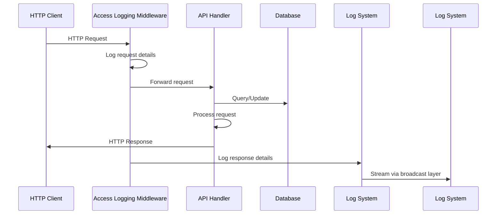

# Access Logging Feature

## Overview

The access logging feature provides detailed logging for all HTTP API requests, including request details, response status, timing information, and client information. This helps with monitoring API usage, debugging issues, and analyzing traffic patterns.

## How It Works

### Architecture



### Data Flow

1. **Request Arrival**: HTTP request arrives at the server
2. **Middleware Interception**: Access logging middleware intercepts the request before it reaches the handler
3. **Request Logging**: Middleware logs:
   - HTTP method (GET, POST, etc.)
   - Request path and query string
   - Remote client IP address
   - User-Agent header
   - HTTP version
4. **Request Processing**: Request is processed normally by API handlers
5. **Response Logging**: After response is generated, middleware logs:
   - Response status code
   - Response size in bytes
   - Request processing time (milliseconds)
   - Same request details as step 3

## Log Format

### Access Log Format

```
[ACCESS] GET /api/music/song.mp3 - Status: 200
[ACCESS] GET /api/music - Status: 200
[ACCESS] GET /api/music/missing.mp3 - Status: 404
```

### Log Fields

| Field | Description | Example |
|-------|-------------|---------|
| Method | HTTP method (GET, POST, etc.) | `GET` |
| Path | Request path | `/api/music/song.mp3` |
| Status | HTTP response status | `200`, `404`, `500` |

## Usage Examples

### Monitoring API Requests

```bash
# Watch access logs in real-time
nc localhost 2081 | grep "\[ACCESS\]"

# Count requests per endpoint
nc localhost 2081 | grep "\[ACCESS\]" | cut -d' ' -f4 | sort | uniq -c
```

### Error Analysis

```bash
# Find all 4xx and 5xx errors
nc localhost 2081 | grep "Status: 4" || nc localhost 2081 | grep "Status: 5"
```

### Error Analysis

```bash
# Find all 4xx and 5xx errors
nc localhost 2081 | grep "Status: 4\|Status: 5"
```

## Configuration

### Ports Used

| Port | Purpose | Protocol |
|------|---------|----------|
| 2080 | HTTP API | HTTP |
| 2081 | Log Streaming | TCP (plain text) |

### Log Level

Access logs are always at INFO level and are always logged regardless of the configured log level. This ensures API access is always monitored.

## Middleware Implementation

### File Structure

```
backend/src/
├── middleware/
│   └── mod.rs          # Access logging middleware implementation
```

### Key Components

1. **AccessLogging**: Transform trait that creates the middleware
2. **AccessLoggingMiddleware**: Actual service that processes requests
3. **Request/Response Logging**: Logs both incoming requests and outgoing responses
4. **Performance Tracking**: Measures and logs request processing time

### Integration

The middleware is automatically applied to all API endpoints in `server/mod.rs`:

```rust
App::new()
    .wrap(cors)
    .wrap(AccessLogging)  // Access logging middleware
    .app_data(app_state.clone())
    // ... services
```

## Related Source Files

- **`backend/src/middleware/mod.rs`** - Access logging middleware implementation
  - `AccessLogging` - Transform that creates the middleware
  - `AccessLoggingMiddleware` - Service that logs requests/responses
  - Tracks timing, status codes, and client information

- **`backend/src/server/mod.rs`** - Server configuration
  - Middleware is applied to all API endpoints
  - Access logging is the first middleware after CORS

## Best Practices

### When Access Logging is Most Useful

1. **Debugging API Issues**: Quickly see which endpoints are failing
2. **Performance Monitoring**: Identify slow endpoints
3. **Security Monitoring**: Track unusual request patterns
4. **Usage Analysis**: Understand how your API is being used
5. **Client Troubleshooting**: Help users debug their access issues

### Log Analysis Tips

1. **Combine with Context**: Use log streaming to correlate access logs with application logs
2. **Monitor for Patterns**: Look for unusual request frequencies or patterns
3. **Track Errors**: Pay special attention to 4xx and 5xx status codes
4. **Performance Tuning**: Use timing data to identify bottlenecks

### Privacy Considerations

- Logs include client IP addresses and user-agent strings
- Ensure compliance with privacy regulations when storing/accessing logs
- Consider log rotation to prevent indefinite storage of client data

## Troubleshooting

### Access Logs Not Appearing

1. Verify the server is running and generating logs
2. Check that you're connected to the correct log stream (port 2081)
3. Ensure no other log filtering is blocking INFO level messages

### Missing Request Information

- Some headers may be missing if the client doesn't provide them
- Query string will be empty for requests without parameters
- Remote address may be "unknown" if the client doesn't provide it

### Timing Inaccurate

- Processing time includes middleware overhead
- Very fast requests (<1ms) may show as 0ms
- Time is measured in milliseconds for readability