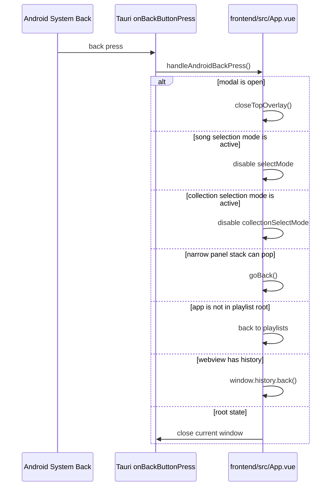

# Android Back Navigation

## Overview

Kaulan handles the Android system back button in the frontend so it behaves like the visible `返回` buttons instead of closing the webview immediately.

- Related source: [`frontend/src/App.vue`](../../frontend/src/App.vue)
- Related source: [`frontend/src/utils/platform.ts`](../../frontend/src/utils/platform.ts)

The implementation is Android-only. Desktop browsers and non-Android Tauri targets do not register this handler.

## Why This Is Needed

Kaulan's main UI is mostly a single-page Vue app driven by reactive state:

- modal visibility flags such as `showSettings`
- mode flags such as `selectMode`
- a narrow-layout panel stack that tracks the last visible content or player panel
- view state such as `currentView`

Without custom handling, Android back exits the Tauri webview directly. That skips the app's own UI state transitions.

## Frontend Flow

On mount, the app reads runtime capabilities from `frontend/src/utils/platform.ts`. Only when `supportsAndroidBackHandler` is true does it load Tauri's Android back listener and register `onBackButtonPress`.



## Ordered Back Priority

Each back event closes only one layer. The handler returns immediately after the first matching state.

Current priority in [`frontend/src/App.vue`](../../frontend/src/App.vue):

1. Filter sheet
2. Source action sheet
3. Collection action sheet
4. Song action sheet
5. Active queue modal
6. Add device modal
7. Upload modal
8. Online search modal
9. Create collection modal
10. Add-to-collection modal
11. Settings modal
12. Song selection mode
13. Collection selection mode
14. Narrow panel stack pop
15. Fallback reset to playlist root
16. Browser history back
17. Close Tauri window

This ordered check is what makes one back event affect only one visible page or panel.

## Modal Handling Pattern

Modal overlays are handled by a dedicated helper:

```ts
const closeTopOverlay = () => {
  if (showFilterSheet.value) {
    showFilterSheet.value = false;
    return true;
  }

  if (selectedSourceMenuGroup.value) {
    closeSourceMenu();
    return true;
  }

  if (selectedCollectionMenuName.value) {
    closeCollectionMenu();
    return true;
  }

  if (selectedSongMenuSong.value) {
    closeSongMenu();
    return true;
  }

  if (showActiveQueueModal.value) {
    showActiveQueueModal.value = false;
    return true;
  }

  if (showAddDeviceModal.value) {
    showAddDeviceModal.value = false;
    return true;
  }

  if (showUploadModal.value) {
    showUploadModal.value = false;
    return true;
  }

  if (showOnlineSearchModal.value) {
    showOnlineSearchModal.value = false;
    return true;
  }

  if (showCreateCollection.value) {
    hideCreateCollectionModal();
    return true;
  }

  if (showAddToCollection.value) {
    hideAddToCollectionModal();
    return true;
  }

  if (showSettings.value) {
    hideSettingsModal();
    return true;
  }

  return false;
};
```

The important rule is: check from topmost overlay to lowest overlay, and stop after the first match.

## Stack-Based Page Handling Pattern

For non-modal pages in narrow layout, the app uses a small panel stack instead of hardcoded "collapse player, then go playlists" rules.

Examples:

- `selectMode.value = false` exits song multi-select state
- `collectionSelectMode.value = false` exits collection multi-select state
- opening search pushes a `search` content panel
- opening the player pushes a `player` panel
- Android back pops the last visible panel before falling back to playlist root

Wide layout does not use player entries in this stack. When the app switches to wide mode, player panels are removed from back history and only left-side content history remains. When the app returns to narrow mode, the player panel is restored as the top mobile panel.

This is a good fit for mobile UIs with stacked panels inside one Vue page.

## Android-Only Safety

The Android back listener is registered only when the runtime capability `supportsAndroidBackHandler` is `true`.

This avoids:

- calling Tauri Android APIs in normal browser development
- crashing non-Android targets due to unavailable back-button APIs
- changing desktop web behavior

## Design Rule For New Panels

When adding a new page, panel, or modal that should respond to Android back:

1. Represent its visibility with explicit reactive state.
2. Add a close or reset function for that state.
3. Insert that check in `handleAndroidBackPress()` at the correct priority.
4. Return immediately after handling it.

If the new UI is a modal overlay, prefer adding it to `closeTopOverlay()`.

## Summary

Kaulan's Android back behavior is implemented as a single ordered state machine in the frontend. One back event does one thing:

- close the topmost modal,
- or exit the current mode,
- or move back one in-app view,
- or finally leave the app.
