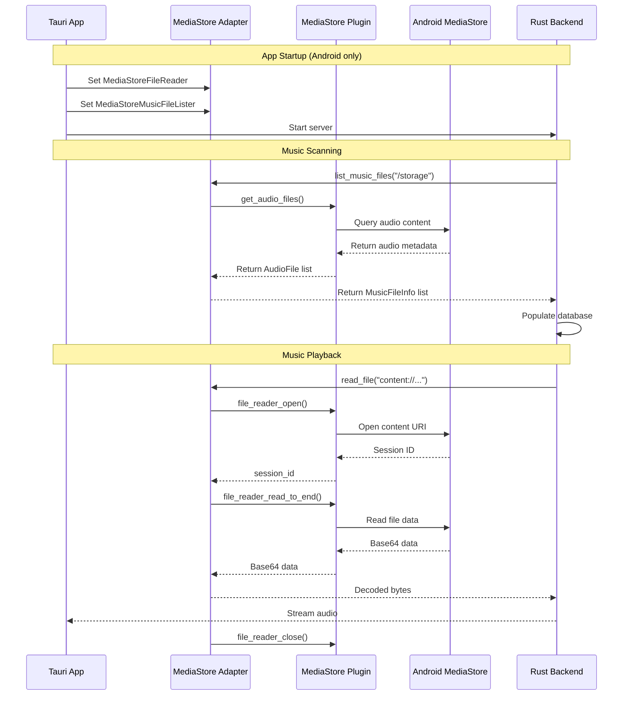

# Android MediaStore Integration

## Overview

Kaulan integrates with Android's MediaStore API to scan and play music files on Android devices. This integration is necessary because Android's scoped storage restrictions (introduced in Android 10) prevent direct filesystem access to media files.

## Problem

On Android 10 (API 29) and later, direct filesystem access to media files is restricted due to scoped storage. A traditional music player that scans directories using `std::fs` cannot:

1. Access media files outside the app-specific directories
2. Scan the user's entire music library stored in standard locations like `/Music` or `/Download`
3. Read audio files using normal file paths

## Solution

Kaulan uses a pluggable file operations abstraction layer that allows platform-specific implementations:

- **Desktop platforms**: Uses `std::fs` for traditional file access
- **Android platforms**: Uses the [tauri-plugin-android-mediastore](https://github.com/rustmini/tauri-plugin-android-mediastore) plugin to access MediaStore

This architecture allows the same backend code to work on both desktop and Android platforms.

## Architecture



## Implementation Details

### Backend: Pluggable File Operations

**Source: [`backend/src/file_ops/mod.rs`](../../../backend/src/file_ops/mod.rs)**

The backend defines two traits that allow platform-specific implementations:

#### FileReader Trait

```rust
#[async_trait]
pub trait FileReader: Send + Sync {
    async fn read_file(&self, path: &str) -> Result<Vec<u8>, std::io::Error>;
}
```

- **StdFileReader**: Uses `std::fs::read` (default for desktop)
- **MediaStoreFileReader**: Uses Android content URIs

#### MusicFileLister Trait

```rust
#[async_trait]
pub trait MusicFileLister: Send + Sync {
    async fn list_music_files(&self, base_path: &str) -> Result<Vec<MusicFileInfo>, std::io::Error>;
}
```

- **StdMusicFileLister**: Recursive directory scan using `std::fs` (default for desktop)
- **MediaStoreMusicFileLister**: Queries Android MediaStore API

#### MusicFileInfo Structure

```rust
pub struct MusicFileInfo {
    pub path: String,        // Content URI on Android, file path on desktop
    pub filename: String,    // Generated filename from metadata on Android
    pub title: Option<String>,
    pub artist: Option<String>,
    pub album: Option<String>,
    pub duration_ms: Option<i64>,
}
```

### Frontend: MediaStore Adapters

**Source: [`frontend/src-tauri/src/mediastore_adapter.rs`](../../../frontend/src-tauri/src/mediastore_adapter.rs)**

The adapters are compiled only on Android and provide implementations of the backend traits:

#### MediaStoreFileReader

Reads file content using Android's content resolver:

```rust
#[cfg(target_os = "android")]
pub struct MediaStoreFileReader {
    app_handle: tauri::AppHandle,
}
```

**Process:**
1. Opens a file reader session with the content URI
2. Reads all data to end (returns base64-encoded data)
3. Closes the session
4. Decodes base64 to bytes and returns

#### MediaStoreMusicFileLister

Queries MediaStore for audio files:

```rust
#[cfg(target_os = "android")]
pub struct MediaStoreMusicFileLister {
    app_handle: tauri::AppHandle,
}
```

**Process:**
1. Calls `get_audio_files()` on the MediaStore plugin
2. Receives metadata (title, artist, album, duration, content URI)
3. Generates safe filenames from metadata (e.g., `Artist_Title.mp3`)
4. Returns `MusicFileInfo` list

### Desktop Stub Implementations

The adapters include stub implementations for desktop platforms to allow development and testing:

```rust
#[cfg(not(target_os = "android"))]
pub struct MediaStoreFileReader;

#[cfg(not(target_os = "android"))]
impl FileReader for MediaStoreFileReader {
    async fn read_file(&self, path: &str) -> Result<Vec<u8>, std::io::Error> {
        Err(std::io::Error::new(
            std::io::ErrorKind::Unsupported,
            "MediaStore is only available on Android"
        ))
    }
}
```

## Initialization

**Source: [`frontend/src-tauri/src/lib.rs`](../../../frontend/src-tauri/src/lib.rs:52-60)**

MediaStore adapters are set up before the backend server starts:

```rust
// Set up custom file operations implementations for Android
#[cfg(target_os = "android")]
{
    log::info!("Setting up MediaStore adapters for Android");
    let app_handle_for_adapter = app.handle().clone();
    let _ = kaulan::set_file_reader(Box::new(mediastore_adapter::MediaStoreFileReader::new(app_handle_for_adapter.clone())));
    let _ = kaulan::set_music_file_lister(Box::new(mediastore_adapter::MediaStoreMusicFileLister::new(app_handle_for_adapter)));
    log::info!("MediaStore adapters configured successfully");
}
```

## Android Permissions

**Source: [`frontend/src-tauri/gen/android/app/src/main/AndroidManifest.xml`](../../../frontend/src-tauri/gen/android/app/src/main/AndroidManifest.xml)**

The app requires the `READ_MEDIA_AUDIO` permission for Android 13 (API 33) and later:

```xml
<uses-permission android:name="android.permission.READ_MEDIA_AUDIO" />
```

For Android 12L (API 32) and earlier, the deprecated `READ_EXTERNAL_STORAGE` permission may be used (removed in commit f65dff2).

## Data Storage

On Android, the database stores content URIs instead of file paths:

| Field | Desktop | Android |
|-------|---------|---------|
| `file_path` | `/path/to/music/song.mp3` | `content://media/external/audio/media/123` |
| `filename` | `song.mp3` | `Artist_Title.mp3` (generated from metadata) |

The scanner normalizes paths differently based on whether they are content URIs:

```rust
fn is_content_uri(path: &str) -> bool {
    path.starts_with("content://")
}

fn normalize_path(path: &str) -> String {
    if is_content_uri(path) {
        path.to_string()  // Keep content URI as-is
    } else {
        Path::new(path).canonicalize().to_string_lossy().to_string()  // Canonicalize file path
    }
}
```

## Usage

### Scanning for Music

When the app starts on Android:

1. The MediaStoreMusicFileLister queries `get_audio_files()`
2. Returns all audio files with metadata from MediaStore
3. The scanner populates the database with content URIs
4. The UI displays the music library

### Playing Music

When a user plays a song:

1. Frontend requests `GET /api/music/{filename}`
2. Backend looks up the song in the database
3. MediaStoreFileReader reads the content URI
4. Audio is streamed to the frontend

## Related Source Files

### Backend
- **[`backend/src/file_ops/mod.rs`](../../../backend/src/file_ops/mod.rs)** - Pluggable file operations traits and implementations
- **[`backend/src/services/scanner.rs`](../../../backend/src/services/scanner.rs)** - Music scanner using MusicFileLister
- **[`backend/src/handlers/music.rs`](../../../backend/src/handlers/music.rs)** - Music streaming endpoint using FileReader

### Frontend
- **[`frontend/src-tauri/src/mediastore_adapter.rs`](../../../frontend/src-tauri/src/mediastore_adapter.rs)** - MediaStore adapter implementations
- **[`frontend/src-tauri/src/lib.rs`](../../../frontend/src-tauri/src/lib.rs)** - App setup, MediaStore adapter initialization
- **[`frontend/src-tauri/Cargo.toml`](../../../frontend/src-tauri/Cargo.toml)** - Plugin dependency

### Configuration
- **[`frontend/src-tauri/gen/android/app/src/main/AndroidManifest.xml`](../../../frontend/src-tauri/gen/android/app/src/main/AndroidManifest.xml)** - Android permissions
- **[`frontend/src-tauri/capabilities/default.json`](../../../frontend/src-tauri/capabilities/default.json)** - ACL permissions for MediaStore plugin

## Troubleshooting

### No Music Files Found

**Symptoms:** Database is empty after scanning

**Possible causes:**
1. **MediaStore permission not granted** - Check if the app has `READ_MEDIA_AUDIO` permission
2. **No audio files on device** - MediaStore only returns files that have been indexed by Android
3. **Plugin not initialized** - Check logs for "Setting up MediaStore adapters for Android"

**Solution:** Verify the plugin is initialized in `lib.rs` and permissions are granted.

### File Read Errors

**Symptoms:** Playback fails with file read errors

**Possible causes:**
1. **Content URI changed** - MediaStore URIs can change if the file is moved
2. **File removed** - The audio file was deleted from the device

**Solution:** Trigger a database update via `POST /api/database/update` to refresh the MediaStore data.

### Compilation Errors on Desktop

**Symptoms:** Build fails with MediaStore-related errors

**Possible causes:**
1. Missing `#[cfg(target_os = "android")]` guards
2. Missing stub implementations

**Solution:** Ensure all MediaStore-specific code is properly guarded with `#[cfg(target_os = "android")]` and stub implementations exist for desktop.

## Known Limitations

### Full File Loading Before Streaming

**Current Behavior:**

The current implementation loads entire music files into memory before streaming them to the client. This applies to both desktop and Android platforms:

```
MediaStore/StdFileReader ──► Read Entire File ──► Vec<u8> ──► HttpResponse
        (entire file)           (into RAM)        (5-50MB)    (send at once)
```

**Impact:**

| File Type | Typical Size | Memory Usage per Song |
|-----------|--------------|----------------------|
| MP3 (320kbps, 5min) | ~5-8 MB | 5-8 MB |
| FLAC (5min) | ~20-50 MB | 20-50 MB |
| Base64 overhead (Android) | +33% | Additional ~2-17 MB |

**Consequences:**

1. **High memory usage** - Each song fully loaded into RAM before playback starts
2. **Playback delay** - User must wait for entire file to load before hearing audio
3. **Base64 overhead** - Android MediaStore returns base64-encoded data, adding ~33% memory overhead during transfer
4. **Limited concurrent playback** - Multiple simultaneous streams multiply memory usage

**Source Files:**

- [`backend/src/handlers/music.rs:49-58`](../../../backend/src/handlers/music.rs) - Loads entire file via `read_file()` then sends as response body
- [`frontend/src-tauri/src/mediastore_adapter.rs:71-113`](../../../frontend/src-tauri/src/mediastore_adapter.rs) - Uses `file_reader_read_to_end()` for entire file transfer

**Future Improvement:**

A proper streaming implementation would:

1. Read files in fixed-size chunks (e.g., 8-64 KB)
2. Send each chunk immediately via actix-web's streaming body
3. Maintain only a small buffer regardless of file size

This would require:
- Adding a `read_stream()` method to `FileReader` trait
- Implementing chunked reading for both `StdFileReader` and `MediaStoreFileReader`
- Using `file_reader_read` (chunked) instead of `file_reader_read_to_end` in the MediaStore plugin
- Updating music handler to use `StreamingBody` or similar actix-web streaming type

## Build Configuration

### Tauri Plugin Dependency

**File: [`frontend/src-tauri/Cargo.toml`](../../../frontend/src-tauri/Cargo.toml)**

```toml
[dependencies]
tauri-plugin-android-mediastore = "0.1"
```

### ACL Permissions

**File: [`frontend/src-tauri/capabilities/default.json`](../../../frontend/src-tauri/capabilities/default.json)**

```json
{
  "identifier": "default",
  "description": "Default capabilities for the app",
  "windows": ["main"],
  "permissions": [
    "core:default",
    "android-mediastore:allow-get-audio-files",
    "android-mediastore:allow-file-reader-open",
    "android-mediastore:allow-file-reader-read-to-end",
    "android-mediastore:allow-file-reader-close"
  ]
}
```

## Development Notes

### Testing on Desktop

To test the app on desktop during development:

1. The StdFileReader and StdMusicFileLister are used by default
2. No MediaStore plugin is available on desktop
3. Stub implementations allow compilation but return errors when called

### Testing on Android

1. Build the Android app: `cd frontend && npm run tauri android build`
2. Install on a physical device or emulator
3. Grant the READ_MEDIA_AUDIO permission when prompted
4. The app will automatically scan MediaStore on first launch

### Debug Logging

The MediaStore adapters include extensive debug logging:

```rust
log::info!("Querying MediaStore for audio files...");
log::debug!("Found audio file: {} - {} ({})", af.artist, af.title, af.content_uri);
log::info!("MediaStore query complete: {} audio files found", files.len());
```

Enable logging via:
- **Desktop**: `RUST_LOG=debug cargo run`
- **Android**: Check logcat or use the TCP log streaming feature on port 2081

## References

- **Commit:** [`07e67c7`](https://github.com/your-repo/commit/07e67c7) - Initial MediaStore integration
- **Follow-up:** [`36376cf`](https://github.com/your-repo/commit/36376cf) - Fix Android READ_MEDIA_AUDIO permission
- **Plugin:** [tauri-plugin-android-mediastore](https://github.com/rustmini/tauri-plugin-android-mediastore)
- **Android Docs:** [MediaStore Overview](https://developer.android.com/training/data-storage/app-specific#best-practices)
