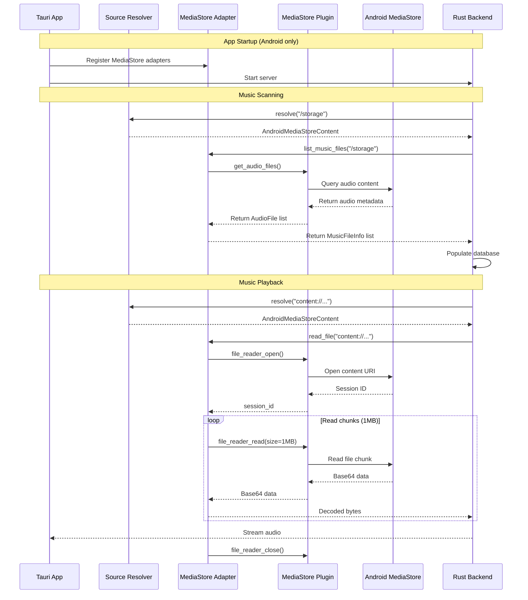

# Android MediaStore Integration

## Overview

Kaulan integrates with Android's MediaStore API to scan and play music files on Android devices. This integration is necessary because Android's scoped storage restrictions (introduced in Android 10) prevent direct filesystem access to media files.

For Android playback queue ownership, session polling, and webview restart recovery, see [`docs/android/playback-session.md`](./playback-session.md).

## Problem

On Android 10 (API 29) and later, direct filesystem access to media files is restricted due to scoped storage. A traditional music player that scans directories using `std::fs` cannot:

1. Access media files outside the app-specific directories
2. Scan the user's entire music library stored in standard locations like `/Music` or `/Download`
3. Read audio files using normal file paths

## Solution

Kaulan uses a source-resolved file operations layer:

- **`StdFs` source**: Uses `std::fs` / `tokio::fs` for normal filesystem paths
- **`AndroidMediaStoreContent` source**: Uses the [tauri-plugin-android-mediastore](https://github.com/rustmini/tauri-plugin-android-mediastore) plugin for `content://` paths

The database keeps storing raw paths. Backend code resolves each path to the correct source before reading, streaming, listing, or checking existence.

## Architecture



## Implementation Details

### Backend: Source-Resolved File Operations

**Source: [`backend/src/file_ops/mod.rs`](../../../backend/src/file_ops/mod.rs)**

The backend resolves each raw path through a registry of `Source` implementations.

#### Source Trait

```rust
#[async_trait]
pub trait Source: Send + Sync {
    fn matches(&self, raw_path: &str) -> bool;
    fn normalize_path(&self, raw_path: &str) -> String;
    async fn read_file(&self, path: &str) -> Result<Vec<u8>, std::io::Error>;
    async fn read_stream(&self, path: &str, chunk_size: usize) -> Result<ByteStream, std::io::Error>;
    async fn get_file_size(&self, path: &str) -> Result<u64, std::io::Error>;
    async fn open_seekable_reader(&self, path: &str) -> Result<Box<dyn ReadSeekSendSync>, std::io::Error>;
    async fn list_music_files(&self, base_path: &str, media_types: &[String]) -> Result<Vec<MusicFileInfo>, std::io::Error>;
    async fn exists(&self, path: &str) -> Result<bool, std::io::Error>;
}
```

- **`StdFs` source** handles desktop paths and Android app-private filesystem paths
- **`AndroidMediaStoreContent` source** handles `content://` paths

#### MusicFileInfo Structure

```rust
pub struct MusicFileInfo {
    pub path: String,        // Raw path stored in DB
    pub filename: String,    // Generated filename from metadata on Android
    pub title: Option<String>,
    pub artist: Option<String>,
    pub album: Option<String>,
    pub duration_ms: Option<i64>,
}
```

### Frontend: MediaStore Adapters

**Source: [`frontend/src-tauri/src/mediastore_adapter.rs`](../../../frontend/src-tauri/src/mediastore_adapter.rs)**

The adapters are compiled only on Android and provide MediaStore-backed behavior that the backend registers into the source registry.

#### MediaStoreFileReader

Reads file content using Android's content resolver:

```rust
#[cfg(target_os = "android")]
pub struct MediaStoreFileReader {
    app_handle: tauri::AppHandle,
}
```

**Process:**
1. Opens a file reader session with the content URI
2. Reads all data to end (returns base64-encoded data)
3. Closes the session
4. Decodes base64 to bytes and returns

#### MediaStoreMusicFileLister

Queries MediaStore for audio files:

```rust
#[cfg(target_os = "android")]
pub struct MediaStoreMusicFileLister {
    app_handle: tauri::AppHandle,
}
```

**Process:**
1. Calls `get_audio_files()` on the MediaStore plugin
2. Receives metadata (title, artist, album, duration, content URI)
3. Generates safe filenames from metadata (e.g., `Artist_Title.mp3`)
4. Returns `MusicFileInfo` list

### Desktop Stub Implementations

The adapters include stub implementations for desktop platforms to allow development and testing:

```rust
#[cfg(not(target_os = "android"))]
pub struct MediaStoreFileReader;

#[cfg(not(target_os = "android"))]
impl FileReader for MediaStoreFileReader {
    async fn read_file(&self, path: &str) -> Result<Vec<u8>, std::io::Error> {
        Err(std::io::Error::new(
            std::io::ErrorKind::Unsupported,
            "MediaStore is only available on Android"
        ))
    }
}
```

## Initialization

**Source: [`frontend/src-tauri/src/lib.rs`](../../../frontend/src-tauri/src/lib.rs:52-60)**

MediaStore adapters are registered before the backend server starts:

```rust
// Register MediaStore-backed file operations for Android
#[cfg(target_os = "android")]
{
    log::info!("Setting up MediaStore adapters for Android");
    let app_handle_for_adapter = app.handle().clone();
    let _ = kaulan::set_file_reader(Box::new(mediastore_adapter::MediaStoreFileReader::new(app_handle_for_adapter.clone())));
    let _ = kaulan::set_music_file_lister(Box::new(mediastore_adapter::MediaStoreMusicFileLister::new(app_handle_for_adapter)));
    log::info!("MediaStore adapters configured successfully");
}
```

## Android Permissions

**Source: [`frontend/src-tauri/gen/android/app/src/main/AndroidManifest.xml`](../../../frontend/src-tauri/gen/android/app/src/main/AndroidManifest.xml)**

The app requires the `READ_MEDIA_AUDIO` permission for Android 13 (API 33) and later:

```xml
<uses-permission android:name="android.permission.READ_MEDIA_AUDIO" />
```

For Android 12L (API 32) and earlier, the deprecated `READ_EXTERNAL_STORAGE` permission may be used (removed in commit f65dff2).

## Data Storage

On Android, the database stores raw paths instead of forcing one path format:

| Field | Desktop | Android |
|-------|---------|---------|
| `file_path` | `/path/to/music/song.mp3` | `content://media/external/audio/media/123` or `/storage/.../Android/data/<app>/...` |
| `filename` | `song.mp3` | `Artist_Title.mp3` (generated from metadata) |

The source resolver normalizes each raw path according to the owning source before scan deduplication and existence checks.

## Usage

### Scanning for Music

When the app starts on Android:

1. The MediaStoreMusicFileLister queries `get_audio_files()`
2. Returns all audio files with metadata from MediaStore
3. The scanner populates the database with content URIs
4. The UI displays the music library

### Playing Music

When a user plays a song:

1. Localhost callers receive the raw database path in the `path` field
2. Remote callers receive the HTTP stream URL in the `path` field
3. Android localhost callers may still add `?stream=content`
4. When `?stream=content` is present, the backend exposes the raw `content://` path in `stream_url` for the Android direct-play backend
5. Remote callers never receive raw MediaStore URIs

### LUFS Pre-caching

When LUFS pre-cache is triggered on Android:

1. Frontend requests `POST /api/music/{id}/precache-lufs`
2. Backend opens a seekable reader via `MediaStoreFileReader` using the content URI
3. LUFS is calculated directly from the reader and cached in the database

## Related Source Files

### Backend
- **[`backend/src/file_ops/mod.rs`](../../../backend/src/file_ops/mod.rs)** - Source registry, resolver, and source implementations
- **[`backend/src/services/scanner.rs`](../../../backend/src/services/scanner.rs)** - Music scanner using source-backed lister and existence checks
- **[`backend/src/handlers/music.rs`](../../../backend/src/handlers/music.rs)** - Music streaming endpoint using source-backed reader

### Frontend
- **[`frontend/src-tauri/src/mediastore_adapter.rs`](../../../frontend/src-tauri/src/mediastore_adapter.rs)** - MediaStore adapter implementations
- **[`frontend/src-tauri/src/lib.rs`](../../../frontend/src-tauri/src/lib.rs)** - App setup, MediaStore adapter initialization
- **[`frontend/src-tauri/Cargo.toml`](../../../frontend/src-tauri/Cargo.toml)** - Plugin dependency

### Configuration
- **[`frontend/src-tauri/gen/android/app/src/main/AndroidManifest.xml`](../../../frontend/src-tauri/gen/android/app/src/main/AndroidManifest.xml)** - Android permissions
- **[`frontend/src-tauri/capabilities/default.json`](../../../frontend/src-tauri/capabilities/default.json)** - ACL permissions for MediaStore plugin

## Troubleshooting

### No Music Files Found

**Symptoms:** Database is empty after scanning

**Possible causes:**
1. **MediaStore permission not granted** - Check if the app has `READ_MEDIA_AUDIO` permission
2. **No audio files on device** - MediaStore only returns files that have been indexed by Android
3. **Plugin not initialized** - Check logs for "Setting up MediaStore adapters for Android"

**Solution:** Verify the plugin is initialized in `lib.rs` and permissions are granted.

### File Read Errors

**Symptoms:** Playback fails with file read errors

**Possible causes:**
1. **Content URI changed** - MediaStore URIs can change if the file is moved
2. **File removed** - The audio file was deleted from the device

**Solution:** Trigger a database update via `POST /api/database/update` to refresh the MediaStore data.

### Compilation Errors on Desktop

**Symptoms:** Build fails with MediaStore-related errors

**Possible causes:**
1. Missing `#[cfg(target_os = "android")]` guards
2. Missing stub implementations

**Solution:** Ensure all MediaStore-specific code is properly guarded with `#[cfg(target_os = "android")]` and stub implementations exist for desktop.

## Known Limitations

### Full File Loading Before Streaming

**Current Behavior:**

The current implementation loads entire music files into memory before streaming them to the client. This applies to both desktop and Android platforms:

```
MediaStore/StdFileReader ──► Read Chunk (1MB) ──► Bytes ──► HttpResponse::streaming
        (1MB)                    (buffer)         (send immediately)
```

**Impact:**

| File Type | Typical Size | Memory Usage per Stream |
|-----------|--------------|-------------------------|
| MP3 (320kbps, 5min) | ~5-8 MB | ~1 MB buffer |
| FLAC (5min) | ~20-50 MB | ~1 MB buffer |
| Base64 overhead (Android) | +33% | +~0.33 MB per chunk |

**Consequences:**

1. **Low memory usage** - Fixed-size buffer per stream regardless of file size
2. **Faster playback start** - Audio begins once the first chunk arrives
3. **Bounded base64 overhead** - Overhead applies per chunk, not for entire file
4. **Better concurrency** - Multiple streams scale with chunk size, not file size

**Source Files:**

- [`backend/src/handlers/music.rs`](../../../backend/src/handlers/music.rs) - Streams audio using `read_stream()`
- [`backend/src/file_ops/mod.rs`](../../../backend/src/file_ops/mod.rs) - Defines `read_stream()` on `FileReader`
- [`frontend/src-tauri/src/mediastore_adapter.rs`](../../../frontend/src-tauri/src/mediastore_adapter.rs) - Uses `file_reader_read()` with 1MB chunks

## Build Configuration

### Tauri Plugin Dependency

**File: [`frontend/src-tauri/Cargo.toml`](../../../frontend/src-tauri/Cargo.toml)**

```toml
[dependencies]
tauri-plugin-android-mediastore = "0.1.9"
```

### ACL Permissions

**File: [`frontend/src-tauri/capabilities/default.json`](../../../frontend/src-tauri/capabilities/default.json)**

```json
{
  "identifier": "default",
  "description": "Default capabilities for the app",
  "windows": ["main"],
  "permissions": [
    "core:default",
    "android-mediastore:default"
  ]
}
```

## Development Notes

### Testing on Desktop

To test the app on desktop during development:

1. The StdFileReader and StdMusicFileLister are used by default
2. No MediaStore plugin is available on desktop
3. Stub implementations allow compilation but return errors when called

### Testing on Android

1. Build the Android app: `cd frontend && npm run tauri android build`
2. Install on a physical device or emulator
3. Grant the READ_MEDIA_AUDIO permission when prompted
4. The app will automatically scan MediaStore on first launch

### Debug Logging

The MediaStore adapters include extensive debug logging:

```rust
log::info!("Querying MediaStore for audio files...");
log::debug!("Found audio file: {} - {} ({})", af.artist, af.title, af.content_uri);
log::info!("MediaStore query complete: {} audio files found", files.len());
```

Enable logging via:
- **Desktop**: `RUST_LOG=debug cargo run`
- **Android**: Check logcat or use the TCP log streaming feature on port 2081

## References

- **Commit:** [`07e67c7`](https://github.com/your-repo/commit/07e67c7) - Initial MediaStore integration
- **Follow-up:** [`36376cf`](https://github.com/your-repo/commit/36376cf) - Fix Android READ_MEDIA_AUDIO permission
- **Plugin:** [tauri-plugin-android-mediastore](https://github.com/rustmini/tauri-plugin-android-mediastore)
- **Android Docs:** [MediaStore Overview](https://developer.android.com/training/data-storage/app-specific#best-practices)
