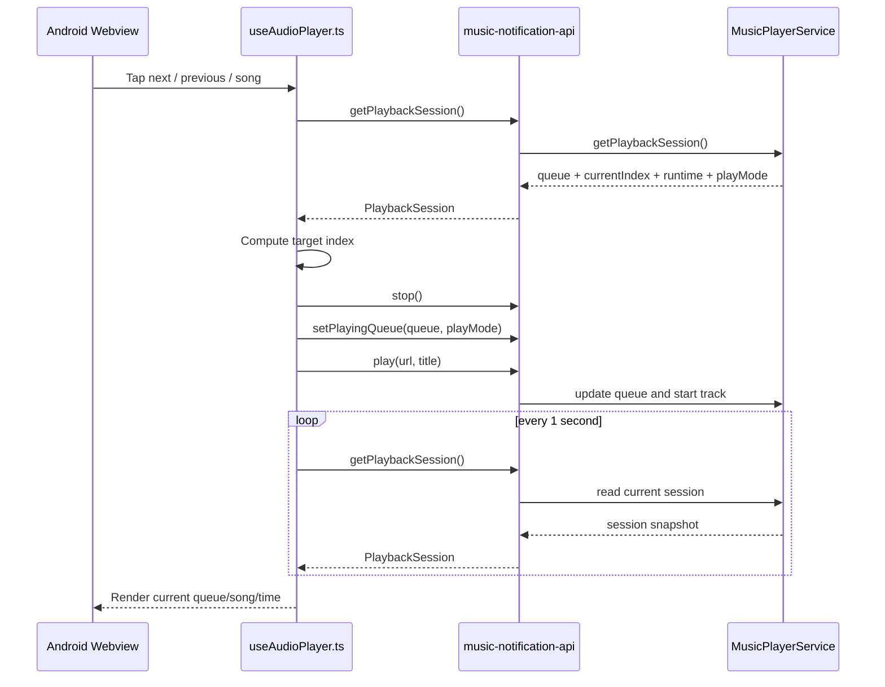

# Android Playback Session

## Overview

Kaulan uses the Android notification plugin as the playback source of truth on Android.

This document covers the Android playback/session flow implemented by:

- [`frontend/src/composables/useAudioPlayer.ts`](../../frontend/src/composables/useAudioPlayer.ts)
- [`frontend/src/App.vue`](../../frontend/src/App.vue)
- [`tauri-plugin-music-notification/android/src/main/java/ExamplePlugin.kt`](../../tauri-plugin-music-notification/android/src/main/java/ExamplePlugin.kt)
- [`tauri-plugin-music-notification/android/src/main/java/MusicPlayerService.kt`](../../tauri-plugin-music-notification/android/src/main/java/MusicPlayerService.kt)
- [`tauri-plugin-music-notification/src/models.rs`](../../tauri-plugin-music-notification/src/models.rs)
- [`tauri-plugin-music-notification/guest-js/index.ts`](../../tauri-plugin-music-notification/guest-js/index.ts)

## Why This Exists

On Android, the webview is frozen, or killed by os, so it can be recreated while the foreground playback service keeps running.

If the frontend owns the playback queue, the UI loses:

1. the current queue
2. the current playing song
3. the current playback position
4. the current play mode

To avoid that, the plugin persists a playback session and the frontend reloads it by polling.

## Session Model

The Android plugin stores:

- `queue.songs` as stable `deviceId + songId` identities for Kaulan tracks
- `queue.currentIndex`
- `runtime.isPlaying`
- `runtime.positionMs`
- `runtime.durationMs`
- `playMode`

The frontend reads that state through `getPlaybackSession()`.

The frontend app shell now consumes playback state through `frontend/src/stores/player.ts`, but that store only mirrors the runtime state. It does not replace plugin authority on Android.

## Frontend Responsibilities

The Android frontend keeps a URL-free identity shadow in localStorage for
compatibility and recovery, while the native service remains runtime authority.

Instead it:

1. copies a queue into the plugin
2. asks the plugin to play a specific queue identity
3. polls the plugin every second
4. renders queue, song, time, and lyric state from the polled session

## Playback Flow

### Start playback from a selected song

When the user taps a song in the Android webview:

1. frontend builds the queue for the active source
2. frontend computes the selected index
3. frontend calls `stop()`
4. frontend calls `setPlayingQueue(queue, playMode)`
5. frontend calls `seekAndPlay(0)`; the service resolves `deviceId` through localhost
6. frontend polls `getPlaybackSession()`
7. UI updates from the returned session

If the tap comes from the "当前播放列表" dialog, the frontend must reuse the current active queue instead of rebuilding from the playlist currently open on screen. Otherwise browsing into a different playlist can overwrite the service queue with the wrong source while the user is trying to jump within the existing playback session.

### Next and previous from the webview

The webview does not rely on plugin-side `next()` or `previous()` for queue mutation.

Instead:

1. frontend reads `getPlaybackSession()`
2. frontend gets the current queue and index from the service
3. frontend computes the target index
4. frontend calls `stop()`
5. frontend calls `setPlayingQueue(queue, playMode)` with the new index
6. frontend asks the service to play the target queue identity
7. frontend refreshes the session

This is intentionally simple. Queue sizes are small enough that correctness is more important than avoiding one extra queue copy.

Normal Kaulan queue entries do not persist stream or cover URLs. Immediately
before playback, `MusicPlayerService` calls
`GET http://localhost:2080/api/discovery/resolutions/{deviceId}` and builds the
music and cover endpoints from the returned API base. A missing resolution is
skipped, and native traversal checks at most one complete queue before stopping.
Local `content://` entries remain direct `local_raw` paths; temporary preview
URLs are not durable queue entries.

## LUFS Behavior

Android playback also follows the shared LUFS playback rules documented in [`docs/lufs-playback-flow.md`](../lufs-playback-flow.md).

Important note:

1. webview-initiated playback resolves current-song LUFS before playback through the frontend player
2. native auto-next inside `MusicPlayerService` also resolves current-song LUFS before playback
3. the webview polls `getPlaybackSession()` every second and updates visible metadata if the backend playback queue has newer LUFS values
4. volume mode and slider changes are sent once through `setNormalizationConfig()` and applied inside `MusicPlayerService`

## Sequence Diagram when tap next/prev in webview

## Lyrics on Android

No Android-specific lyric transport is needed.

Lyrics stay in the frontend:

1. polling updates the current song
2. polling updates the playback position
3. the lyric composable reacts to those values

When the current song changes, the lyric request changes as well, so the lyric panel follows playback.

## Browser vs Android Seeking

- Android: seek uses the plugin `seek(positionMs)` command
- Browser/Desktop: seek uses native `HTMLAudioElement.currentTime`

The browser path intentionally uses the simplest possible behavior to avoid regressions from reload-based seeking optimizations.

## Android Plugin Commands Used

- `play`
- `pause`
- `resume`
- `stop`
- `seek`
- `set_playing_queue`
- `get_playback_session`
- `clear_playing_queue`
- `set_play_mode`
- `set_normalization_config`

## Normalization Config Flow

Android playback does not depend on repeated frontend `setVolume()` calls.

Current behavior:

1. the settings watcher in [`frontend/src/App.vue`](../../frontend/src/App.vue) reacts to volume mode and slider changes
2. [`frontend/src/composables/useAudioPlayer.ts`](../../frontend/src/composables/useAudioPlayer.ts) sends `setNormalizationConfig()`
3. [`tauri-plugin-music-notification/android/src/main/java/ExamplePlugin.kt`](../../tauri-plugin-music-notification/android/src/main/java/ExamplePlugin.kt) forwards that command to the service
4. [`tauri-plugin-music-notification/android/src/main/java/MusicPlayerService.kt`](../../tauri-plugin-music-notification/android/src/main/java/MusicPlayerService.kt) saves the config and reapplies current track volume immediately
5. later native playback operations reuse that stored config without needing the webview to resend a raw volume value every second

## ACL Requirement

The plugin command `set_normalization_config` must be present in the plugin ACL manifests and included in the plugin default permission set. Otherwise Android settings changes appear in the UI but do not affect native playback.

## Failure Handling

The Android service guards stale `MediaPlayer` callbacks during track replacement.

That prevents:

- stale `onCompletion` advancing the queue a second time
- stale `onError` interfering with the current track

## Related Documents

- [`docs/android/mediastore-integration.md`](./mediastore-integration.md)
- [`docs/lyrics-display.md`](../lyrics-display.md)
- [`README.md`](../../README.md)
