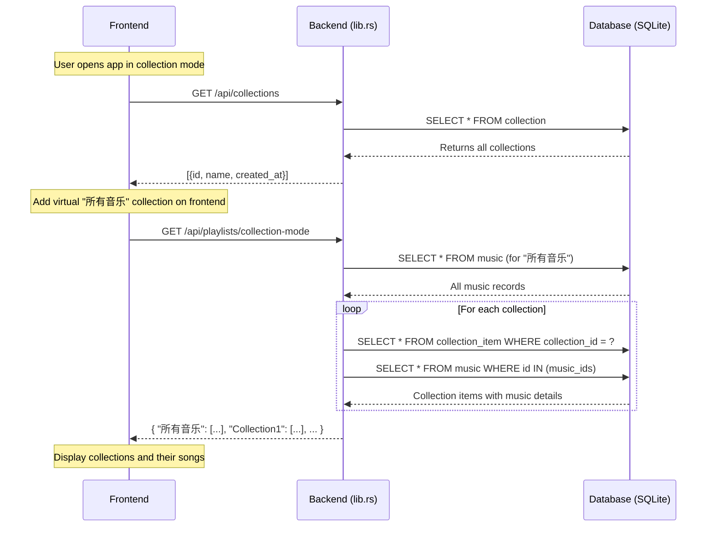

```mermaid
sequenceDiagram                                                                                                                                                                         
    participant FE as Frontend                                                                                                                                                          
    participant BE as Backend (lib.rs)                                                                                                                                                  
participant DB as Database (SQLite)                                                                                                                                                 

    Note over FE: User opens app in collection mode                                                                                                                                     

    FE->>BE: GET /api/collections                                                                                                                                                       
    BE->>DB: SELECT * FROM collection                                                                                                                                                   
    DB-->>BE: Returns all collections                                                                                                                                                   
    BE-->>FE: [{id, name, created_at}]                                                                                                                                                  

    Note over FE: Add virtual "所有音乐" collection on frontend                                                                                                                         

    FE->>BE: GET /api/playlists/collection-mode                                                                                                                                         
    BE->>DB: SELECT * FROM music (for "所有音乐")                                                                                                                                       
    DB-->>BE: All music records                                                                                                                                                         

    loop For each collection                                                                                                                                                            
    BE->>DB: SELECT * FROM collection_item WHERE collection_id = ?                                                                                                                  
    BE->>DB: SELECT * FROM music WHERE id IN (music_ids)                                                                                                                            
    DB-->>BE: Collection items with music details                                                                                                                                   
    end                                                                                                                                                                                 

    BE-->>FE: { "所有音乐": [...], "Collection1": [...], ... }                                                                                                                          

    Note over FE: Display collections and their songs
```
