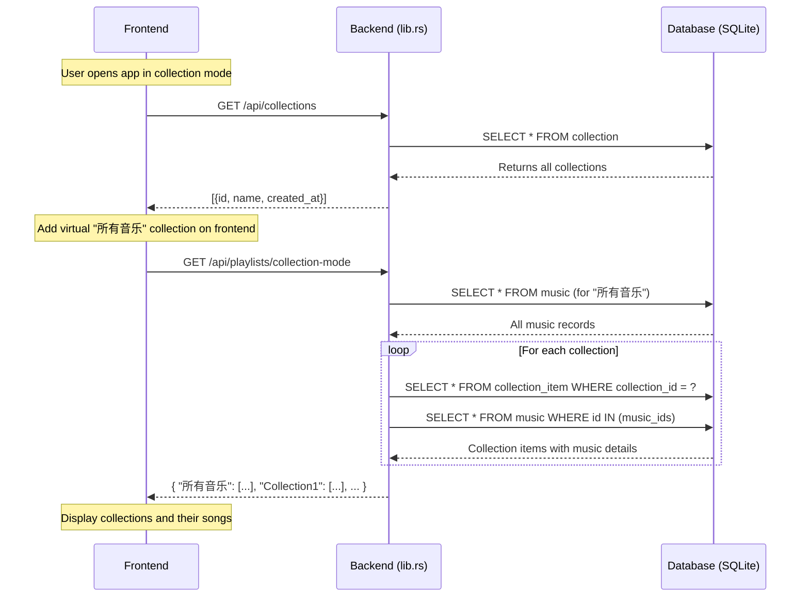
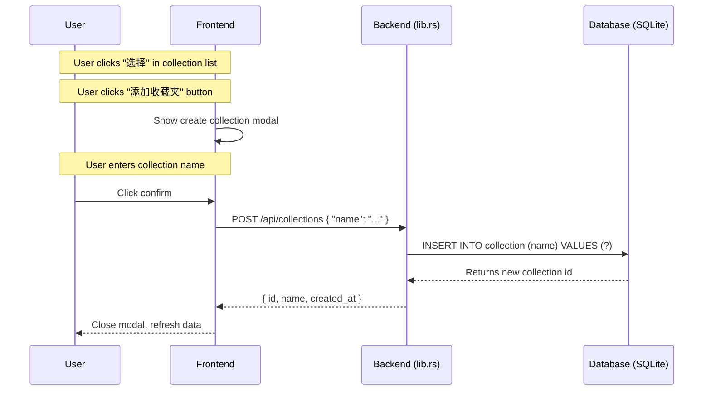
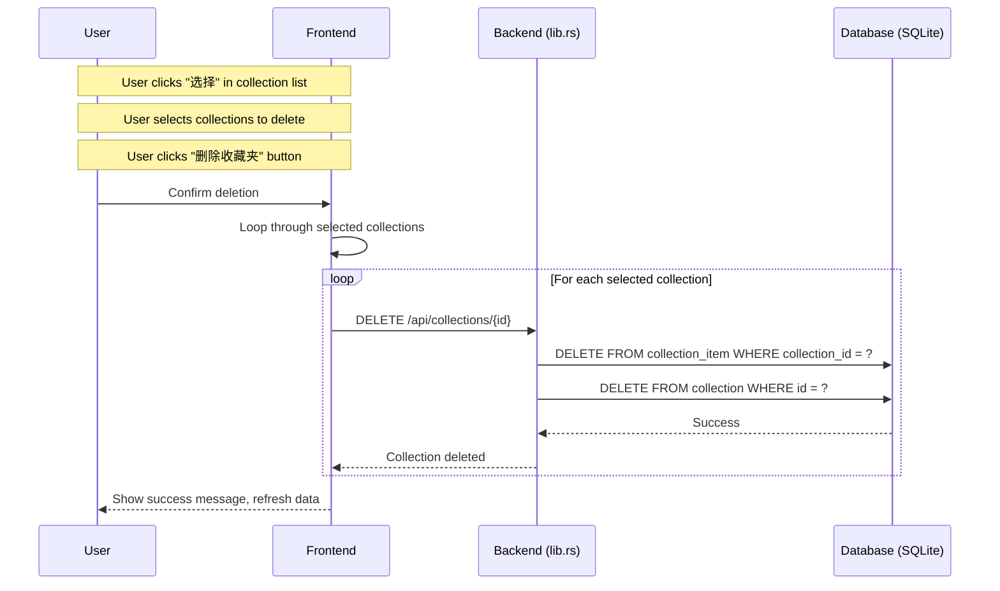
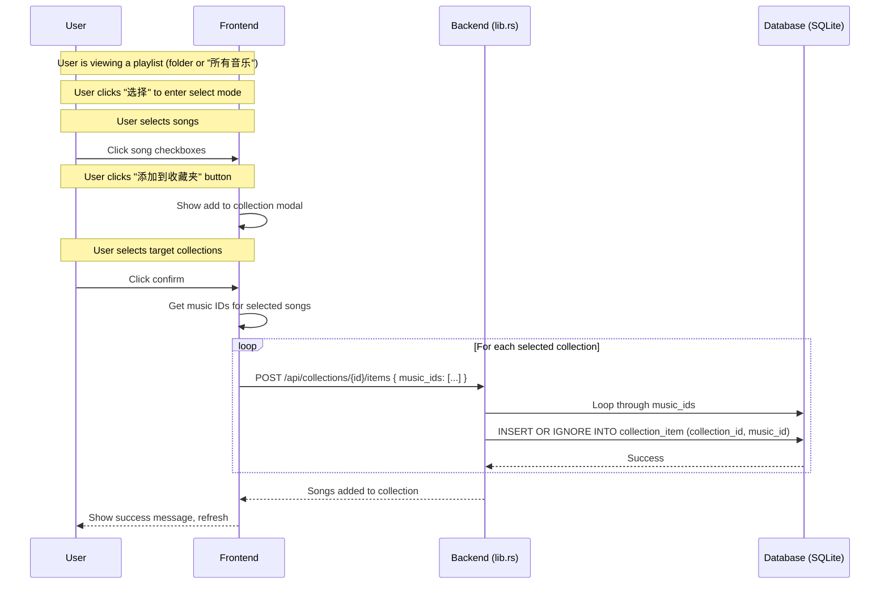
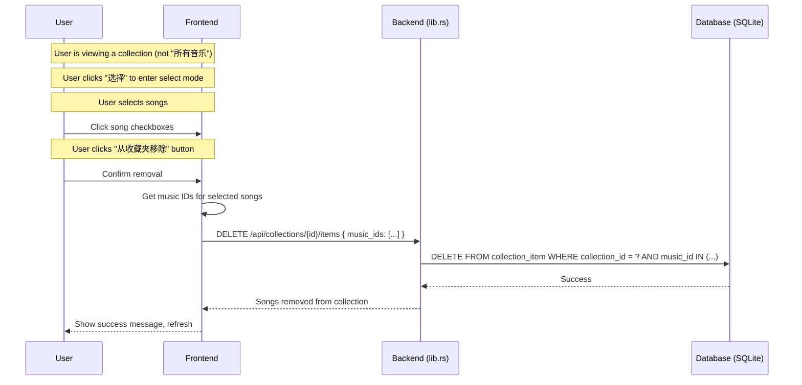

# Collection Feature

## Overview

The Collection feature allows users to create custom playlists (collections) independent of the folder structure. Users can organize music into their own collections, add/remove songs, and manage collections through a select-mode interface.

## API Endpoints

### Collections

| Method | Endpoint | Description |
|--------|----------|-------------|
| GET | `/api/collections` | Get all collections |
| GET | `/api/collections/{id}` | Get single collection metadata (without songs) |
| GET | `/api/collections/{id}/items` | Get collection with its songs |
| POST | `/api/collections` | Create new collection |
| DELETE | `/api/collections/{id}` | Delete collection (also removes all associated items) |
| POST | `/api/collections/{id}/items` | Add songs to collection |
| DELETE | `/api/collections/{id}/items` | Remove songs from collection |

### Collection Mode

| Method | Endpoint | Description |
|--------|----------|-------------|
| GET | `/api/playlists/collection-mode` | Get playlists in collection mode (returns HashMap with collection names as keys) |

## Request/Response Formats

### Create Collection
```bash
POST /api/collections
Content-Type: application/json

{
  "name": "My Favorite Songs"
}

Response:
{
  "id": 1,
  "name": "My Favorite Songs",
  "created_at": "2026-02-01T15:47:31.292519621+00:00"
}
```

### Add Songs to Collection
```bash
POST /api/collections/{id}/items
Content-Type: application/json

{
  "music_ids": [1, 2, 3]
}

Response:
Songs added to collection
```

### Remove Songs from Collection
```bash
DELETE /api/collections/{id}/items
Content-Type: application/json

{
  "music_ids": [2]
}

Response:
Songs removed from collection
```

### Get Collection with Songs
```bash
GET /api/collections/{id}/items

Response:
{
  "id": 1,
  "name": "My Favorite Songs",
  "songs": [
    {"name": "song1.mp3", "lufs": -16.5, "path": "music/song1.mp3"},
    {"name": "song2.mp3", "lufs": -14.2, "path": "music/song2.mp3"}
  ]
}
```

## Sequence Diagrams

### Initial Load - Collection Mode



### Create Collection



### Delete Collection



### Add Songs to Collection



### Remove Songs from Collection



## User Interface Usage

### Switching to Collection Mode

1. Open the app
2. Click the settings button (≡) in the bottom right
3. Tap "分类方式" to toggle from "文件夹" to "收藏夹"
4. The view now shows user-defined collections instead of folders

### Creating a Collection

1. In collection mode, on the collection list page, tap "选择"
2. Tap "添加收藏夹" in the floating bottom menu
3. Enter the collection name
4. Tap "确定" to create

### Deleting Collections

1. In collection mode, on the collection list page, tap "选择"
2. Check the collections you want to delete
3. Tap "删除收藏夹" in the floating bottom menu
4. Confirm the deletion

### Adding Songs to a Collection

1. Navigate to "所有音乐" or any folder-based playlist
2. Tap "选择" to enter select mode
3. Check the songs you want to add
4. Tap "添加到收藏夹" in the floating bottom menu
5. Select one or more target collections
6. Tap "确定" to add

### Removing Songs from a Collection

1. Navigate to a collection (not "所有音乐")
2. Tap "选择" to enter select mode
3. Check the songs you want to remove
4. Tap "从收藏夹移除" in the floating bottom menu
5. Confirm the removal

## UI Notes

- **"所有音乐"** is a virtual collection that shows all songs and cannot be deleted
- The **"选择" (Select)** button enables select mode for bulk operations
- In select mode, floating action buttons appear at the bottom of the screen
- Select mode is automatically exited when navigating back or after completing an operation
