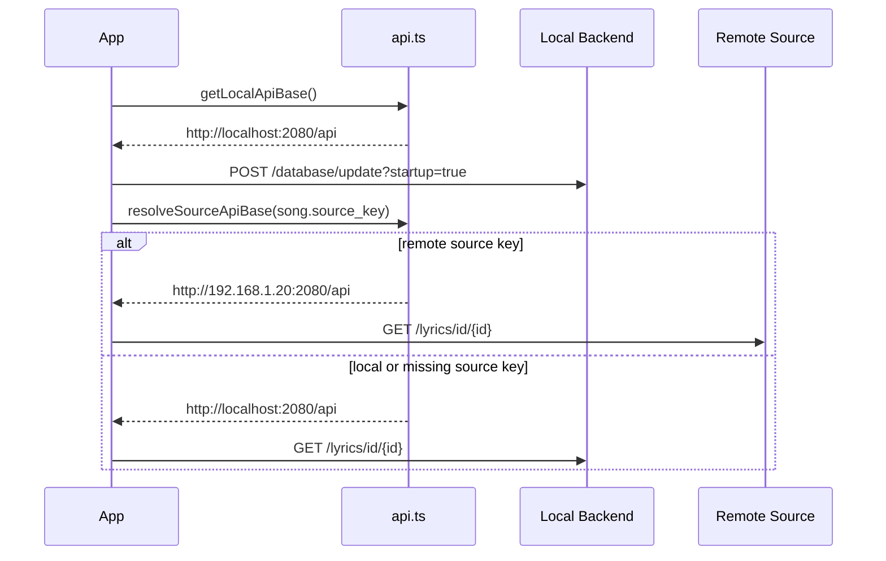

# Source API Routing

Related source files:
- `frontend/src/utils/api.ts`
- `frontend/src/App.vue`
- `frontend/src/components/modals/AddDeviceModal.vue`
- `frontend/src/composables/useDeviceDiscovery.ts`
- `frontend/src/composables/useAudioPlayer.ts`
- `frontend/src/composables/useLyrics.ts`
- `frontend/src/components/modals/SettingsModal.vue`

## Overview

Kaulan no longer uses a single saved "server URL" as the app-wide backend target.

The frontend now routes requests with two explicit rules:

- local maintenance actions always use `http://localhost:2080/api`
- source-bound actions use the source URL carried by the selected source, playlist, or song

This matches the multi-source library model. Adding a device adds a source to the library. It does not replace a global active server.

## Routing Rules

### Local-only actions

These always target localhost:

- startup scan
- local discovery scan
- local device naming
- local media-type settings
- default local upload target

Implementation entry point:
- `getLocalApiBase()` in `frontend/src/utils/api.ts`

### Source-bound actions

These resolve from the item being acted on:

- folder playlist fetches for a source group
- song stream URLs
- cover requests
- lyrics requests
- LUFS precache requests

Implementation entry point:
- `resolveSourceApiBase(sourceKey)`

Resolution rule:

- absolute `http://` or `https://` source key -> use that URL directly
- any non-HTTP source key or missing source key -> fall back to localhost

## Add Device Behavior

The add-device flow now works like this:

1. Discover or manually enter a device URL
2. Normalize it to a full API base URL
3. Save it into the local manual-source list
4. Refresh the aggregated source list

It does not:

- set a global current server
- reload the app
- redirect startup scan or discovery to that remote source

## Sequence

## Notes

- `normalizeApiBase()` is still used for manual device input normalization.
- The old single-server storage key `kaulan_server_url` is no longer part of active frontend routing.
- The old `getApiBase()` model has been removed from runtime source selection.
