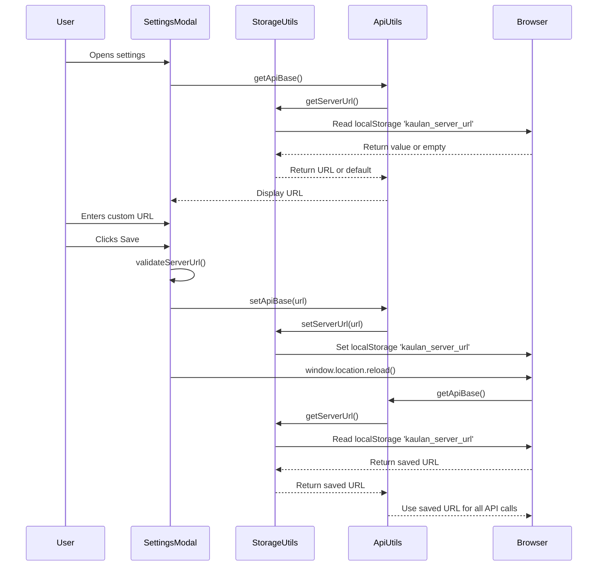

# Configurable Server URL

## Overview

The configurable server URL feature allows users to specify a custom backend server address through the settings panel. This is useful for:

- Connecting to a remote server instead of localhost
- Development environments with different backend addresses
- Testing against staging/production servers

The server URL is saved to browser localStorage and persists across page reloads.

## User Instructions

### Setting a Custom Server URL

1. Open the Settings panel (齿轮 icon)
2. Scroll to the "服务器地址" (Server Address) section
3. Enter one of these forms:
   - `192.168.1.23` or `music-box.local`
   - `192.168.1.23:3090` or `music-box.local:3090`
   - Full HTTP/HTTPS URL such as `http://your-server:port/api`
4. Click "保存地址" (Save Address)
5. The page will reload and connect to your custom server

### Resetting to Default

1. Open the Settings panel
2. In the Server Address section, click "重置为默认" (Reset to Default)
3. Confirm the reset
4. The page will reload and connect to `http://localhost:2080/api`

## Validation Behavior

The URL input validates the format as you type:

- **Empty input**: Allowed and falls back to the default server URL
- **IP or domain without protocol**: Converted to `http://host:2080/api`
- **IP or domain with port**: Converted to `http://host:port/api`
- **Full HTTP/HTTPS URL**: Preserved and normalized to end with `/api`
- **Non-HTTP/HTTPS protocol**: Shows an error
- **Missing host or malformed value**: Shows an error

## Technical Details

### Data Flow



### LocalStorage

| Property | Value |
|----------|-------|
| Storage Key | `kaulan_server_url` |
| Expiration | Persistent (until cleared by user) |
| Storage | Browser localStorage |

### File Structure

```
frontend/src/
├── utils/
│   ├── api.ts           # Dynamic API base with localStorage support
│   ├── storage.ts       # LocalStorage operations
│   └── validation.ts    # URL validation logic
├── components/modals/
│   └── SettingsModal.vue   # UI for server URL configuration
└── composables/
    ├── useAudioPlayer.ts    # Uses getApiBase()
    └── usePlaylist.ts       # Uses getApiBase()
```

### API Changes

All API consumers now use `getApiBase()` instead of the static `API_BASE` constant:

**Before:**
```typescript
import { API_BASE } from '@/utils/api'
const response = await fetch(`${API_BASE}/music`)
```

**After:**
```typescript
import { getApiBase } from '@/utils/api'
const response = await fetch(`${getApiBase()}/music`)
```

### Related Source Files

- `frontend/src/utils/api.ts` - API base URL configuration
- `frontend/src/utils/storage.ts` - LocalStorage operations
- `frontend/src/utils/validation.ts` - URL validation
- `frontend/src/components/modals/SettingsModal.vue` - Settings UI
- `frontend/src/composables/useAudioPlayer.ts` - Audio player API calls
- `frontend/src/composables/usePlaylist.ts` - Playlist API calls
- `frontend/src/components/modals/UploadModal.vue` - Upload API calls
- `frontend/src/views/Home.vue` - Home API calls
- `frontend/src/views/Library.vue` - Library API calls
- `frontend/src/views/Playlists.vue` - Playlists API calls

## Android Cleartext Traffic

To support HTTP URLs (not just HTTPS) on Android, the network security configuration has been updated:

**File:** `frontend/src-tauri/gen/android/app/src/main/res/xml/network_security_config.xml`

The `base-config` now has `cleartextTrafficPermitted="true"` to allow HTTP traffic to any domain.

**Security Note:** This configuration allows cleartext HTTP traffic to all domains. For production releases, consider restricting this to specific domains or enforcing HTTPS.

## Default URL

- **Default**: `http://localhost:2080/api`
- **Fallback**: If no localStorage value is set, uses default automatically

## API Endpoints

All API endpoints are relative to the configured base URL:

- `GET /api/music` - Get all music
- `GET /api/music/{filename}` - Stream audio
- `GET /api/playlists` - Get playlists
- `GET /api/collections` - Get collections
- `POST /api/collections` - Create collection
- etc.
