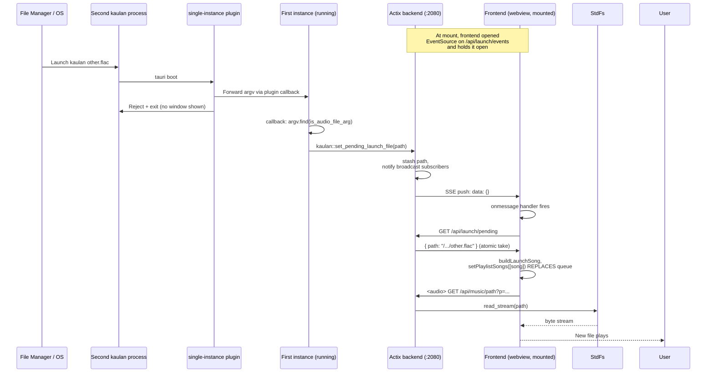
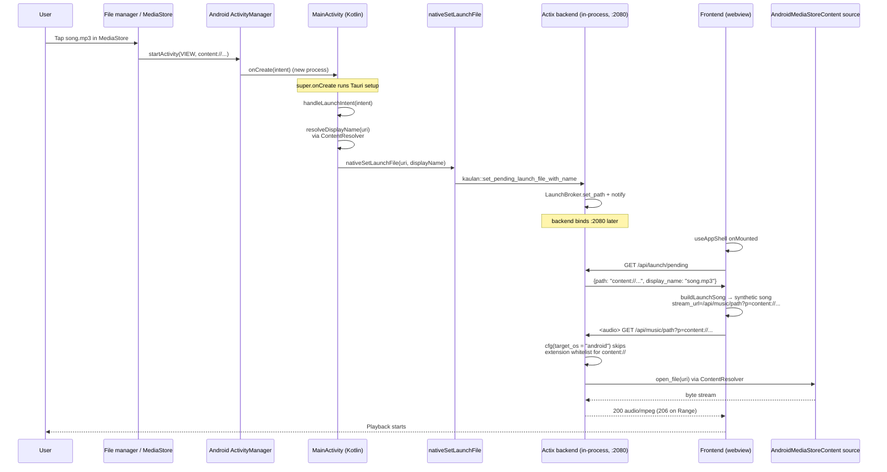
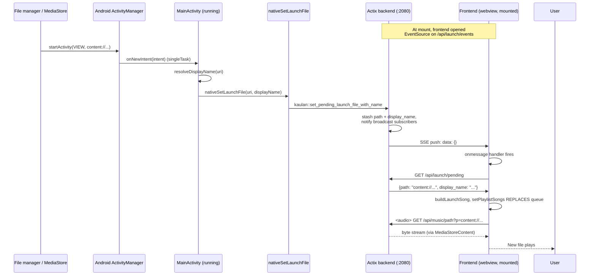

# Default Music App Integration (Linux + Windows + Android)

How Kaulan registers itself as a handler for audio files on Linux, Windows,
and Android, how an OS-launched file reaches playback, and how to set Kaulan
as the system default.

Related source:

- Backend handlers: [`backend/src/handlers/launch.rs`](../backend/src/handlers/launch.rs),
  [`backend/src/handlers/music.rs`](../backend/src/handlers/music.rs) (`get_music_by_path`,
  `build_audio_stream_response`)
- Backend launch broker: [`backend/src/lib.rs`](../backend/src/lib.rs) (`LaunchBroker`,
  `set_pending_launch_file`, `set_pending_launch_file_with_name`, `launch_broker`)
- Server wiring: [`backend/src/server/mod.rs`](../backend/src/server/mod.rs)
- Tauri shell (desktop): [`frontend/src-tauri/src/lib.rs`](../frontend/src-tauri/src/lib.rs)
  (single-instance plugin, cold-start argv capture, Android JNI bridge
  `Java_afeather_kaulan_MainActivity_nativeSetLaunchFile`)
- Tauri config: [`frontend/src-tauri/tauri.conf.json`](../frontend/src-tauri/tauri.conf.json)
  (`bundle.fileAssociations`)
- Android shell: [`frontend/src-tauri/gen/android/app/src/main/AndroidManifest.xml`](../frontend/src-tauri/gen/android/app/src/main/AndroidManifest.xml)
  (VIEW intent-filter), [`frontend/src-tauri/gen/android/app/src/main/java/afeather/kaulan/MainActivity.kt`](../frontend/src-tauri/gen/android/app/src/main/java/afeather/kaulan/MainActivity.kt)
  (`handleLaunchIntent`, `resolveDisplayName`)
- Frontend consumer: [`frontend/src/utils/launchFile.ts`](../frontend/src/utils/launchFile.ts),
  [`frontend/src/composables/useAppShell.ts`](../frontend/src/composables/useAppShell.ts)
  (`openLaunchFilePlayer`)

## File Association Registration

Kaulan's `tauri.conf.json` declares `bundle.fileAssociations` for the audio
formats it can play. Tauri's bundler propagates these to OS-specific
registration entries at install time:

- **Linux** — the generated `.desktop` file (installed under
  `/usr/share/applications/afeather.kaulan.desktop`) carries a `MimeType=`
  line listing the registered MIME types. The desktop environment uses this
  to populate the "Open With" menu.
- **Windows** — the MSI/NSIS installer writes `HKCR\.mp3 → Kaulan.Audio` (and
  equivalents for each extension) plus `HKCR\Kaulan.Audio\shell\open\command`
  pointing at the installed executable with `%1` as the file argument.
- **Android** — `bundle.fileAssociations` is **not** propagated to the Android
  manifest by Tauri's bundler. Kaulan declares the VIEW intent-filter by hand
  in [`frontend/src-tauri/gen/android/app/src/main/AndroidManifest.xml`](../frontend/src-tauri/gen/android/app/src/main/AndroidManifest.xml),
  matching any `content://` or `file://` URI with an `audio/*` MIME type.
  Tauri's `fileAssociations` entry is still required so the desktop bundles
  keep working; Android just reads its own manifest.

Currently registered formats: `mp3`, `flac`, `wav`, `ogg`/`oga`, `opus`,
`m4a`, `aac`.

Registering as a handler is **not** the same as being the default. The user
must explicitly choose Kaulan as the default via their OS settings.

## Setting Kaulan as the Default

### Linux

```bash
# Per-user (no root needed)
xdg-mime default afeather.kaulan.desktop \
    audio/mpeg audio/flac audio/wav audio/ogg audio/opus audio/mp4 audio/aac

# Verify
xdg-mime query default audio/mpeg
# → afeather.kaulan.desktop
```

Or via the file manager: right-click a `.mp3` → Properties → Open With →
Kaulan → "Set as default".

### Windows

Settings → Apps → Default apps → "Choose default apps by file type" → select
`.mp3` → Kaulan. Or right-click a `.mp3` → "Open with" → "Choose another
app" → Kaulan → "Always use this app".

### Android

Settings → Apps → Default apps → "Opening links" (or "Default apps for file
types" on Android 13+) → Kaulan → tap any supported audio MIME type →
"Open supported links" on. Or, the first time you tap an audio file in Files
or a file manager, Android pops an "Open with" chooser — pick Kaulan and
tap "Always".

## Launch Handoff Flow

Two runtime cases feed the same backend broker:

### Cold start (app not running)

```mermaid
sequenceDiagram
    participant User
    participant FM as File Manager / OS
    participant Tauri as Tauri shell (lib.rs)
    participant BE as Actix backend (in-process, :2080)
    participant FE as Frontend (webview)
    participant FS as StdFs source

    User->>FM: Double-click song.mp3
    FM->>Tauri: Launch kaulan song.mp3 (argv[1]=path)
    Note over Tauri: .setup hook runs
    Tauri->>Tauri: argv.find(is_audio_file_arg) → path
    Tauri->>Tauri: set env KAULAN_LAUNCH_FILE=path
    Tauri->>BE: start_backend() (spawn thread)
    BE->>BE: start_server() reads KAULAN_LAUNCH_FILE,<br/>calls set_pending_launch_file(path)
    BE->>BE: bind :2080
    Tauri->>FE: open webview, load index.html
    FE->>FE: useAppShell onMounted
    FE->>BE: GET /api/launch/pending
    BE->>FE: { path: "/.../song.mp3" } (atomic take)
    FE->>FE: buildLaunchSong → synthetic song<br/>stream_url=/api/music/path?p=...<br/>lyrics_url=/api/lyrics/path?p=...<br/>cover_url=/api/music/path/cover?p=...
    FE->>FE: setPlaylistSongs([song]);<br/>playSongFromPlaylist(song, [song], 0)
    FE->>BE: <audio> GET /api/music/path?p=...
    BE->>BE: extension whitelist check ✓
    BE->>FS: read_stream(path, 1MB chunks)
    FS-->>BE: byte stream
    BE-->>FE: 200 audio/mpeg (206 on Range)
    FE->>BE: GET /api/lyrics/path?p=... (lyric composable)
    FE->>BE: GET /api/music/path/cover?p=... (cover art)
    FE-->>User: Playback starts with lyric panel + cover
```

### Warm start (app already running)



### Why two seeding paths

- **Cold start** uses an env var (`KAULAN_LAUNCH_FILE`) because the backend
  starts *after* the Tauri `.setup` hook. Setting the env var before
  `start_backend()` lets the backend drain it synchronously on boot, avoiding
  any race with the frontend's first GET.
- **Warm start** calls `kaulan::set_pending_launch_file(path)` directly from
  the single-instance plugin callback. The backend is already running in the
  same process, so no HTTP retry is needed.

Both paths land in the same `LaunchBroker` singleton at the backend crate
root. `GET /api/launch/pending` atomically takes from it — the frontend
doesn't care which path seeded it.

### Why SSE (not polling)

The frontend opens an `EventSource` on `/api/launch/events` at mount time and
holds it open for the page lifetime. When a warm-start launch arrives, the
backend's broadcast channel delivers a push within milliseconds. The browser
auto-reconnects on disconnect, so we don't need to handle reconnection.

Cold-start seeds (which happened *before* the SSE connection opened) are
caught by a one-shot `GET /api/launch/pending` immediately after mount.

## Android Launch Flow

Android uses the *same* backend broker and frontend consumer as desktop, but
the path that seeds the broker is different. Instead of `argv` and the
single-instance plugin, Android uses Intents + JNI.

Two runtime cases (mirroring desktop):

### Cold start (app not running)



### Warm start (app already running)



### Why a separate `set_pending_launch_file_with_name`

- **Desktop** seeds just a path — the path itself ends in a filename the
  frontend can derive via `filenameFromPath`.
- **Android** seeds a `content://` URI whose last path segment is a numeric
  MediaStore id. The frontend can't derive a useful name from it, so
  `MainActivity` queries ContentResolver's `OpenableColumns.DISPLAY_NAME`
  and forwards the friendly filename alongside the URI. The broker stores
  both; `/api/launch/pending` returns `{path, display_name}` and the
  frontend's `buildLaunchSong` prefers `display_name` when present.

### Why `singleTask` launch mode matters

`AndroidManifest.xml` sets `android:launchMode="singleTask"` on
`MainActivity`. This makes Android route new VIEW intents to the existing
activity (firing `onNewIntent`) instead of stacking new instances. Without
it, warm-start launches would create a new Kaulan activity on top of the
running one — the backend would still play (single process), but the user
would see a duplicate UI and the old activity's SSE would never receive the
new launch event.

### `content://` URI permissions

When Android launches Kaulan via `startActivity(VIEW, content://...)`, the
Intent carries `FLAG_GRANT_READ_URI_PERMISSION`. This grants the Kaulan
process temporary read access to that specific URI — even if the URI is owned
by another app's FileProvider. The permission persists for the life of the
Kaulan process (or until explicitly released). The `AndroidMediaStoreContent`
file-op source opens the URI via `ContentResolver.openFileDescriptor`, which
enforces this permission — Kaulan cannot read URIs it never received via an
Intent.

## Backend Endpoints

### `GET /api/launch/pending`

Atomically take (clear) the stashed launch file path.

Response: `{ "path": "/abs/path/to.mp3" }` if pending, or
`{ "path": null }` otherwise. Either way the stash is cleared — the frontend
gets exactly one shot at each pending launch.

### `GET /api/launch/events`

Server-Sent Events stream. Pushes `data: {}\n\n` on every
`set_pending_launch_file` call (one per warm-start launch). An initial
`: connected` comment is emitted so the browser sees a 200 immediately.

The browser's `EventSource` API auto-reconnects on disconnect.

### `GET /api/music/path?p={url-encoded absolute path}`

Stream an arbitrary filesystem audio file by absolute path. Used by the
launch handoff to play files that aren't in the `music` DB table (the
user's downloads folder, USB mounts, etc.). Supports the same `position` /
`Range` seek behavior as `/api/music/id/{id}`.

**Security**: gated by an extension whitelist (`mp3, ogg, wav, aac, flac,
m4a, opus, mka`) and rejects `content://` URIs. Without the extension guard,
any local process could read arbitrary files via `?p=/etc/passwd`. With it,
the surface is limited to audio files the user could already open from their
file manager.

The endpoint is local-only by convention (port 2080, no auth) — same trust
boundary as the existing `/api/music/{filename}` endpoint.

### `GET /api/music/path/cover?p={url-encoded absolute path}`

Extract embedded cover art for an arbitrary filesystem audio path. Mirrors
`/api/music/id/{id}/cover` but resolves the source by path instead of DB
lookup. Used by the launch handoff so the click-open player shows the same
cover art as regular playlist playback.

Same security gating as `/api/music/path` (extension whitelist on desktop,
accept `content://` URIs on Android). Returns `404` when the file has no
embedded cover art — the frontend treats this as "no cover" and falls back
to the placeholder.

### `GET /api/lyrics/path?p={url-encoded absolute path}`

Stream a sidecar lyric file (`.lrc` preferred, `.vtt` fallback) for an
arbitrary filesystem audio path. Same lookup rules as the DB-backed
`/api/lyrics/id/{id}` — the handler derives `song.lrc` / `song.vtt`
candidate paths from the audio filename and serves the first one that
exists. Used by the launch handoff so a double-clicked file picks up
same-directory lyric sidecars without a DB row.

Same security gating as `/api/music/path` (extension whitelist, rejects
`content://` URIs on every platform — Android MediaStore URIs don't carry
a sibling filename the sidecar resolver can use). Returns `404` when no
sidecar exists — the frontend lyric composable treats this as "no lyrics"
without surfacing an error.

## Testing on Linux

End-to-end smoke test after `npm run tauri build`:

```bash
# 1. Confirm the .desktop file picked up the MIME types
grep "^MimeType" <path-to-installed>/share/applications/afeather.kaulan.desktop

# 2. Set Kaulan as default for audio/mpeg
xdg-mime default afeather.kaulan.desktop \
    audio/mpeg audio/flac audio/wav audio/ogg audio/opus audio/mp4 audio/aac

# 3. Cold start (app not running)
xdg-open /path/to/test.mp3
# → Kaulan launches and auto-plays (or shows the "click to play" prompt if
#   the browser blocks autoplay).

# 4. Warm start (app already running)
xdg-open /path/to/other.flac
# → No second window; current song switches within ~1s.

# 5. Security
curl 'http://localhost:2080/api/music/path?p=/etc/passwd'
# → HTTP 400 (extension whitelist)
```

## Testing on Windows

End-to-end smoke test after installing the MSI or NSIS bundle produced by
`npm run tauri build`. The installer writes the file-association registry
entries; running the raw `.exe` from `target/` will **not** register them.

```powershell
# 1. Confirm the installer wrote the ProgID + shell/open/command entries.
#    First find the ProgID Kaulan registered — Tauri derives it from the
#    bundle identifier (afeather.kaulan), so try that directly.
reg query "HKCU\Software\Classes\afeather.kaulan\shell\open\command"
#    → (Default) REG_SZ "C:\...\kaulan.exe" "%1"

#    Or start from the extension and walk to the ProgID:
reg query "HKCU\Software\Classes\.mp3" /ve
#    → (Default) REG_SZ <ProgID>  (if Kaulan is the user's default for .mp3)
#    If another app owns .mp3, the ProgID entry above is still present
#    under HKCU\Software\Classes\<ProgID> so "Open with" works.

# 2. Cold start (app not running)
Start-Process "$env:USERPROFILE\Music\test.mp3"
# → Kaulan launches and auto-plays (or shows the "click to play" prompt if
#   the browser blocks autoplay).

# 3. Warm start (app already running)
Start-Process "$env:USERPROFILE\Music\other.flac"
# → No second window; current song switches within ~1s. The second instance
#   exits after forwarding argv to the running one via the single-instance
#   plugin (named-pipe based on Windows).

# 4. Security
curl "http://localhost:2080/api/music/path?p=$env:WINDIR/win.ini"
# → HTTP 400 (extension whitelist)
```

To make Kaulan the **default** for a file type (rather than just an "Open with"
option), use one of:

- **Settings UI**: Settings → Apps → Default apps → "Choose default apps by
  file type" → select `.mp3` → Kaulan.
- **`cmd.exe`**: `assoc .mp3=<ProgID>` where `<ProgID>` is the value found in
  step 1 above (e.g., `afeather.kaulan`). Run as the user; no admin needed
  for per-user associations. Verify with `assoc .mp3` and
  `ftype <ProgID>`.

## Testing on Android

End-to-end smoke test after `./build-android.sh --target aarch64` (or
`build-android.bat --target aarch64` on Windows). The build stages FFmpeg and
signs the APK; see [`build-android.sh`](../build-android.sh) /
[`build-android.bat`](../build-android.bat) and
[`docs/ffmpeg-audio-pipeline.md`](ffmpeg-audio-pipeline.md) for prerequisites.

```bash
# 0. Install the built APK on a physical device (emulator won't cut it for
#    real file-manager launches — most emulators have no audio files staged).
adb install -r frontend/src-tauri/gen/android/app/build/outputs/apk/universal/release/app-universal-release.apk

# 1. Cold start (Kaulan not running). Tap an audio file in Files or send an
#    Intent via adb:
adb shell am start -a android.intent.action.VIEW \
    -d "content://media/external/audio/media/42" \
    -t "audio/*" \
    -n afeather.kaulan/.MainActivity
# → Kaulan launches and auto-plays (or shows the "click to play" prompt if
#   the webview blocks autoplay).

# 2. Warm start (Kaulan already running). Send another Intent — onNewIntent
#    fires, the SSE pushes, and the current song switches without a new UI:
adb shell am start -a android.intent.action.VIEW \
    -d "content://media/external/audio/media/43" \
    -t "audio/*" \
    -n afeather.kaulan/.MainActivity

# 3. Backend logs (for verifying nativeSetLaunchFile forwarded the URI):
adb logcat -s KaulanLaunch:* RustW:* stdout

# 4. Security: content:// is only accepted on Android. From the device:
adb shell curl 'http://localhost:2080/api/music/path?p=content://media/external/audio/media/42'
# → streams audio. From desktop over adb forward:
#   adb forward tcp:2080 tcp:2080
#   curl 'http://localhost:2080/api/music/path?p=content://...' also works,
#   proving the file_ops layer dispatches content:// to the MediaStore source.
```

To verify the intent-filter registered at install time:

```bash
adb shell dumpsys package afeather.kaulan | grep -A20 'android.intent.action.VIEW'
# → two VIEW intent-filters (content+file schemes with audio/* MIME)
```

Backend unit tests live in [`backend/src/handlers/launch.rs`](../backend/src/handlers/launch.rs)
and [`backend/src/handlers/music.rs`](../backend/src/handlers/music.rs) — run
with `cd backend && cargo test`.
