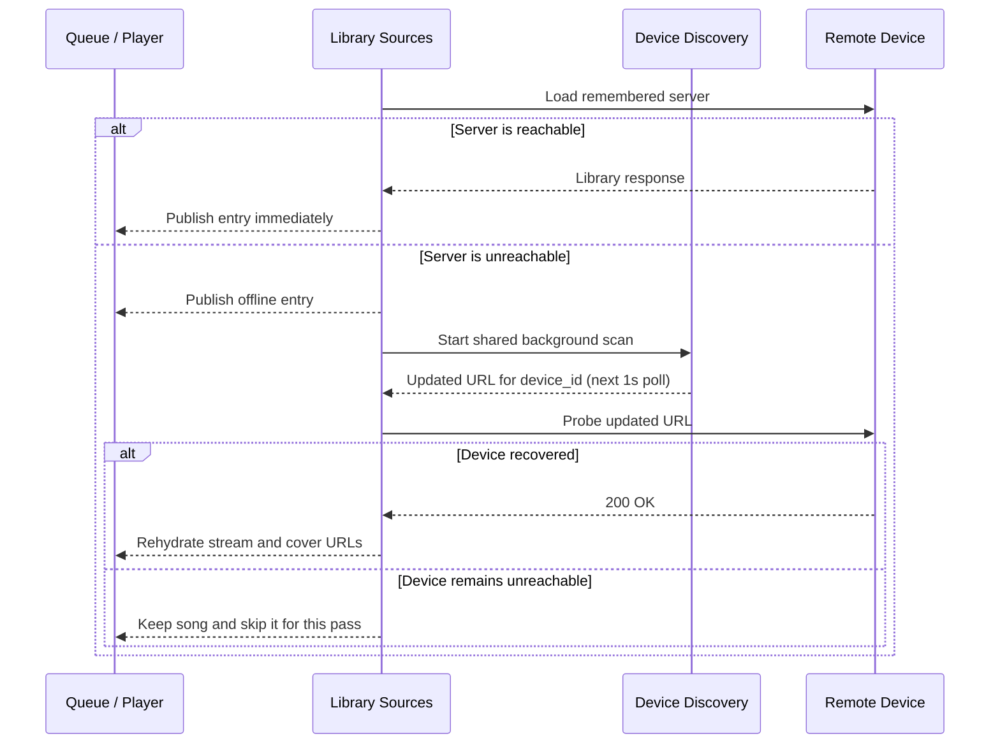
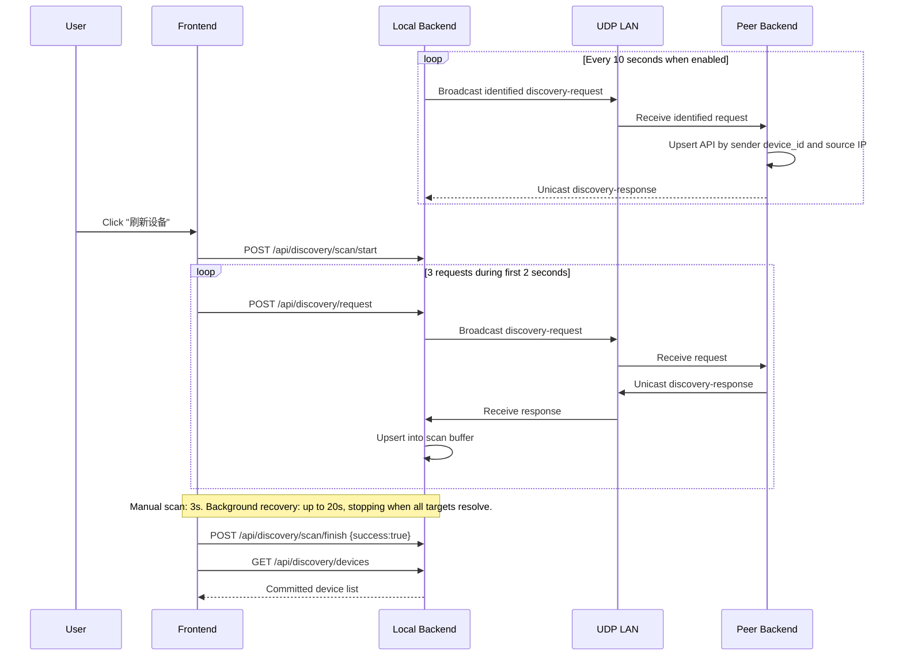

# Device Discovery

## Overview

Kaulan uses identified UDP requests for on-demand scans and optional periodic
local-network announcements.

Discovery runs in these cases:

- during startup or playback recovery only when a saved manual-device URL is
  unreachable
- when the **添加设备** sheet opens
- when the user presses **刷新** in the nearby-device section

Periodic discovery is enabled by default and can be disabled under
**设置 → 设备与来源 → 定期发现附近设备** to reduce background battery use.
Disabling it does not close the UDP listener or disable manual refresh.

For the local device name, backend uses this fallback order:

1. Saved `device_name` from config
2. Hostname, when it is not a generic value such as `localhost`
3. Generated fallback `Kaulan Player <short-device-id>`

## Protocol (Kaulan Discovery Protocol v1.1)

- Transport: UDP IPv4 on port `2082`
- Request target: broadcast `255.255.255.255:2082`
- Response target: unicast back to requester source address/port
- Payload: JSON UTF-8, max 1024 bytes

### Message Types

#### Discovery Request

```json
{
  "type": "kaulan-discovery-request",
  "version": "1.1",
  "device_id": "550e8400-e29b-41d4-a716-446655440000",
  "device_name": "Living Room Player",
  "api_port": 2080,
  "timestamp": 1678912345678
}
```

#### Discovery Response

```json
{
  "type": "kaulan-discovery-response",
  "version": "1.1",
  "device_id": "550e8400-e29b-41d4-a716-446655440000",
  "device_name": "Living Room Player",
  "api_port": 2080,
  "timestamp": 1678912345678
}
```

## Scan Behavior

Every 10 seconds, an enabled backend broadcasts an identified request. A peer
records the requester using the UDP source IP and request metadata, then sends
the normal unicast response. This bidirectional behavior supports router-hosted
servers whose own broadcast packets cannot enter the LAN. Anonymous requests
from older Kaulan versions remain supported.

Passively discovered devices are updated by stable `device_id` when their IP
changes. When an explicit scan commits, devices seen within the previous 30
seconds are merged into the scan result. This grace period prevents a healthy
device from disappearing because of a brief packet loss. Older devices absent from the scan are removed,
and failed scans restore the complete prior list.

> **Note:** a successful scan that finds zero responders still retains peers
> seen within the 30-second grace window — the grace merge is unconditional.
> "Empty result" therefore does **not** mean "clear the list"; only peers whose
> `last_seen` is older than the grace period (or a failed scan rollback) can
> remove entries.

When discovery refresh runs:

1. Frontend calls `POST /api/discovery/scan/start`
2. Frontend sends up to three `POST /api/discovery/request` calls during the first two seconds
3. Frontend polls `GET /api/discovery/devices` every second; during an active scan this returns fresh scan-buffer observations
4. A manual UI scan lasts three seconds and updates the visible list after every poll
5. Background startup/playback recovery may remain open for up to 20 seconds, but resolves each target immediately and stops early when every failed `device_id` is found
6. Frontend calls `POST /api/discovery/scan/finish` with `{ "success": true }`; backend commits the scan and retains devices seen in the 30-second grace period
7. Frontend reconciles saved manual devices by `device_id` when possible, updating stored API URLs if the device IP changed

If scan fails, frontend calls `POST /api/discovery/scan/finish` with `{ "success": false }` and backend rolls back to pre-scan list.

## Device-keyed song persistence and lazy recovery

Collection and playback-queue entries use the stable source identity rather
than the source URL. The persisted song shape is:

```json
{
  "device_id": "550e8400-e29b-41d4-a716-446655440000",
  "song_id": 42,
  "filename": "Artist - Song.flac"
}
```

Optional display metadata such as `name`, `lufs`, and `mediaType` may also be
stored. Runtime-only fields including `source_key`, `stream_url`, and
`cover_url` are never persisted. The frontend resolves the current API base by
`device_id` and rebuilds those URLs when sources load or change. This keeps
collections and queues valid when DHCP assigns a device a different IP.

Startup source loading and playback address resolution are lazy:

1. Create a loading entry for every remembered server and query all servers concurrently.
2. Publish each entry as soon as that server responds; reachable servers never wait for discovery or another server.
3. A successful remembered-address probe publishes the verified `device_id -> api_url` mark to the localhost backend.
4. If any remembered server fails, start one shared discovery scan in the background, with a maximum 20-second window. Simultaneous failures join the same scan.
5. Discovery observations update the same in-memory resolution map immediately, without waiting for the scan to finish.
6. Playback resolves a device from localhost when starting each song. A missing mark is skipped immediately; discovery is never started by playback.
7. Skipped songs remain in the queue and become eligible after a later manual refresh resolves their device.



## Settings UI

- Device list always includes `localhost(self)` (`http://localhost:2080/api`), so users can switch back to local server quickly.
- The Add Device sheet triggers a nearby-device refresh when it opens, so users see current LAN devices instead of only the last committed scan result.
- Manual address input accepts:
  - IP or domain name, which is normalized to `http://host:2080/api`
  - IP or domain name with port, which is normalized to `http://host:port/api`
  - Full HTTP/HTTPS URL, which is normalized to end with `/api`
- Manual address input is required in the Add Device flow. Empty input is rejected instead of falling back to localhost.
- Nearby-device entries are identity-based (`device_id`). If a known device gets a new IP address, discovery can update the saved manual source URL to the new `api_url`.
- Manual address save stores the current `device_id` when the target server responds to `/discovery/self`.
- Non-local manual sources can be removed from the source `⋮` menu. The localhost source is permanent and cannot be deleted.
- In the device list, `last seen` and manual remove action are shown on the same row as the device name, while long API URLs wrap inside the card instead of overflowing.
- The library source page resolves each configured server independently. `localhost` can appear immediately while slow or dead manual servers continue in parallel and fall back to `Offline` after a short request timeout.
- Offline sources stay visible in the library source card list, so users can see the saved server and tap `重试` directly on that card after the source times out or becomes unreachable.

## API Endpoints

### `GET /api/discovery/devices`
Return committed discovered devices list.

### `GET /api/discovery/self`
Return current server's `device_id` and `device_name`.

### `GET /api/discovery/resolutions/{device_id}`

Return the session-only verified API address for a device. When startup probing
or discovery has not resolved the ID, the local server address
(`http://localhost:<api-port>/api`) is returned so webview playback can continue
using the local backend. This lookup does not start discovery.

### `PUT /api/discovery/resolutions/{device_id}`

Publish an address already verified through the target server's
`/api/discovery/self` endpoint. Request body: `{ "api_url": "http://host:2080/api" }`.
The map is memory-only and is rebuilt on every backend startup.

### `GET /api/discovery/periodic`

Return `{ "enabled": true }` when periodic announcements are enabled.

### `PUT /api/discovery/periodic`

Enable or disable periodic announcements immediately and persist the setting.
Manual discovery remains available.

Request body:

```json
{ "enabled": false }
```

### `POST /api/discovery/name`
Set current server's device name.

### `POST /api/discovery/scan/start`
Start a new manual scan transaction.

### `POST /api/discovery/request`
Send one UDP discovery request packet.

### `POST /api/discovery/scan/finish`
Commit or rollback scan transaction.

Request body:

```json
{ "success": true }
```

## Sequence Diagram



## Implementation Files

- `backend/src/discovery/types.rs`
- `backend/src/discovery/discovery.rs`
- `backend/src/handlers/discovery.rs`
- `frontend/src/composables/useDeviceDiscovery.ts`
- `frontend/src/composables/useLibrarySources.ts`
- `frontend/src/composables/useAudioPlayer.ts`
- `frontend/src/utils/songRestore.ts`
- `frontend/src/components/modals/SettingsModal.vue`
