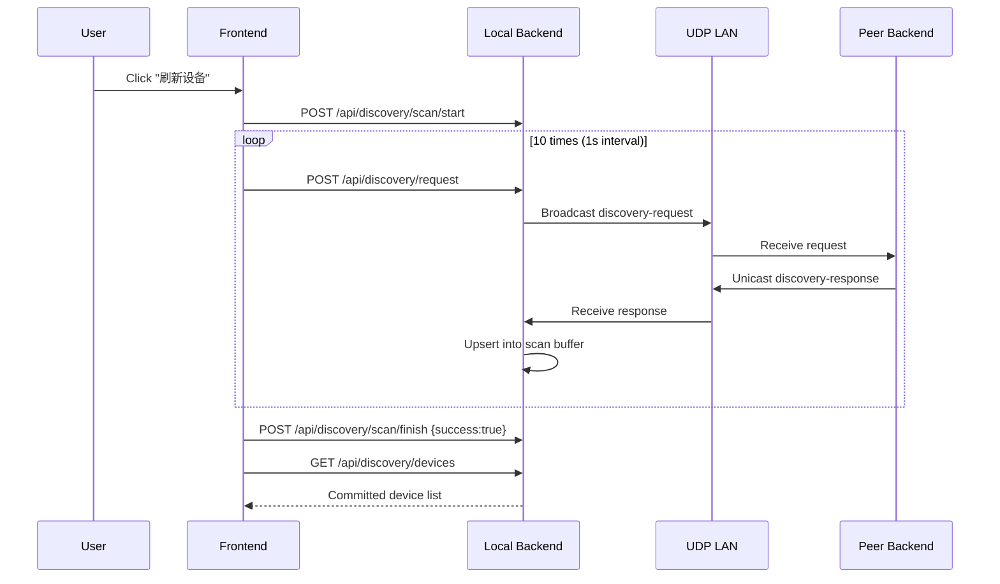

# Device Discovery

## Overview

Kaulan uses an on-demand local-network discovery protocol.

Discovery runs in these cases:

- during app startup, before library sources are refreshed
- when the **添加设备** sheet opens
- when the user presses **刷新** in the nearby-device section

There is no timer-based periodic discovery loop after startup.

For the local device name, backend uses this fallback order:

1. Saved `device_name` from config
2. Hostname, when it is not a generic value such as `localhost`
3. Generated fallback `Kaulan Player <short-device-id>`

## Protocol (Kaulan Discovery Protocol v1.1)

- Transport: UDP IPv4 on port `2082`
- Request target: broadcast `255.255.255.255:2082`
- Response target: unicast back to requester source address/port
- Payload: JSON UTF-8, max 1024 bytes

### Message Types

#### Discovery Request

```json
{
  "type": "kaulan-discovery-request",
  "version": "1.1",
  "timestamp": 1678912345678
}
```

#### Discovery Response

```json
{
  "type": "kaulan-discovery-response",
  "version": "1.1",
  "device_id": "550e8400-e29b-41d4-a716-446655440000",
  "device_name": "Living Room Player",
  "api_port": 2080,
  "timestamp": 1678912345678
}
```

## Scan Behavior

When discovery refresh runs:

1. Frontend calls `POST /api/discovery/scan/start`
2. Frontend calls `POST /api/discovery/request` every 1 second during the scan window
3. Backend listener receives unicast responses and stores them in scan buffer
4. Frontend calls `POST /api/discovery/scan/finish` with `{ "success": true }`
5. Frontend calls `GET /api/discovery/devices` to render final results
6. Frontend reconciles saved manual devices by `device_id` when possible, updating stored API URLs if the device IP changed

If scan fails, frontend calls `POST /api/discovery/scan/finish` with `{ "success": false }` and backend rolls back to pre-scan list.

## Settings UI

- Device list always includes `localhost(self)` (`http://localhost:2080/api`), so users can switch back to local server quickly.
- The Add Device sheet triggers a nearby-device refresh when it opens, so users see current LAN devices instead of only the last committed scan result.
- Manual address input accepts:
  - IP or domain name, which is normalized to `http://host:2080/api`
  - IP or domain name with port, which is normalized to `http://host:port/api`
  - Full HTTP/HTTPS URL, which is normalized to end with `/api`
- Manual address input is required in the Add Device flow. Empty input is rejected instead of falling back to localhost.
- Nearby-device entries are identity-based (`device_id`). If a known device gets a new IP address, discovery can update the saved manual source URL to the new `api_url`.
- Manual address save stores the current `device_id` when the target server responds to `/discovery/self`.
- Non-local manual sources can be removed from the source `⋮` menu. The localhost source is permanent and cannot be deleted.
- In the device list, `last seen` and manual remove action are shown on the same row as the device name, while long API URLs wrap inside the card instead of overflowing.
- The library source page resolves each configured server independently. `localhost` can appear immediately while slow or dead manual servers continue in parallel and fall back to `Offline` after a short request timeout.

## API Endpoints

### `GET /api/discovery/devices`
Return committed discovered devices list.

### `GET /api/discovery/self`
Return current server's `device_id` and `device_name`.

### `POST /api/discovery/name`
Set current server's device name.

### `POST /api/discovery/scan/start`
Start a new manual scan transaction.

### `POST /api/discovery/request`
Send one UDP discovery request packet.

### `POST /api/discovery/scan/finish`
Commit or rollback scan transaction.

Request body:

```json
{ "success": true }
```

## Sequence Diagram



## Implementation Files

- `backend/src/discovery/types.rs`
- `backend/src/discovery/discovery.rs`
- `backend/src/handlers/discovery.rs`
- `frontend/src/composables/useDeviceDiscovery.ts`
- `frontend/src/components/modals/SettingsModal.vue`
