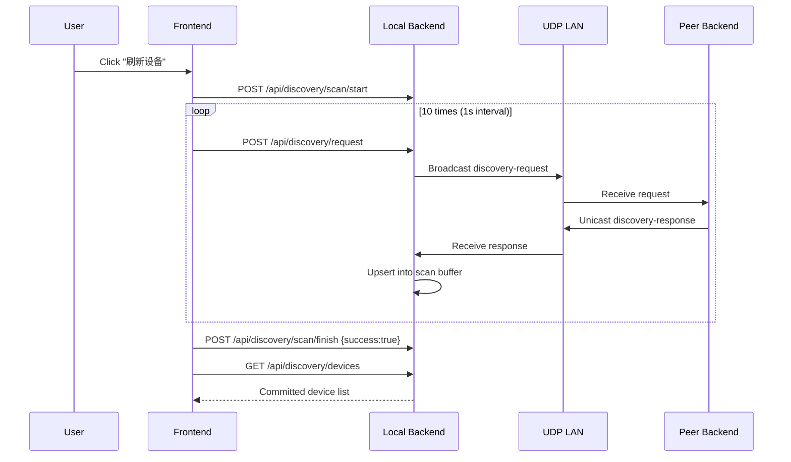

# Device Discovery

## Overview

Kaulan uses a manual local-network discovery protocol. Discovery only runs when the user presses **刷新设备** in Settings.

There is no timer-based periodic discovery.

For the local device name, backend uses this fallback order:

1. Saved `device_name` from config
2. Hostname, when it is not a generic value such as `localhost`
3. Generated fallback `Kaulan Player <short-device-id>`

## Protocol (Kaulan Discovery Protocol v1.1)

- Transport: UDP IPv4 on port `2082`
- Request target: broadcast `255.255.255.255:2082`
- Response target: unicast back to requester source address/port
- Payload: JSON UTF-8, max 1024 bytes

### Message Types

#### Discovery Request

```json
{
  "type": "kaulan-discovery-request",
  "version": "1.1",
  "timestamp": 1678912345678
}
```

#### Discovery Response

```json
{
  "type": "kaulan-discovery-response",
  "version": "1.1",
  "device_id": "550e8400-e29b-41d4-a716-446655440000",
  "device_name": "Living Room Player",
  "api_port": 2080,
  "timestamp": 1678912345678
}
```

## Scan Behavior

When user presses **刷新设备**:

1. Frontend calls `POST /api/discovery/scan/start`
2. Frontend calls `POST /api/discovery/request` every 1 second for 10 seconds
3. Backend listener receives unicast responses and stores them in scan buffer
4. Frontend calls `POST /api/discovery/scan/finish` with `{ "success": true }`
5. Frontend calls `GET /api/discovery/devices` to render final results

If scan fails, frontend calls `POST /api/discovery/scan/finish` with `{ "success": false }` and backend rolls back to pre-scan list.

## Settings UI

- Device list always includes `localhost(self)` (`http://localhost:2080/api`), so users can switch back to local server quickly.
- `手动指定地址` button is part of the device discovery section and opens a popup dialog for manual address input.
- Manual address input accepts:
  - IP or domain name, which is normalized to `http://host:2080/api`
  - IP or domain name with port, which is normalized to `http://host:port/api`
  - Full HTTP/HTTPS URL, which is normalized to end with `/api`
- Manual address save updates server URL and reloads the app to connect to that target.
- In the device list, `last seen` and manual remove action are shown on the same row as the device name, while long API URLs wrap inside the card instead of overflowing.

## API Endpoints

### `GET /api/discovery/devices`
Return committed discovered devices list.

### `GET /api/discovery/self`
Return current server's `device_id` and `device_name`.

### `POST /api/discovery/name`
Set current server's device name.

### `POST /api/discovery/scan/start`
Start a new manual scan transaction.

### `POST /api/discovery/request`
Send one UDP discovery request packet.

### `POST /api/discovery/scan/finish`
Commit or rollback scan transaction.

Request body:

```json
{ "success": true }
```

## Sequence Diagram



## Implementation Files

- `backend/src/discovery/types.rs`
- `backend/src/discovery/discovery.rs`
- `backend/src/handlers/discovery.rs`
- `frontend/src/composables/useDeviceDiscovery.ts`
- `frontend/src/components/modals/SettingsModal.vue`
