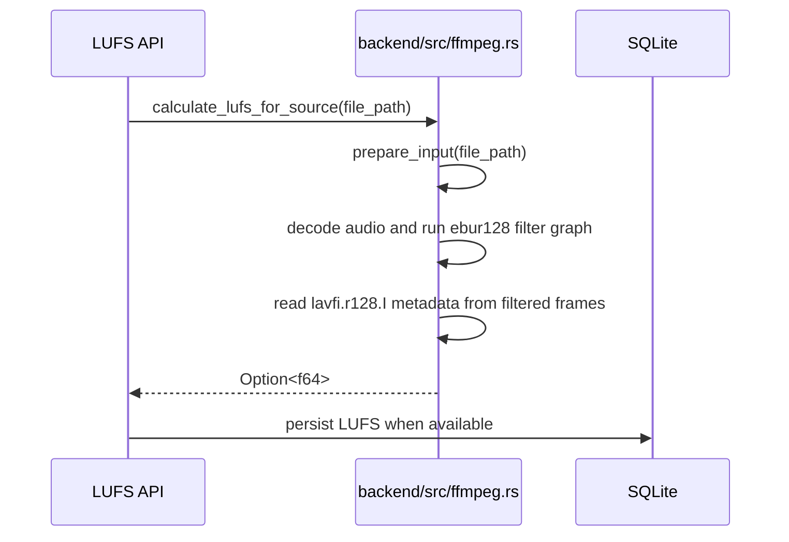
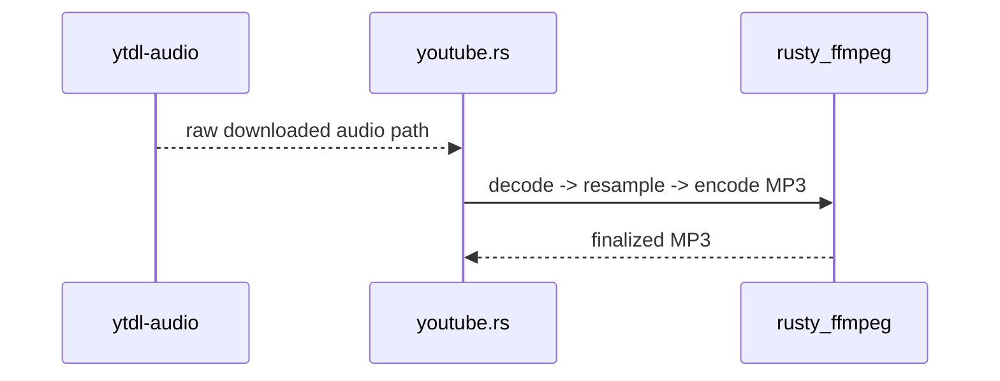

# FFmpeg Audio Pipeline

## Overview

Kaulan currently uses an in-process FFmpeg backend through vendored
[`rusty_ffmpeg`](../vendor/rusty_ffmpeg).

This pipeline currently covers:

- LUFS calculation through the `ebur128` filter
- YouTube preview/full-download audio transcoding to MP3
- Cover-art extraction for downloaded or scanned files
- Bilibili audio conversion through the vendored `bilibili-api` crate

The goal is to avoid codec gaps from decoder-specific Rust crates when Kaulan needs to handle provider output such as Opus-in-WebM or DASH audio containers.

## Backend Flow

### LUFS calculation

Related source files:

- [`backend/src/ffmpeg.rs`](../backend/src/ffmpeg.rs)
- [`backend/src/handlers/lufs.rs`](../backend/src/handlers/lufs.rs)
- [`backend/src/lufs_queue/mod.rs`](../backend/src/lufs_queue/mod.rs)

Sequence:



For non-filesystem sources such as Android `content://` URIs, Kaulan first materializes a temporary local file before opening it through the in-process FFmpeg pipeline.

### YouTube download finalization

Related source files:

- [`backend/src/services/download/youtube.rs`](../backend/src/services/download/youtube.rs)
- [`backend/src/ffmpeg.rs`](../backend/src/ffmpeg.rs)
- [`vendor/rusty_ffmpeg`](../vendor/rusty_ffmpeg)

Sequence:



Kaulan now requires a successful FFmpeg transcode for the YouTube path on desktop. It no longer preserves a provider container like `.webm` as a silent fallback when re-encoding fails.

### Bilibili download finalization

Related source files:

- [`backend/src/services/download/bilibili.rs`](../backend/src/services/download/bilibili.rs)
- [`vendor/ncmdump-rs/bilibili-api/src/download.rs`](../vendor/ncmdump-rs/bilibili-api/src/download.rs)

Desktop Bilibili downloads now remux the raw DASH AAC stream into an `.m4a` container with FFmpeg stream copy only (`-c:a copy`). Kaulan sets the output muxer explicitly instead of relying on the temporary file suffix, because the remux is written to a temporary path before being renamed into place. Android still keeps the raw `.m4s` container until FFmpeg is integrated into that runtime path.

## Runtime Requirements

- system FFmpeg libraries and headers must be installed for `rusty_ffmpeg`
- `pkg-config` metadata for FFmpeg must be available

Android builds use the staged FFmpeg bundle under
[`build/android-ffmpeg/android/<target>`](../build/android-ffmpeg/android)
instead of host `pkg-config`. The vendored `rusty_ffmpeg` build script
automatically picks that bundle when Cargo targets Android, using:

- `build/android-ffmpeg/android/<target>/lib` for linker search paths
- `build/android-ffmpeg/android/<target>/prefix/include` for FFmpeg headers
- `build/android-ffmpeg/android/binding.rs` as the prebuilt Rust bindings

On Arch Linux, the desktop build currently relies on:

```bash
sudo pacman -S --needed base-devel pkgconf ffmpeg clang
```

Desktop validation commands:

```bash
cd backend
cargo test
cargo check
```

## Notes

- The backend no longer depends on `lufsgen`, so Symphonia is removed from the backend media-analysis path.
- Desktop YouTube MP3 conversion now runs in-process through `rusty_ffmpeg`.
- LUFS calculation and cover-art probing now run in-process through `rusty_ffmpeg`, not by shelling out to `ffmpeg` or `ffprobe`.
- Online download cover-art embedding now also runs through the same in-process FFmpeg path, so YouTube, Netease, and Bilibili share one artwork muxer.
- OGG outputs are currently a documented exception: Kaulan still exports Opus/Vorbis downloads as `.ogg`, but the current attached-picture muxing path does not work for that container, so those files are expected to remain without embedded artwork.
- The next Android step is packaging or bundling FFmpeg in a way that works for the Tauri Android runtime.
