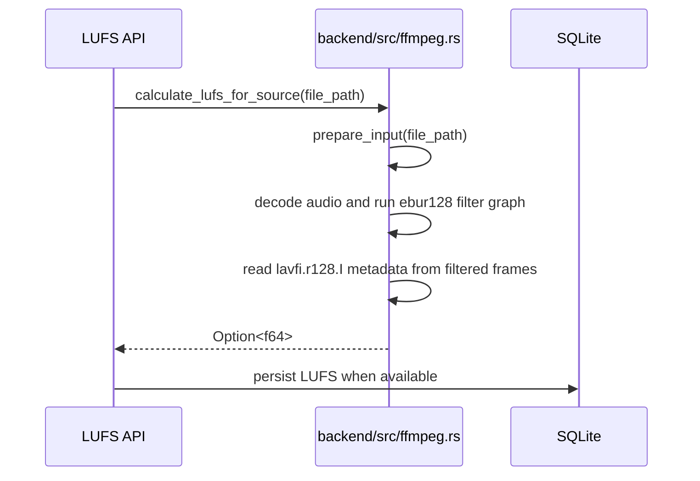
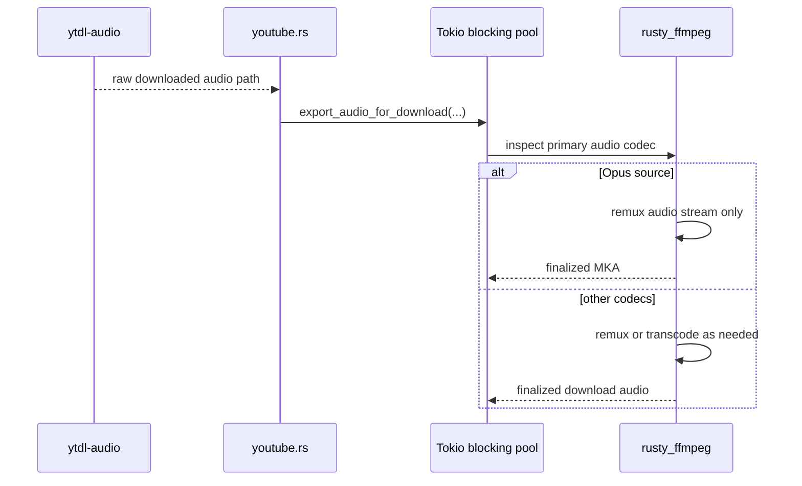

# FFmpeg Audio Pipeline

## Overview

Kaulan currently uses an in-process FFmpeg backend through vendored
[`rusty_ffmpeg`](../vendor/rusty_ffmpeg).

This pipeline currently covers:

- LUFS calculation through the `ebur128` filter
- YouTube preview/full-download audio finalization
- Cover-art extraction for downloaded or scanned files
- Bilibili audio conversion through the vendored `bilibili-api` crate

The goal is to avoid codec gaps from decoder-specific Rust crates when Kaulan needs to handle provider output such as Opus-in-WebM or DASH audio containers.

## Backend Flow

### LUFS calculation

Related source files:

- [`backend/src/ffmpeg.rs`](../backend/src/ffmpeg.rs)
- [`backend/src/handlers/lufs.rs`](../backend/src/handlers/lufs.rs)
- [`backend/src/lufs_queue/mod.rs`](../backend/src/lufs_queue/mod.rs)

Sequence:



For non-filesystem sources such as Android `content://` URIs, Kaulan first materializes a temporary local file before opening it through the in-process FFmpeg pipeline.

### YouTube download finalization

Related source files:

- [`backend/src/services/download/youtube.rs`](../backend/src/services/download/youtube.rs)
- [`backend/src/ffmpeg.rs`](../backend/src/ffmpeg.rs)
- [`vendor/rusty_ffmpeg`](../vendor/rusty_ffmpeg)

Sequence:



Kaulan now finalizes YouTube downloads through the shared FFmpeg export path on desktop. The FFmpeg work runs on Tokio's blocking pool so a long remux or transcode does not occupy an async executor worker. Opus source audio is remuxed into `.mka` with stream copy only, which preserves the original audio while allowing Kaulan to embed cover art. The backend does not preserve the raw provider container like `.webm` as a silent fallback.

### Bilibili download finalization

Related source files:

- [`backend/src/services/download/bilibili.rs`](../backend/src/services/download/bilibili.rs)
- [`vendor/ncmdump-rs/bilibili-api/src/download.rs`](../vendor/ncmdump-rs/bilibili-api/src/download.rs)

Desktop Bilibili downloads now remux the raw DASH AAC stream into an `.m4a` container with FFmpeg stream copy only (`-c:a copy`). Kaulan sets the output muxer explicitly instead of relying on the temporary file suffix, because the remux is written to a temporary path before being renamed into place. Android still keeps the raw `.m4s` container until FFmpeg is integrated into that runtime path.

## Runtime Requirements

- Linux desktop builds require system FFmpeg libraries and headers for `rusty_ffmpeg`
- Linux desktop builds require `pkg-config` metadata for FFmpeg
- Windows desktop builds use [`scripts/setup-windows-vcpkg.ps1`](../scripts/setup-windows-vcpkg.ps1) to install FFmpeg through `vcpkg`
- Windows desktop builds reuse the vendored [`vendor/rusty_ffmpeg/src/binding.rs`](../vendor/rusty_ffmpeg/src/binding.rs), so no separate LLVM or `libclang` install is required

Android builds use the staged FFmpeg bundle under
[`build/android-ffmpeg/android/<target>`](../build/android-ffmpeg/android)
instead of host `pkg-config`. The vendored `rusty_ffmpeg` build script
automatically picks that bundle when Cargo targets Android, using:

- `build/android-ffmpeg/android/<target>/lib` for linker search paths
- `build/android-ffmpeg/android/<target>/prefix/include` for FFmpeg headers
- `build/android-ffmpeg/android/binding.rs` as the prebuilt Rust bindings

The staged bundle can be generated locally with:

```bash
./scripts/build-android-ffmpeg.sh --target aarch64
```

Omit `--target` to stage all Android ABIs. The release workflow runs this staging
step automatically and caches `build/android-ffmpeg` for later Android releases.

On Arch Linux, the desktop build currently relies on:

```bash
sudo pacman -S --needed base-devel pkgconf ffmpeg clang
```

On Windows, the equivalent setup is:

```powershell
pwsh -File .\scripts\setup-windows-vcpkg.ps1
$env:VCPKG_ROOT = (Resolve-Path .\.cache\vcpkg)
$env:VCPKGRS_DYNAMIC = '1'
```

Desktop validation commands:

```bash
cd backend
cargo test
cargo check
```

## Notes

- The backend no longer depends on `lufsgen`, so Symphonia is removed from the backend media-analysis path.
- Desktop YouTube download finalization now runs in-process through `rusty_ffmpeg`.
- LUFS calculation and cover-art probing now run in-process through `rusty_ffmpeg`, not by shelling out to `ffmpeg` or `ffprobe`.
- Online download cover-art embedding now also runs through the same in-process FFmpeg path, so YouTube, Netease, and Bilibili share one artwork muxer.
- Embedded cover-art payloads are capped at 10 MiB during extraction and embedding to avoid unbounded memory allocation on malformed media.
- FFmpeg export and cover replacement use UUID-suffixed output paths for temporary/intermediate files. When an unknown audio codec falls back to MP3 transcoding, the backend emits a warning log so support can be added later.
- Minimal FFmpeg builds used by CI must include both the `ebur128` and `aresample` filters. `ebur128` requires double-precision samples, and common decoded MP3 frames may need `aresample` for filter-graph format conversion before LUFS analysis can run.
- Vorbis outputs remain a documented exception: Kaulan still exports Vorbis downloads as `.ogg`, but the current attached-picture muxing path does not work for that container, so those files are expected to remain without embedded artwork.
- The next Android step is packaging or bundling FFmpeg in a way that works for the Tauri Android runtime.
