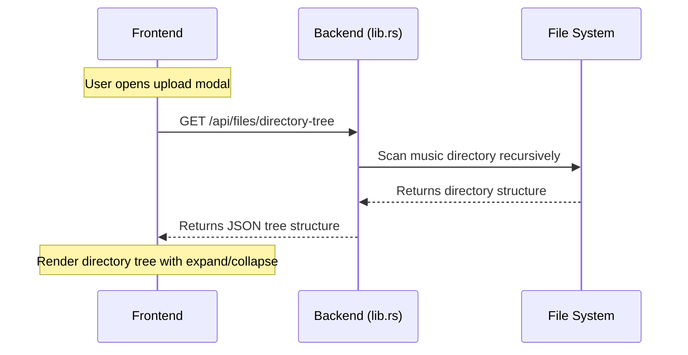
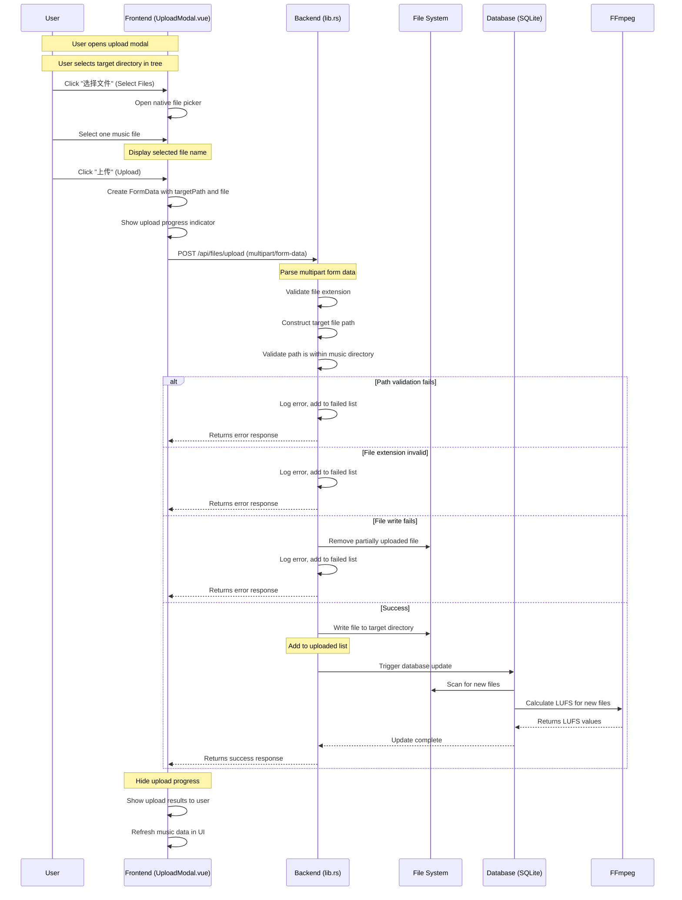

# File Upload Feature

## Overview

The File Upload feature allows users to upload music files directly to the music directory through the UI, without needing to manually copy files to the server. Files are automatically organized into folders, and the database is updated after upload.

## Features

1. **Directory Tree Selection** - Browse and select the target directory within the music folder
2. **Single File Upload** - Upload one music file at a time (users can make multiple requests for multiple files)
3. **Automatic Database Update** - Database is automatically refreshed after successful upload
4. **File Type Validation** - Only accepted audio formats can be uploaded

## API Endpoints

### File Upload Endpoints

| Method | Endpoint | Description |
|--------|----------|-------------|
| GET | `/api/files/directory-tree` | Get the hierarchical directory structure of the music directory |
| POST | `/api/files/upload` | Upload music files to a specified directory |

## Request/Response Formats

### Get Directory Tree

```bash
GET /api/files/directory-tree

Response:
{
  "name": "music-directory",
  "path": "",
  "type": "directory",
  "children": [
    {
      "name": "Album1",
      "path": "Album1",
      "type": "directory",
      "children": [...]
    }
  ]
}
```

### Upload Files

```bash
POST /api/files/upload
Content-Type: multipart/form-data

Form Fields:
- targetPath: string (optional, relative path within music directory, e.g., "Album1/Subfolder")
- files: File (single music file)

Response:
{
  "success": true,
  "message": "Uploaded 1 file(s)",
  "uploaded": ["song.mp3"],
  "failed": []
}
```

## Sequence Diagrams

### Initial Load - Get Directory Tree



### Upload Files Flow



## User Interface Usage

### Accessing the Upload Feature

1. Open the app
2. Click the settings button (≡) in the bottom right
3. Click the "上传音乐文件" (Upload Music Files) button

### Uploading Files

1. **Select Target Directory**
   - Browse the directory tree displayed in the modal
   - Click on a directory to select it as the upload target
   - The selected path is displayed above the file selection button

2. **Select File**
   - Click "选择文件" (Select Files) button
   - Select one music file from your device
   - The selected file name is displayed

3. **Upload**
   - Click "上传" (Upload) button
   - Wait for the upload to complete
   - A success message shows the uploaded file name
   - The database is automatically updated with the new file

4. **Upload Multiple Files**
   - Repeat the process for each additional file
   - Or use the upload modal multiple times

## Supported Audio Formats

The following file extensions are accepted:

- MP3 (`.mp3`)
- OGG Vorbis (`.ogg`)
- WAV (`.wav`)
- AAC (`.aac`)
- FLAC (`.flac`)

Files with other extensions will be rejected with an error message.

## Security Features

### Path Validation

- All upload paths are validated to ensure they stay within the configured music directory
- Directory traversal attacks (using `..` in paths) are prevented
- The backend uses `Path::starts_with()` to verify the final file path

### File Extension Filtering

- Only accepted audio file extensions are allowed
- File validation happens on the backend before writing to disk

### Error Handling

- Partial uploads are cleaned up if an error occurs
- Detailed error messages are returned for each failed file
- Failed uploads do not affect other files in the batch

## Technical Notes

### Backend Implementation

The file upload is implemented in `backend/src/lib.rs`:

- `get_directory_tree_endpoint()` - Returns the directory structure
- `upload_files_endpoint()` - Handles multipart file upload
- `get_directory_tree()` - Recursively builds the tree structure

Key dependencies:
- `actix-multipart` - For handling multipart/form-data uploads
- `tokio::fs` - Async file operations
- `tokio::io::AsyncWriteExt` - For writing file chunks

### Frontend Implementation

The upload UI is implemented in:
- `frontend/src/components/modals/UploadModal.vue` - Main upload modal
- `frontend/src/components/modals/SettingsModal.vue` - Settings button that opens upload modal

Key features:
- `DirectoryTreeNode` component for tree visualization
- `FormData` API for multipart upload construction
- Reactive state for file selection and upload progress

### Database Integration

After successful file upload, the existing `POST /api/database/update` endpoint is called automatically:

1. New files are added to the database with calculated LUFS values
2. Existing entries are updated if LUFS is missing or default (0.5)
3. Deleted files are removed from the database

### Error Handling

| Error Scenario | Behavior |
|----------------|----------|
| Invalid file extension | File rejected, added to `failed` list |
| Path outside music directory | Request rejected with 400 error |
| Path traversal attempt (..) | Request rejected with 400 error |
| Target directory doesn't exist | Directory created automatically |
| File write fails | Partial file removed, added to `failed` list |
| FFmpeg not available | File saved, LUFS set to default (0.5) |

## Configuration

No additional configuration is required for the file upload feature. It uses:

- The music directory configured via backend startup argument or settings
- The same audio file extensions as the database scanner
- CORS settings from the main application configuration
