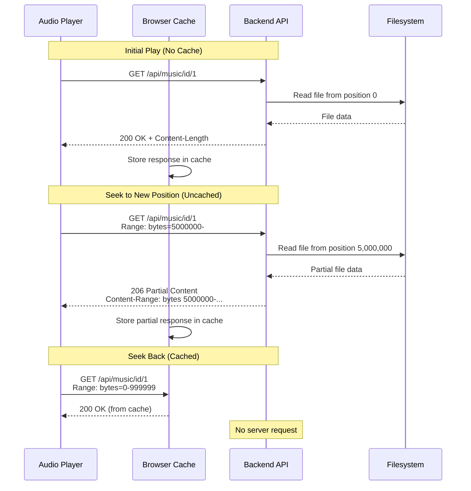

# HTTP Range Caching for Audio Streaming

## Overview

The music streaming endpoints support HTTP Range requests (RFC 7233) to enable efficient seeking in audio files. Combined with browser caching, this reduces bandwidth usage when users seek through audio content.

## How It Works

### Architecture



### HTTP Range Requests

When a user seeks in an audio file, the browser sends a Range header:

```http
Range: bytes=5000000-
```

The server responds with `206 Partial Content`:

```http
HTTP/1.1 206 Partial Content
Content-Type: audio/mpeg
Content-Range: bytes 5000000-9999999/10000000
Accept-Ranges: bytes
Content-Length: 5000000
Cache-Control: public, max-age=86400, must-revalidate
```

### Cache Headers

The following cache headers are used:

| Header | Value | Purpose |
|--------|-------|---------|
| `Cache-Control` | `public, max-age=86400, must-revalidate` | Allow public caching for 24 hours with revalidation |
| `Accept-Ranges` | `bytes` | Advertise Range request support |

**Rationale:**
- `public`: Allows browsers and CDNs to cache responses
- `max-age=86400` (24 hours): Content can be cached without revalidation
- `must-revalidate`: Stale content must be checked with server before use
- `Accept-Ranges: bytes`: Signals that Range requests are supported

## Endpoints

| Endpoint | Range Support | Cache Headers |
|----------|---------------|---------------|
| `GET /api/music/{filename}` | Yes | `public, max-age=86400, must-revalidate` |
| `GET /api/music/id/{id}` | Yes | `public, max-age=86400, must-revalidate` |

## Related Source Files

- **`backend/src/handlers/music.rs`**
  - `get_music()` - Stream by filename with caching
  - `get_music_by_id()` - Stream by ID with Range support and caching
  - `parse_range_header()` - Parse HTTP Range header format

## Browser Behavior

### HTML5 Audio Element

The HTML5 `<audio>` element automatically handles Range requests:

```javascript
const audio = new Audio('/api/music/id/1');
audio.currentTime = 300; // Seek to 5 minutes
// Browser sends: Range: bytes=<calculated_offset>-
```

### Cache Benefits

| Scenario | Without Caching | With Caching |
|----------|-----------------|--------------|
| Initial play | Downloads entire file | Downloads entire file |
| Seek forward (uncached) | Re-downloads from new position | Downloads from new position |
| Seek back (cached) | Re-downloads from beginning | Uses cache (no network request) |

## Limitations

### Large File Seeks

For very large audio files (e.g., 500MB, 8 hours), seeking to near the end still requires significant time because:

1. The server must read from the file at the seeked position
2. The data must be transferred over the network
3. Browser cache only helps with previously loaded portions

Cache headers improve re-seek behavior but cannot eliminate initial seek latency for uncached positions.

### Android WebView

Older Android WebView versions (pre-84.x) may have limited Range request support. The implementation is compatible with:
- Android WebView 84.x and later
- Modern browsers (Chrome, Firefox, Safari, Edge)

## Testing

### Browser DevTools

1. Open DevTools → Network tab
2. Filter by "media" or "audio"
3. Play a song and seek around

**Expected behavior:**
- Initial play: `200 OK` response
- Seek forward: `206 Partial Content` with `Content-Range` header
- Seek back: Response served from cache (size column shows "from disk cache")

### Example Network Log

```
Name                  Status   Type    Size
song.mp3              200 OK   audio   5.2 MB
song.mp3              206      audio   1.1 MB
song.mp3              (from disk cache)  audio   5.2 MB
```

## Configuration

No configuration is required. The caching behavior is built into the music streaming endpoints.

To adjust cache duration, modify `max-age` in `backend/src/handlers/music.rs`:

```rust
// Current: 24 hours
response.insert_header(("Cache-Control", "public, max-age=86400, must-revalidate"));

// Example: 7 days
response.insert_header(("Cache-Control", "public, max-age=604800, must-revalidate"));
```
