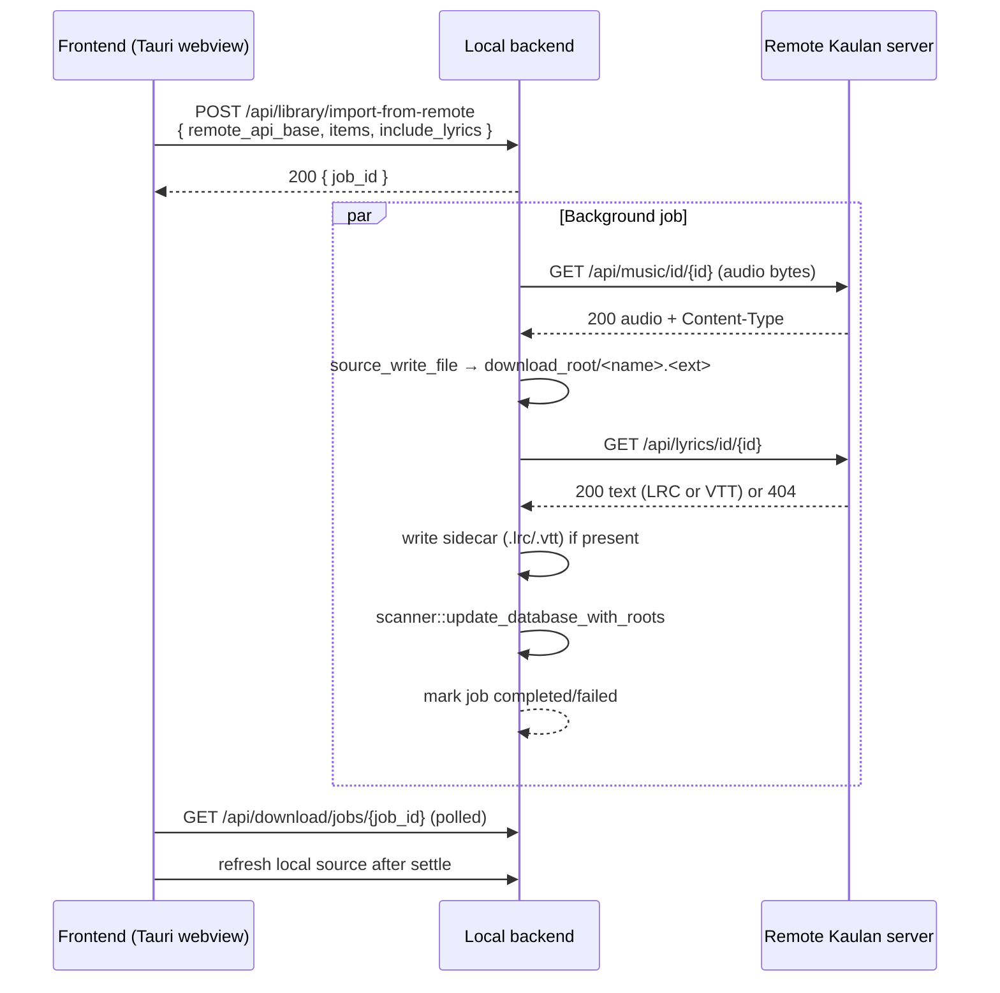

# Remote Library Import (Download to Local)

Lets a user who is browsing **another Kaulan server's library** download that
server's songs — audio **and** lyrics sidecar — so they are available without
the remote server. The destination depends on the runtime:

| Runtime | Destination | Mechanism |
| --- | --- | --- |
| Desktop / Android (Tauri shell) | The local backend's `download_root` (song joins the app library) | The local backend pulls the file from the remote server (server-to-server) |
| Plain browser | The user's device (browser save) | The browser fetches the file directly from the remote server |

The action is exposed from the **multi-select** song flow and only appears when
the user is browsing a **remote** source. Songs already on the local/source
server are not offered for download.

Related source files:
- Backend: `backend/src/handlers/library_import.rs`, `backend/src/handlers/download.rs` (`finalize_downloaded_audio`, `resolve_target_dir`, `lyric_sidecar_extension`), `backend/src/handlers/music.rs` (`get_music_by_id` `?download=1` → `Content-Disposition: attachment`, `download_disposition`), `backend/src/types/mod.rs` (`ImportFromRemoteRequest`)
- Frontend: `frontend/src/composables/useAppShell.ts` (`downloadSelectedToLocal`, `downloadViaBrowser`, `canDownloadToLocal`), `frontend/src/stores/downloads.ts` (`startImportJob`), `frontend/src/utils/browserDownload.ts` (`triggerAnchorDownload`), `frontend/src/components/AppActionSheets.vue`

## How it works

### Desktop / Android — server-to-server import



The import creates one background job per batch (polled through the same
`DownloadJobStore` and `GET /api/download/jobs/{id}` endpoint as online
downloads). Items are processed sequentially. Each item is **streamed to a
temp file chunk-by-chunk and renamed into place**, so peak memory is bounded by
a single chunk (not the file size) — a large track never fills RAM. The size cap
(`IMPORT_MAX_BYTES_PER_ITEM`, 512 MiB) is enforced *during* the write: an
oversized item is aborted and its partial file is deleted.

**Idempotent:** if the target file already exists locally, the item is skipped
with a warning (`已存在，跳过`) and the remote audio endpoint is **not** hit.
This prevents duplicate files when re-importing.

**Filename derivation:** the supplied filename's extension is used when it is a
supported audio type; otherwise the extension is derived from the remote
`Content-Type` (`audio/mpeg` → `mp3`, `audio/flac` → `flac`, …). The stem is
sanitized via the shared `sanitize_filename`. Supplied filenames must be plain
filenames only; values containing `/` or `\` are rejected so they cannot become
path components under the download root. The lyric sidecar extension is
sniffed from the body (`WEBVTT` header → `.vtt`, otherwise `.lrc`), because the
remote lyrics endpoint always returns `text/plain`.

### Plain browser — native download

```mermaid
sequenceDiagram
    participant UI as Frontend (browser)
    participant Remote as Remote Kaulan server
    participant Device as User device (browser download manager)

    UI->>Remote: GET /api/music/id/{id}?download=1  (anchor click)
    Remote-->>Device: 200 audio + Content-Disposition: attachment; filename=...
    Note over Device: browser streams body straight to disk (no page-memory buffer)
    UI->>Remote: GET /api/lyrics/id/{id}
    Remote-->>UI: 200 text or 404
    UI->>Device: <a download> (.lrc/.vtt) if present
```

The hosting/local backend is **not** involved. Audio is downloaded
**natively**: the frontend triggers an anchor click to
`GET /api/music/id/{id}?download=1`, and the remote server responds with
`Content-Disposition: attachment; filename="..."; filename*=UTF-8''...`. The
browser's own download manager then issues the GET and **streams the body
straight to disk** — the bytes never enter the page's JS heap, so even very
large files cannot crash the tab. Progress and resume are handled by the
browser's download UI. (This is why the `?download=1` flag exists: without
`Content-Disposition: attachment`, a cross-origin `<a download>` would
open/play the `audio/*` response instead of saving it.)

For a multi-select batch the frontend staggers the anchor clicks (~400 ms
apart) so the browser registers each as a distinct download; the user sees one
"allow multiple downloads" prompt per site, then the files queue in the
download manager. Lyrics sidecars are tiny, so they are still fetched as text
and saved as a blob (one optional `.lrc`/`.vtt` per song). Downloaded files do
**not** join any library.

## API

### `POST /api/library/import-from-remote`

Pulls the listed tracks from a remote Kaulan server into the local
`download_root` and refreshes the local library database. Creates an
asynchronous job and returns immediately.

**Request body**

```json
{
  "remote_api_base": "http://192.168.1.10:2080/api",
  "items": [
    { "music_id": 12, "filename": "Track.mp3" },
    { "music_id": 34 }
  ],
  "include_lyrics": true,
  "target_subdir": null
}
```

| Field | Type | Notes |
| --- | --- | --- |
| `remote_api_base` | string | Absolute `http`/`https` API base of the remote server |
| `items` | array | One entry per track; `filename` (the remote `MusicInfo.name`) is optional and used only for a readable local name. If present, it must not contain `/` or `\` |
| `include_lyrics` | boolean? | `null`/omitted means `true` |
| `target_subdir` | string? | Optional subdirectory under `download_root` (path-traversal protected) |

**Responses**

- `200 OK` — `{ "success": true, "message": "导入任务已创建", "job_id": "<uuid>" }`
- `400 Bad Request` — empty `items`, invalid/non-http `remote_api_base`, an `remote_api_base` that resolves to a blocked (internal) address, an item `filename` containing `/` or `\`, or invalid `target_subdir`
- `500 Internal Server Error` — the resolved target is not a writable filesystem path

### Security: SSRF protection

The local backend fetches from a caller-supplied `remote_api_base`, so this
endpoint is an SSRF surface. Two mitigations are enforced (see
`backend/src/handlers/library_import.rs`):

1. **Host allow/deny by resolved IP.** Before any fetch, `remote_host_is_safe`
   resolves the host and rejects it if **any** resolved address is internal.
   Blocked: link-local (`169.254.0.0/16` — includes the cloud-metadata
   `169.254.169.254` — and IPv6 `fe80::/10`), unspecified (`0.0.0.0`, `::`),
   and loopback (`127.0.0.0/8`, `::1`, incl. IPv4-mapped-v6 forms). A resolver
   failure is treated as unsafe. **RFC1918 / ULA private ranges are
   intentionally allowed**, because importing from another Kaulan server on the
   LAN is this feature's purpose.
2. **No redirect following.** The reqwest client is built with
   `redirect::Policy::none()`, so a `3xx` from the validated host to an
   internal address cannot bypass the host check; any `3xx` is treated as a
   fetch failure.

Residual gap: a DNS name that resolves to a safe address during validation but
to an internal one when `reqwest` re-resolves (DNS rebinding) is not fully
closed; disabling redirects limits the practical impact. Pinning the resolved
IP would break TLS hostname verification for `https` remotes, so it is not
done.

Progress is then polled with `GET /api/download/jobs/{job_id}` (shared with
online downloads); the job `source` label is `"import"`. The job ends:

- `completed` with a `warning` listing any skipped/failed items (or `"所选歌曲已全部存在"` when every item already existed), or
- `failed` when nothing could be imported.

## How a user triggers it

1. Connect a remote Kaulan server via **Add Device** (or discovery).
2. Open a playlist on that **remote** source.
3. Tap the song-list menu (the playlist's menu button) → **下载到本机**. This
   button only appears while browsing a remote source (and, on Tauri, when the
   local backend is reachable).
4. Multi-select the desired songs and confirm.
5. Desktop/Android: progress shows in the downloads indicator; the songs appear
   in the **local** source once the job completes. Browser: the browser saves
   each file to the device.
