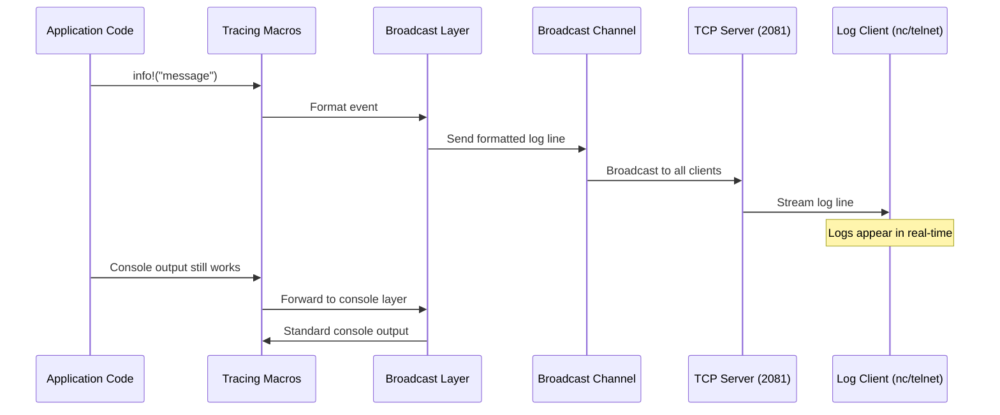

# Log Streaming Feature

## Overview

The log streaming feature provides real-time access to server logs via a plain TCP connection on port 2081. This is useful for debugging on devices where accessing logs directly is difficult (e.g., remote servers, embedded devices).

## How It Works

### Architecture



### Data Flow

1. **Log Generation**: Application code uses tracing macros (`info!`, `warn!`, `error!`, etc.)
2. **Broadcast Layer**: A custom tracing layer intercepts log events and formats them as plain text
3. **Broadcast Channel**: Formatted log lines are sent to a tokio `broadcast::channel` (capacity: 256 messages)
4. **TCP Server**: A TCP listener on `0.0.0.0:2081` accepts client connections
5. **Client Streaming**: Each connected client receives a receiver and gets log lines as they're generated

### Key Characteristics

- **No Historical Logs**: Only logs generated **after** a client connects are streamed
- **Multiple Clients**: Broadcast channel supports unlimited simultaneous connections
- **Non-Blocking**: If the channel is full, oldest messages are dropped (FIFO eviction)
- **Plain Text**: Logs are formatted as human-readable plain text with ANSI color codes
- **Standard Tools**: Works with any TCP client (`nc`, `telnet`, netcat, etc.)

## Usage

### Connecting to the Log Stream

```bash
# Using netcat (nc)
nc localhost 2081

# Using telnet
telnet localhost 2081

# For remote device
nc <device-ip> 2081
```

### Example Output

```
2026-02-04T12:41:00.966681Z INFO sqlx::query: SELECT "music"."id"... rows_returned=4 elapsed=544.129µs
2026-02-04T12:41:01.037456Z INFO kaulan: Returning 4 music entries
2026-02-04T12:41:02.115715Z WARN kaulan::api: Request timeout for client 192.168.1.100
```

## Configuration

### Ports Used

| Port | Purpose | Protocol |
|------|---------|----------|
| 2080 | HTTP API | HTTP |
| 2081 | Log Streaming | TCP (plain text) |

### Channel Capacity

The broadcast channel has a capacity of 256 messages. When full:
- Oldest messages are automatically dropped
- New messages are always accepted
- Clients that can't keep up will see gaps in the log stream

### Log Format

Logs follow the standard tracing-subscriber compact format:

```
<Timestamp> <Level> <Target>: <Message>
```

- **Timestamp**: ISO 8601 with microsecond precision (UTC)
- **Level**: INFO, WARN, ERROR, DEBUG, TRACE
- **Target**: Module path (e.g., `kaulan::api`, `sqlx::query`)
- **Message**: The log message

## Related Source Files

- **`backend/src/log_broadcast.rs`** - Log broadcast module implementation
  - `LogBroadcaster` - Broadcast channel management
  - `BroadcastWriter` - Custom `io::Write` for formatted logs
  - `create_broadcast_layer()` - Creates the tracing layer
  - `start_log_server()` - TCP server on port 2081
  - `handle_client()` - Individual client connection handler

- **`backend/src/main.rs`** - Server initialization
  - `init_tracing()` - Sets up tracing with broadcast layer
  - Log server spawn in `main()` for the `run` command

## Troubleshooting

### Cannot connect to port 2081

1. Verify the server is running:
   ```bash
   ps aux | grep kaulan
   ```

2. Check if port is listening:
   ```bash
   ss -tlnp | grep 2081
   # or
   netstat -tlnp | grep 2081
   ```

3. Check firewall rules if connecting remotely

### No logs appearing

1. Verify the server is generating logs (trigger an API request)
2. Check that you're connected to the correct port (2081, not 2080)
3. Some log levels may be filtered by `RUST_LOG` environment variable

### Connection drops unexpectedly

- The server will close connections if the client stops reading
- Slow clients may be dropped if they can't keep up with log volume
- Use `nc -v` to see verbose connection information

## Development Notes

### Adding New Logs

Use the standard tracing macros:

```rust
use tracing::{info, warn, error, debug};

// INFO level - important business events
info!("User requested playlist: {}", name);

// WARN level - recoverable issues
warn!("Cache miss for key: {}", key);

// ERROR level - errors requiring attention
error!("Failed to connect to database: {}", e);

// DEBUG level - development diagnostics
debug!("Processing file: {:?}", file_path);
```

### Log Level Guidelines

| Scenario | Level | Example |
|----------|-------|---------|
| Key business events | INFO | User login, API requests, music access |
| Potential issues | WARN | Retry attempts, fallbacks, missing files |
| Errors needing attention | ERROR | Database failures, file I/O errors |
| Development diagnostics | DEBUG | Function entry/exit, intermediate values |

See `CLAUDE.md` for complete logging guidelines.
