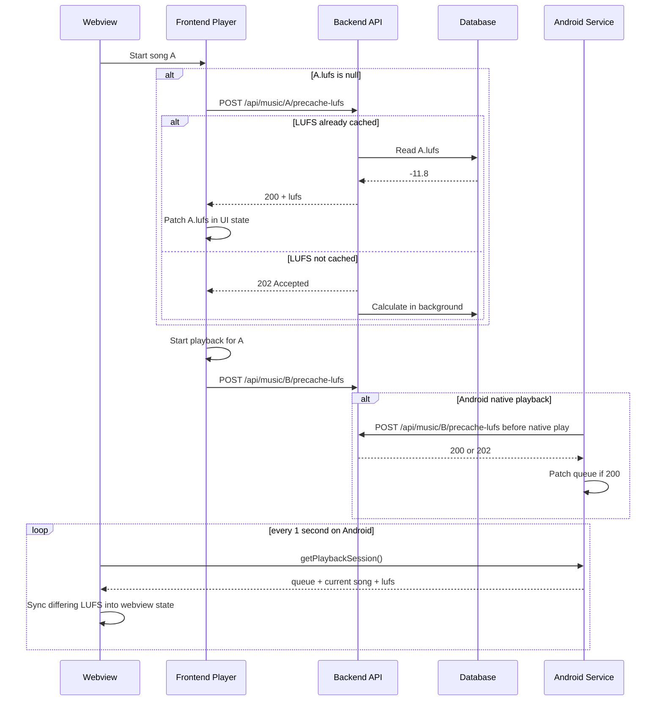

# LUFS Playback Flow

## Overview

Kaulan calculates LUFS on demand during playback instead of during database update.

This document explains the real playback behavior used by:

- [`frontend/src/App.vue`](../frontend/src/App.vue)
- [`frontend/src/composables/useAudioPlayer.ts`](../frontend/src/composables/useAudioPlayer.ts)
- [`frontend/src/composables/useVolume.ts`](../frontend/src/composables/useVolume.ts)
- [`backend/src/handlers/lufs.rs`](../backend/src/handlers/lufs.rs)
- [`tauri-plugin-music-notification/android/src/main/java/MusicPlayerService.kt`](../tauri-plugin-music-notification/android/src/main/java/MusicPlayerService.kt)

## Goals

The LUFS flow is designed to keep playback responsive.

1. Do not block playback for a long LUFS calculation.
2. Try to use LUFS before playback if the value is already cached.
3. Only pre-cache the current song and the immediate next song.
4. Keep Android native playback and web playback behavior aligned.
5. Let the webview update itself from backend playback state when Android service metadata changes.

## Backend API

LUFS pre-cache uses one endpoint:

```http
POST /api/music/{id}/precache-lufs
```

Response meanings:

- `200 OK`
  LUFS already exists in the database, so the backend returns it immediately.
- `202 Accepted`
  LUFS does not exist yet. The backend starts background calculation and returns immediately.

Example `200` response:

```json
{
  "success": true,
  "lufs": -11.8,
  "cached": true
}
```

Example `202` response:

```json
{
  "success": true,
  "lufs": null,
  "cached": false
}
```

## Playback Backend Contract

The frontend LUFS flow assumes the playback backend provides a small, stable contract.

This is a conceptual interface, not a literal shared source file today.

### Shared data types

```ts
type PlayMode = 'sequential' | 'shuffle' | 'loop'

interface QueueSong {
  id: number
  name: string
  path: string
  url: string
  lufs: number | null
}

interface PlayingQueue {
  songs: QueueSong[]
  currentIndex: number | null
}

interface PlaybackRuntime {
  isPlaying: boolean
  positionMs: number
  durationMs: number
}

interface PlaybackSession {
  queue: PlayingQueue
  runtime: PlaybackRuntime
  playMode: PlayMode
}
```

### Required interface

```ts
interface PlaybackBackend {
  play(input: { url: string; title?: string }): Promise<void>
  pause(): Promise<void>
  stop(): Promise<void>
  seek(positionMs: number): Promise<void>

  setPlayingQueue(queue: PlayingQueue, playMode: PlayMode): Promise<void>
  setPlayMode(playMode: PlayMode): Promise<void>
  setNormalizationConfig(input: {
    mode: 'auto' | 'manual' | 'fixed'
    manualVolume: number
    fixedLufs: number
  }): Promise<void>
  getPlaybackSession(): Promise<PlaybackSession>
}
```

### Contract rules

Any playback backend used by Kaulan should provide these behaviors:

1. `QueueSong.lufs` must be included in the queue/session model.
2. `setPlayingQueue()` must persist the queue metadata, not only the URLs.
3. `getPlaybackSession()` must return the backend's latest queue metadata.
4. If backend playback changes queue metadata later, such as resolving LUFS, the next `getPlaybackSession()` result should expose that updated value.
5. `play()` must start playback from the queue item selected by the backend state.
6. `setNormalizationConfig()` must update backend normalization state so later playback, resume, and track changes use the same mode and slider values.
7. Web playback may apply volume directly from frontend state, but Android playback should apply track volume inside the playback service.

### Why LUFS needs to be part of the backend contract

The frontend may be recreated, especially on Android.

If the playback backend does not retain `lufs` in its queue/session state, then:

- current playback can have one LUFS value
- the webview can show another value
- the next polling tick can overwrite correct frontend state with stale `null`

So `lufs` is not just UI metadata. It is part of playback state synchronization.

### Web playback backend

The web audio backend is simpler:

- the frontend owns the queue
- the HTML audio element provides playback runtime
- there is no external service session to query

Conceptually, web playback still follows the same contract, but the queue/session state lives directly in frontend refs.

### Android playback backend

The Android playback backend is the foreground service plus plugin API.

Its concrete interface is already close to the conceptual one above:

- `play`
- `pause`
- `stop`
- `seek`
- `setPlayingQueue`
- `setPlayMode`
- `setNormalizationConfig`
- `getPlaybackSession`

The important rule is:

- `getPlaybackSession()` is the source of truth for the webview on Android
- if service state differs from the webview, the webview should update itself
- Android normalization settings are pushed once through `setNormalizationConfig()`, then applied by `MusicPlayerService`

## Current Song Flow

When the user starts a song and that song has `lufs = null`, the player does one LUFS request before playback starts.

### Rule

1. Send one `POST /api/music/{id}/precache-lufs`.
2. If response is `200` with a LUFS value:
   store that LUFS in frontend state first, then start playback.
3. If response is `202`:
   start playback immediately and do not retry in that playback start.

There is no polling loop and no retry loop for the current song start.

### Example 1: LUFS already cached

Song list before play:

```json
[
  { "id": 5, "name": "A", "lufs": null },
  { "id": 6, "name": "B", "lufs": null }
]
```

User presses play on song `A`.

1. Frontend sees `A.lufs = null`.
2. Frontend sends `POST /api/music/5/precache-lufs`.
3. Backend replies:

```json
{
  "success": true,
  "lufs": -11.8,
  "cached": true
}
```

4. Frontend updates song `A` in all active UI state holders.
5. Playback starts using `A.lufs = -11.8`.

### Example 2: LUFS not cached yet

User presses play on song `A`.

1. Frontend sends `POST /api/music/5/precache-lufs`.
2. Backend replies:

```json
{
  "success": true,
  "lufs": null,
  "cached": false
}
```

3. Frontend does not wait any longer.
4. Playback starts immediately.
5. Volume uses the existing null-LUFS fallback behavior until a later state refresh sees a real LUFS value.

## Next Song Pre-cache Flow

When the current song starts, Kaulan may also pre-cache the immediate next song.

### Rule

1. Find the next song in the active queue.
2. If next song already has LUFS, do nothing.
3. If next song has `lufs = null`, send one `POST /api/music/{id}/precache-lufs`.
4. If response is `200`, patch the next song metadata immediately.
5. If response is `202`, do nothing else.

### Example

Queue:

```json
[
  { "id": 5, "name": "A", "lufs": -11.8 },
  { "id": 6, "name": "B", "lufs": null }
]
```

When `A` starts:

1. Player checks `B`.
2. `B.lufs` is null, so player sends `POST /api/music/6/precache-lufs`.
3. If backend returns `200`, `B.lufs` is updated in queue and UI.
4. If backend returns `202`, `B` stays null for now.

## Web Playback vs Android Playback

### Web playback

Web playback is controlled by the frontend audio element.

Sequence:

1. Resolve current-song LUFS once before playback.
2. Start playback.
3. Pre-cache next song once.
4. Recalculate volume when LUFS metadata changes.

### Android playback

Android has two playback paths:

1. frontend-driven playback start from the webview
2. native service-driven next/previous/auto-next inside `MusicPlayerService`

Both paths now use the same rule:

1. if queued song already has LUFS, play it directly
2. if queued song LUFS is null, send one pre-cache request first
3. if request returns `200`, patch the track LUFS, then play
4. if request returns `202`, play immediately without waiting

This matters because auto-next on Android happens in the service, not in the webview.

## Why the Webview May Change Later

On Android, the foreground service is the playback source of truth.

The frontend polls playback state every second through `getPlaybackSession()`.

If the service queue contains newer LUFS than the webview currently shows, the webview updates its local song metadata to match the backend playback state.

### Example

Initial webview state:

```json
{
  "currentSong": { "id": 6, "name": "B", "lufs": null }
}
```

Android service queue later becomes:

```json
{
  "queue": {
    "songs": [
      { "id": 6, "name": "B", "lufs": -9.7 }
    ]
  }
}
```

On the next polling tick:

1. frontend reads `getPlaybackSession()`
2. frontend sees song `B` now has `lufs = -9.7`
3. frontend updates visible playlist state and current song state
4. volume calculation can now use the real LUFS value

## Volume Mode and Slider Behavior

When the user changes volume mode or moves the volume slider in settings, Kaulan updates normalization differently on the two playback backends.

### Web playback

- the watcher in [`frontend/src/App.vue`](../frontend/src/App.vue) recalculates the effective volume immediately
- [`frontend/src/composables/useAudioPlayer.ts`](../frontend/src/composables/useAudioPlayer.ts) applies that value directly to `HTMLAudioElement.volume`
- if the current song still has `lufs = null`, [`frontend/src/composables/useVolume.ts`](../frontend/src/composables/useVolume.ts) falls back to `manualVolume`

### Android playback

- the same watcher sends `setNormalizationConfig({ mode, manualVolume, fixedLufs })` through the plugin
- [`tauri-plugin-music-notification/android/src/main/java/MusicPlayerService.kt`](../tauri-plugin-music-notification/android/src/main/java/MusicPlayerService.kt) stores that config and immediately reapplies the current track volume
- future `play`, `resume`, next, previous, and native auto-next all reuse the stored normalization config inside the service

### Important note about ACL

The Android plugin command `set_normalization_config` must be allowed by the plugin ACL manifests. If that permission is missing, slider changes in the frontend do not reach the Android service even though the UI updates locally.

## Frontend State Synchronization

When LUFS is resolved immediately, Kaulan updates every frontend copy of that song, not just one field.

Updated state may include:

- `currentSong`
- `activeQueue`
- selected playlist songs
- last played playlist songs
- search playback songs
- visible playlist cache

This avoids a case where:

- the player uses the new LUFS
- but the webview still renders `-`
- or a later queue refresh overwrites the new LUFS with stale `null`

## Sequence Diagram



## Edge Cases

- Current song LUFS is null and backend returns `202`
  playback starts immediately
- Next song LUFS is null and backend returns `202`
  nothing else happens until a later refresh
- Loop mode with same current and next song
  skip next-song pre-cache
- Android auto-next
  handled inside `MusicPlayerService`, not only in the frontend
- Unsupported file or failed LUFS calculation
  playback continues, LUFS remains null

## Related Files

| Path | Responsibility |
|------|----------------|
| `frontend/src/App.vue` | frontend LUFS request, UI metadata sync, next-song pre-cache |
| `frontend/src/composables/useAudioPlayer.ts` | pre-play song preparation, queue/session application |
| `frontend/src/composables/useVolume.ts` | normalization math and null-LUFS fallback |
| `backend/src/handlers/lufs.rs` | LUFS pre-cache API |
| `tauri-plugin-music-notification/android/src/main/java/MusicPlayerService.kt` | Android native pre-play LUFS resolution |
| `tauri-plugin-music-notification/permissions/default.toml` | Android plugin ACL default permission set |
