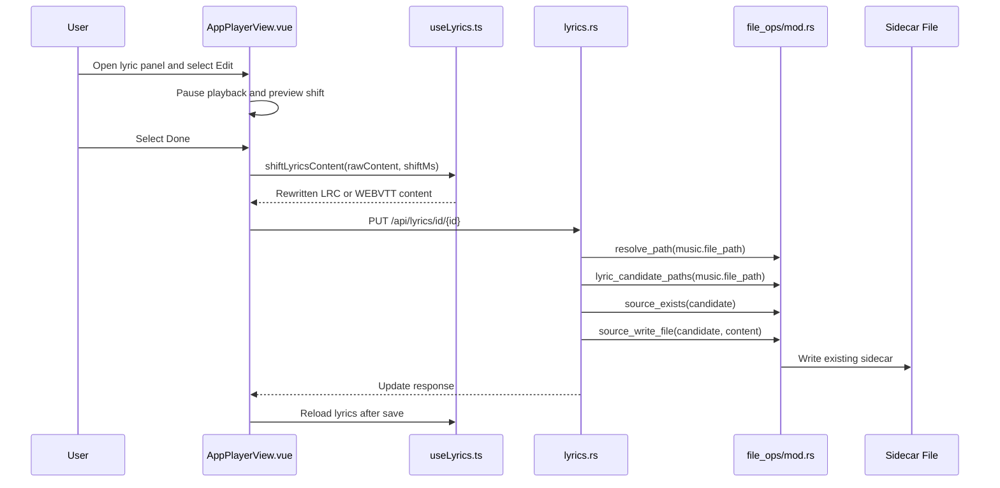
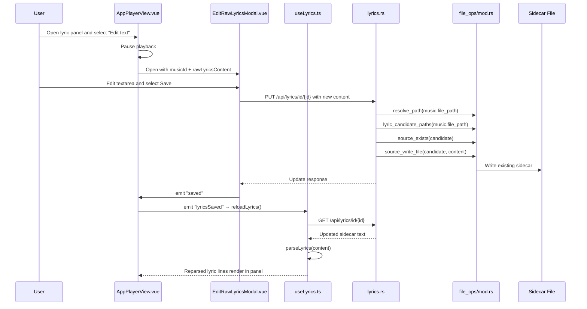

# Lyric Editing

## Overview

Kaulan lets users edit the currently loaded lyric sidecar file from the player lyric panel. Two editing modes share the same backend endpoint:

- **Timing editing** — shift all timestamps in the loaded `.lrc` or `.vtt` content by a previewed amount. Useful when downloaded lyrics are uniformly early or late.
- **Raw text editing** — open the sidecar content as a single editable text blob. Useful when downloaded lyrics contain typos, wrong words, or wrong line breaks. The user is responsible for keeping the `[mm:ss.xx]` (LRC) or `hh:mm:ss.mmm --> ...` (WEBVTT) format intact.

Both modes send the rewritten text to the backend, which only updates existing writable sidecar files resolved through the standard filesystem source.

Related source files:

- `frontend/src/components/AppPlayerView.vue` - Lyric edit controls, shift save, and raw-text editor trigger
- `frontend/src/components/modals/EditRawLyricsModal.vue` - Raw text editing dialog
- `frontend/src/composables/useLyrics.ts` - Raw lyric loading, parsing, and timestamp shifting
- `frontend/src/composables/__tests__/useLyrics.test.ts` - LRC and WEBVTT shifting tests
- `backend/src/handlers/lyrics.rs` - Lyric read and update endpoints
- `backend/src/file_ops/mod.rs` - Source-resolved lyric path candidates and file writes
- `backend/src/types/mod.rs` - Lyric update request and response types

## Timing Editing

### User Flow

1. Open a song that has a `.lrc` or `.vtt` sidecar lyric file.
2. Open the lyric panel.
3. Select `Edit`.
4. Use `-`, `+`, and the millisecond step input to preview timing shifts.
5. Select `Done` to save the rewritten sidecar file, or `Cancel` to discard the previewed shift.

Entering edit mode pauses playback so the user can inspect the shifted timing against the visible lyric lines. The edit controls shift line timestamps for normal LRC files, inline word timestamps for enhanced LRC files, and cue start/end timestamps for WEBVTT files. Negative shifts clamp timestamps at zero.

### Sequence



## Raw Text Editing

### User Flow

1. Open a song that has a `.lrc` or `.vtt` sidecar lyric file.
2. Open the lyric panel.
3. Select `Edit text`.
4. The full lyric content opens in a modal dialog with a textarea. Playback pauses on entry because audio is not useful while editing words.
5. Edit the text directly. The app does not reparse or reformat the content — the user owns the format.
6. Select `Save` to PUT the rewritten content, or `Cancel` to discard. `Cancel` confirms first if there are unsaved edits.

On `Save` success the modal closes, the parent refetches lyrics through `useLyrics.reloadLyrics()`, and the lyric panel re-renders with the new text. On `400` / `404` / `409` / `500` the modal stays open and surfaces the backend `message` (with a read-only-specific fallback for `409`).

### Why a modal, not inline

Timing editing stays inside the upper player panel because the user wants to see and hear the shifted lines. Raw-text editing has no audio relationship, so the player panel context is dead weight. A self-contained dialog keeps the player panel's state machine clean (no `isRawLyricEditMode` flag threaded through unrelated child components) and gives the textarea the full viewport. See `docs/ui-layout.md` for the parallel layout rule.

### Sequence



## API

### `GET /api/lyrics/id/{id}`

Returns the current song lyric sidecar content as `text/plain; charset=utf-8`.

Responses:

- `200 OK` - Lyric content was found.
- `404 Not Found` - The song or lyric sidecar file was not found.
- `500 Internal Server Error` - Database or source read failed.

### `PUT /api/lyrics/id/{id}`

Updates the existing lyric sidecar file for a song. Used by both timing and raw-text editing.

Request:

```json
{
  "content": "[00:01.00]Updated lyric line"
}
```

Responses:

- `200 OK` - The existing lyric sidecar file was updated.
- `400 Bad Request` - `content` is empty or only whitespace.
- `404 Not Found` - The song or existing lyric sidecar file was not found.
- `409 Conflict` - The song source is not writable, such as Android MediaStore content.
- `500 Internal Server Error` - Path resolution, database access, or file writing failed.

Response body:

```json
{
  "success": true,
  "message": "Lyrics updated",
  "lyric_filename": "song.lrc"
}
```
