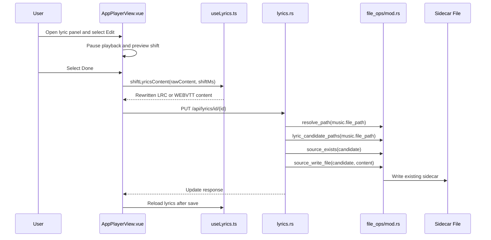

# Lyric Timing Editing

## Overview

Kaulan lets users adjust the timing of the currently loaded lyric sidecar file from the player lyric panel. The frontend shifts all timestamps in the loaded `.lrc` or `.vtt` content and sends the rewritten text to the backend. The backend only updates existing writable sidecar files resolved through the standard filesystem source.

Related source files:

- `frontend/src/components/AppPlayerView.vue` - Lyric edit controls and save request
- `frontend/src/composables/useLyrics.ts` - Raw lyric loading, parsing, and timestamp shifting
- `frontend/src/composables/__tests__/useLyrics.test.ts` - LRC and WEBVTT shifting tests
- `backend/src/handlers/lyrics.rs` - Lyric read and update endpoints
- `backend/src/file_ops/mod.rs` - Source-resolved lyric path candidates and file writes
- `backend/src/types/mod.rs` - Lyric update request and response types

## User Flow

1. Open a song that has a `.lrc` or `.vtt` sidecar lyric file.
2. Open the lyric panel.
3. Select `Edit`.
4. Use `-`, `+`, and the millisecond step input to preview timing shifts.
5. Select `Done` to save the rewritten sidecar file, or `Cancel` to discard the previewed shift.

Entering edit mode pauses playback so the user can inspect the shifted timing against the visible lyric lines. The edit controls shift line timestamps for normal LRC files, inline word timestamps for enhanced LRC files, and cue start/end timestamps for WEBVTT files. Negative shifts clamp timestamps at zero.

## API

### `GET /api/lyrics/id/{id}`

Returns the current song lyric sidecar content as `text/plain; charset=utf-8`.

Responses:

- `200 OK` - Lyric content was found.
- `404 Not Found` - The song or lyric sidecar file was not found.
- `500 Internal Server Error` - Database or source read failed.

### `PUT /api/lyrics/id/{id}`

Updates the existing lyric sidecar file for a song.

Request:

```json
{
  "content": "[00:01.00]Updated lyric line"
}
```

Responses:

- `200 OK` - The existing lyric sidecar file was updated.
- `400 Bad Request` - `content` is empty or only whitespace.
- `404 Not Found` - The song or existing lyric sidecar file was not found.
- `409 Conflict` - The song source is not writable, such as Android MediaStore content.
- `500 Internal Server Error` - Path resolution, database access, or file writing failed.

Response body:

```json
{
  "success": true,
  "message": "Lyrics updated",
  "lyric_filename": "song.lrc"
}
```

## Sequence


