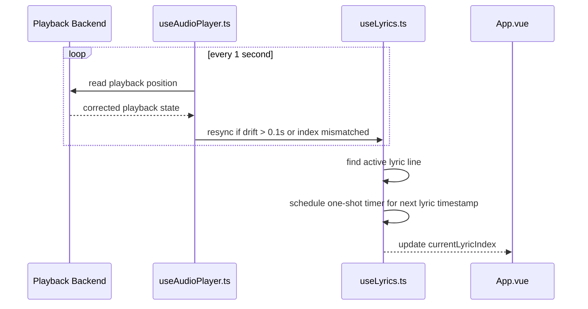
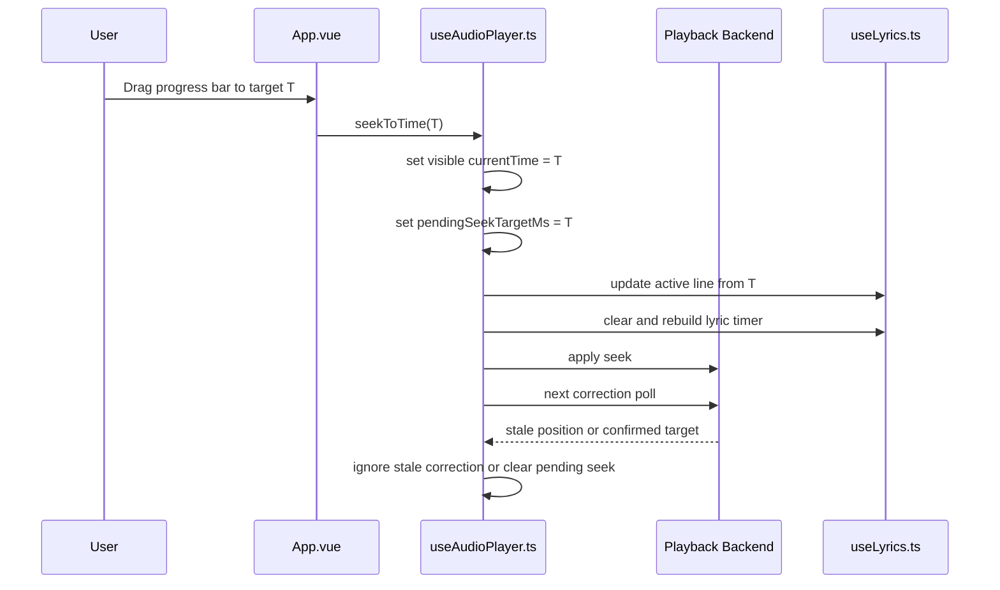
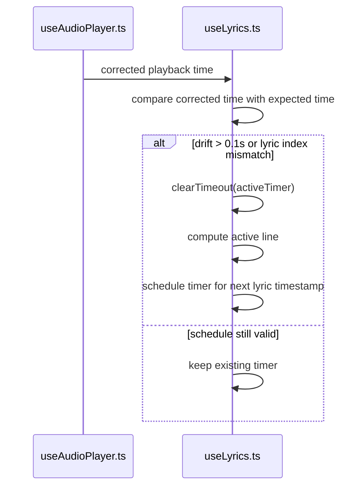

# Lyric Sync Timing Design

## Overview

This document describes the lyric synchronization model used by Kaulan across playback backends.

It applies to:

- web playback driven by `HTMLAudioElement`
- Android playback driven by playback-session polling

The implementation is centered in:

- `frontend/src/composables/useAudioPlayer.ts`
- `frontend/src/composables/useLyrics.ts`
- `frontend/src/App.vue`

## Problem Statement

Timed lyrics cannot be synchronized well by checking playback position once per second.

Two issues show up immediately:

1. **Coarse lyric switching**
   - LRC timestamps often use sub-second precision such as `00:00.54`.
   - Some lyric lines only last `0.x` seconds.
   - A one-second update loop will skip or delay those lines.

2. **Wrong intermediate state after seek**
   - Some playback backends may briefly report a stale position during seek.
   - The lyric panel can jump to the first line and then jump again to the real target.

The parser is not the problem. The problem is how playback time is consumed.

## Final Approach

Kaulan uses a plain frontend model with three rules:

1. **One-second correction timer**
   - The existing `1s` playback correction loop remains the authoritative sync path.
   - Its job is correction, not lyric switching.

2. **Lyric timestamp scheduling**
   - The active lyric line is found from the current playback time.
   - The next lyric line timestamp is used to schedule a one-shot timer.
   - When that timer fires, the lyric advances and the next one is scheduled.

3. **Seek guard**
   - When the user seeks, the frontend updates the visible playback time and lyric index immediately.
   - A pending seek target prevents stale correction snapshots from forcing a `0:00 -> target` jump.

## Why This Works

This separates two concerns:

- **Playback correction** comes from the current backend timing source
- **Lyric precision** comes from lyric timestamps

This works for both web and Android without making `useLyrics.ts` depend on backend-specific timing behavior.

## Timing Rules

### Correction timer

- Keep the correction timer at `1s`
- Do not use that timer to advance lyrics directly
- Use it only to correct playback state and confirm pending seek targets

### Lyric timer

- Keep only one active lyric timeout at a time
- Always clear the old timeout before scheduling a new one
- Rebuild the lyric timer only when needed:
  - song change
  - play
  - pause
  - seek
  - correction drift larger than threshold
  - correction shows lyric index mismatch

### Drift threshold

- Use `0.1s` as the resync threshold
- If corrected playback time differs from expected playback time by more than `0.1s`, rebuild lyric scheduling

## Seek Guard

On seek:

1. update visible playback time immediately
2. update active lyric line immediately
3. cancel and rebuild lyric timer from the target
4. store `pendingSeekTargetMs`

On correction:

1. if corrected position is within `0.1s` of the pending seek target, accept it
2. if corrected position is clearly stale, ignore it temporarily

This prevents transient `0:00` or old-position lyric jumps.

## Sequence Diagrams

### Normal playback

### Seek handling

### Lyric timer rebuild

## Frontend Responsibilities

### `useAudioPlayer.ts`

- owns backend correction behavior
- stores pending seek state
- updates `currentTime`
- keeps Android and web playback in one frontend state shape

### `useLyrics.ts`

- parses LRC and WebVTT timestamps
- finds the active lyric line
- owns the one-shot lyric timer
- rebuilds scheduling only when correction says it is necessary

### `App.vue`

- renders the lyric panel
- scrolls the active lyric line into view
- forwards lyric-line clicks to seeking

## Notes

- This design does not require backend-specific lyric logic.
- It does not require continuous Android callback delivery.
- It keeps the implementation plain: correction timer, lyric timer, seek guard.

## Related Documents

- `docs/lyrics-display.md`
- `docs/android/playback-session.md`
