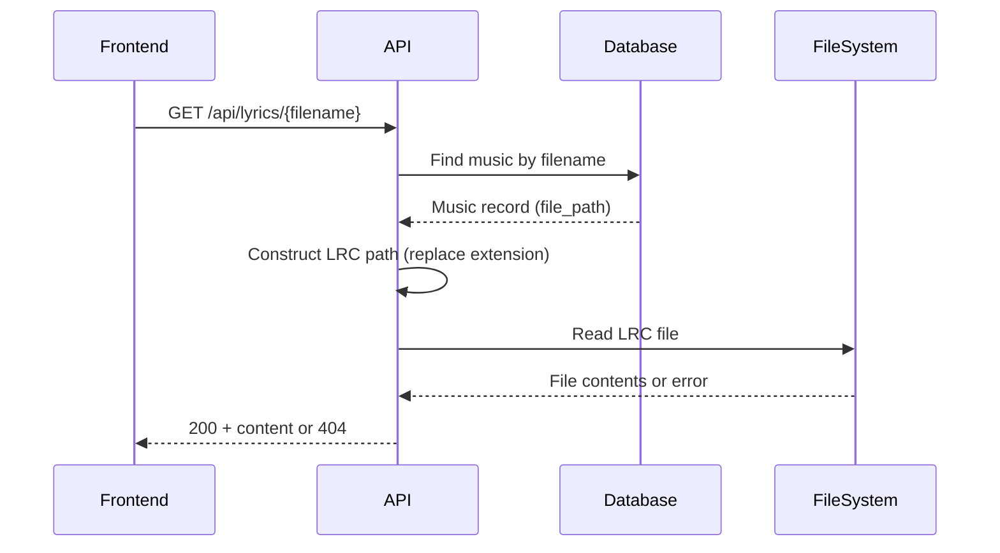
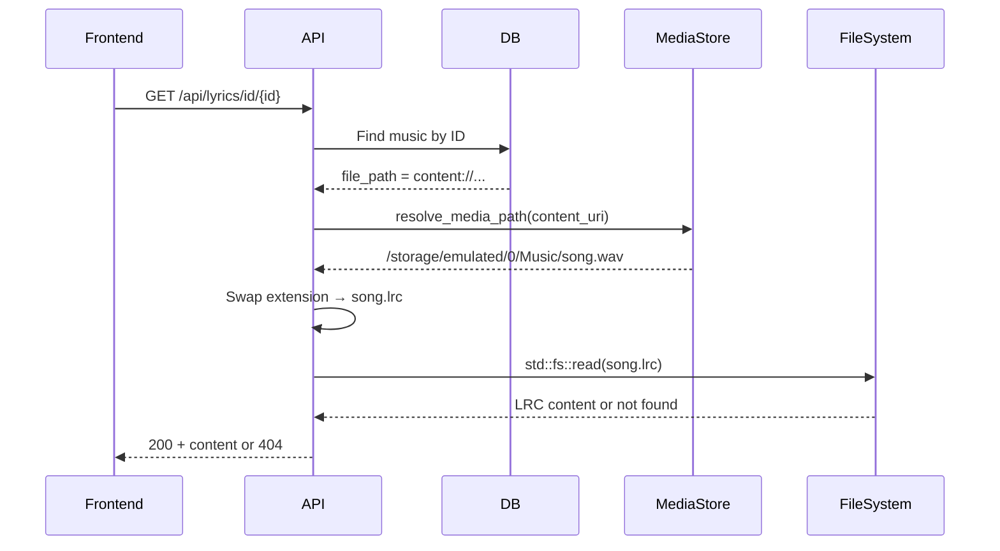

# Lyrics Display Feature

## Overview

The lyrics display feature adds synchronized lyrics display to the Kaulan music player. LRC (Lyric) files stored alongside music files are served via a backend API endpoint, parsed on the frontend, and displayed with real-time highlighting and auto-scrolling.

On Android, lyric updates are still frontend-driven. The frontend polls the playback session from the Android plugin, updates the current song and playback position, and the lyric panel reacts to those values.

## Related Files

**Backend:**
- `backend/src/file_ops/mod.rs` - `LyricReader` trait, `StdLyricReader`, `set_lyric_reader()`/`get_lyric_reader()`
- `backend/src/handlers/lyrics.rs` - Lyrics API endpoint handler
- `backend/src/handlers/mod.rs` - Module exports
- `backend/src/server/mod.rs` - Route registration

**Tauri (Android adapters):**
- `frontend/src-tauri/src/android_media_adapter.rs` - `AndroidLyricReader` implementation, `MediaStoreFileReader`, `MediaStoreMusicFileLister`
- `frontend/src-tauri/src/lib.rs` - Plugin registration, `request_external_storage_permission`, `check_external_storage_permission` commands

**Frontend:**
- `frontend/src/composables/useLyrics.ts` - LRC parsing and sync logic
- `frontend/src/App.vue` - Lyric panel UI and integration
- `frontend/src/components/modals/SettingsModal.vue` - "使用本地歌词" checkbox (Android only)

## LRC Format

### Standard Single-Language Format

```
[mm:ss.xx]Lyric text here
```

Example:
```
[00:00.54]First line of lyrics
[00:02.52]Second line of lyrics
[00:05.00]Third line of lyrics
```

### Bilingual Format

The player supports bilingual lyrics where consecutive lines with the same timestamp are treated as original + translation:

```
[00:00.64]Japanese original text
[00:00.64]Chinese translation
[00:02.14]Another Japanese line
[00:02.14]Another Chinese translation
```

### Format Details

- **Timestamp format:** `[mm:ss.xx]` or `[mm:ss.xxx]`
  - `mm` = minutes (00-59)
  - `ss` = seconds (00-59)
  - `xx/xxx` = milliseconds (2 or 3 digits)
- **UTF-8 encoding:** Supports Chinese, Japanese, Korean, and other Unicode characters
- **File naming:** LRC files must have the same base name as the audio file:
  - `song.mp3` → `song.lrc`
  - `album/track.flac` → `album/track.lrc`

## API Reference

### GET /api/lyrics/{filename}

Retrieve the LRC file content for a given music filename.

**Path Parameters:**
- `filename` - The music filename to look up (e.g., `song.mp3`)

**Response:**
- **200 OK** - Returns LRC file content as `text/plain; charset=utf-8`
- **404 Not Found** - Music not in database or LRC file missing

**Example:**
```bash
curl http://localhost:2080/api/lyrics/song.mp3
```

Response:
```
[00:00.54]First line
[00:02.52]Second line
```

## User Instructions

### Viewing Lyrics

1. **Mobile/Tall Layout:**
   - Tap the lyrics icon in the player controls to toggle lyrics display
   - The lyrics panel will replace the song list

2. **Desktop/Wide Layout:**
   - Lyrics are displayed automatically in the right panel
   - Toggle lyrics display using the lyrics icon in player controls

### Lyrics Behavior

- **Auto-scroll:** The current lyric line is automatically centered as the song plays
- **Highlighting:** The active lyric line is highlighted in green with larger text
- **Bilingual display:** Original language is shown larger, translation is shown smaller below
- **Missing lyrics:** "暂无歌词" (No lyrics available) is displayed if no LRC file exists

### Adding Lyrics

1. Create an `.lrc` file with the same name as your audio file
2. Place it in the same directory as the audio file
3. Use the standard LRC timestamp format
4. On desktop: lyrics are available immediately
5. On Android: see [Local Lyrics on Android](#local-lyrics-on-android) for setup

### Local Lyrics on Android (Android only)

Reading `.lrc` files from the filesystem requires the `MANAGE_EXTERNAL_STORAGE` permission, which is granted through system settings.

1. Open Settings
2. Check "使用本地歌词" under display settings
3. The app will request `MANAGE_EXTERNAL_STORAGE` permission — this opens Android system settings
4. Grant the permission
5. Return to the app — the checkbox reflects the actual permission state

The checkbox directly reflects the system permission state. To disable local lyrics, revoke the permission in Android Settings > Apps > Kaulan > Permissions.

## Implementation Details

### Backend Flow



### Frontend Parsing

The `parseLrc()` function handles:
1. Line-by-line parsing of `[mm:ss.xx]` timestamps
2. Merging consecutive lines with the same timestamp (bilingual support)
3. Sorting lyrics by timestamp
4. Returning an array of `LyricLine` objects:
   ```typescript
   interface LyricLine {
     time: number      // Time in seconds
     texts: string[]   // Array of lyric texts
   }
   ```

### Sync Logic

The `updateCurrentLyric(time)` function:
1. Finds the last lyric line with `time <= current_time`
2. Updates `currentLyricIndex` to highlight the active line
3. Triggers auto-scroll to center the active line

### Android Behavior

On Android:

1. playback queue and runtime state come from the plugin session
2. the frontend polls the plugin every second
3. `currentSong` changes trigger lyric file reloads
4. `currentTime` updates drive lyric highlighting

#### Android Lyrics Resolution

On Android, the database stores content URIs (`content://media/external/audio/media/...`) instead of filesystem paths. The `AndroidLyricReader` resolves these to real paths using `resolve_media_path()` from `tauri-plugin-android-mediastore`, then reads `.lrc` files via `std::fs` (requires `MANAGE_EXTERNAL_STORAGE` permission).



See [`docs/android/playback-session.md`](./android/playback-session.md) for the playback/session side of this flow.

## Testing

### Backend Tests

```bash
cd backend
cargo test lyrics
```

Tests cover:
- LRC file present → 200 with content
- LRC file missing → 404
- Music not in database → 404
- UTF-8 content (Chinese/Japanese characters)

### Frontend Tests

```bash
cd frontend
npm test useLyrics
```

Tests cover:
- Single-language LRC parsing
- Bilingual LRC parsing
- Empty lyric lines handling
- Timestamp sorting
- UTF-8 character support
- Mixed bilingual/monolingual entries

## Troubleshooting

### Lyrics not displaying

1. **Check LRC file exists:**
   ```bash
   ls -l /path/to/music/song.lrc
   ```

2. **Check backend is serving the file:**
   ```bash
   curl http://localhost:2080/api/lyrics/song.mp3
   ```

3. **Check frontend console for errors:**
   - Open browser DevTools
   - Look for fetch errors or parsing issues

4. **Android: Check MANAGE_EXTERNAL_STORAGE permission is granted in system settings**

5. **Android: Check logs** — search for `AndroidLyricReader` entries showing the resolved path and whether the `.lrc` file was found

### Sync issues

- **Lyrics ahead/behind audio:** Check the timestamp format in the LRC file
- **Missing lyrics:** Verify timestamps match the audio version (different recordings may have different timings)

### Encoding issues

- Ensure LRC files are saved with UTF-8 encoding
- Most text editors default to UTF-8, but some may use other encodings
