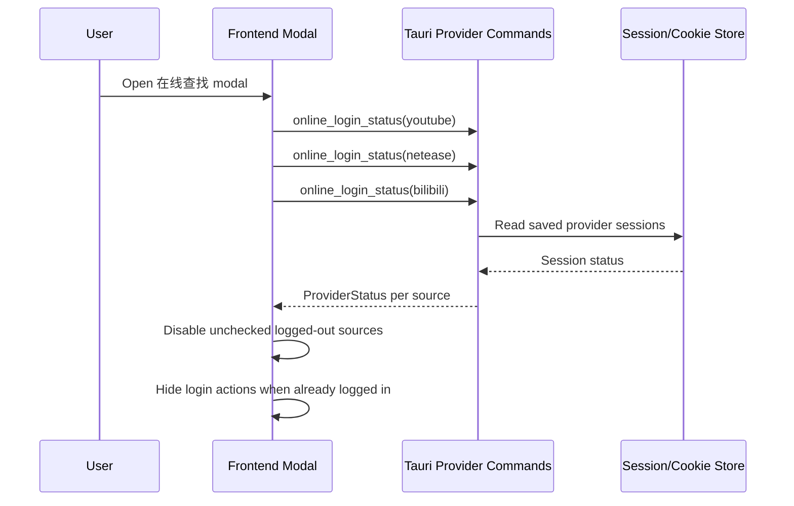
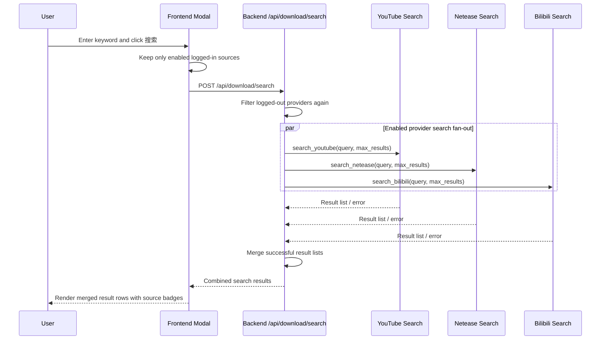
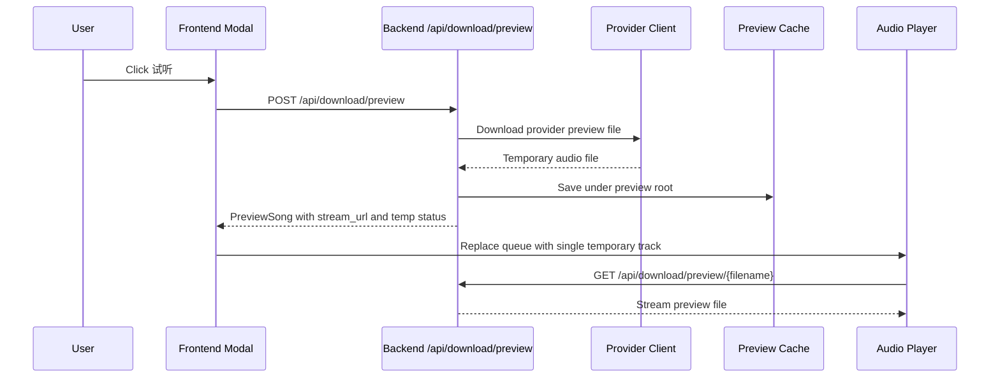
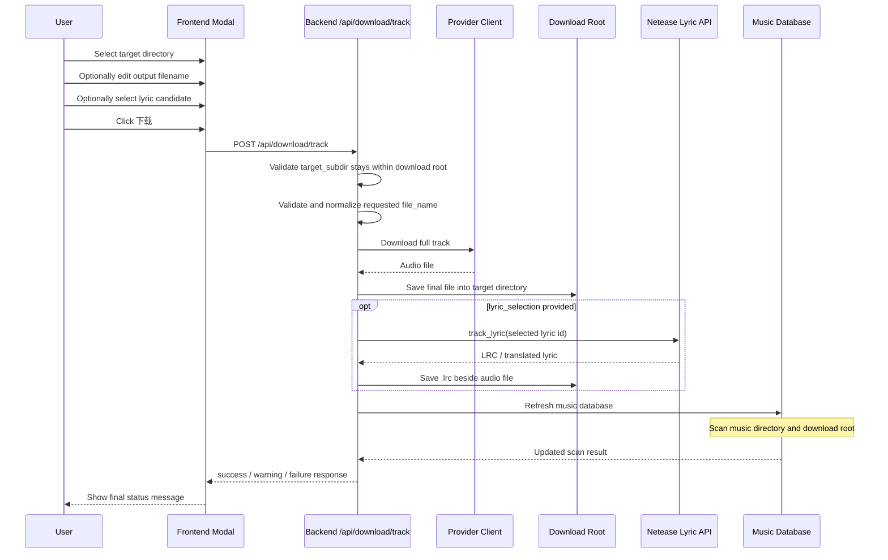
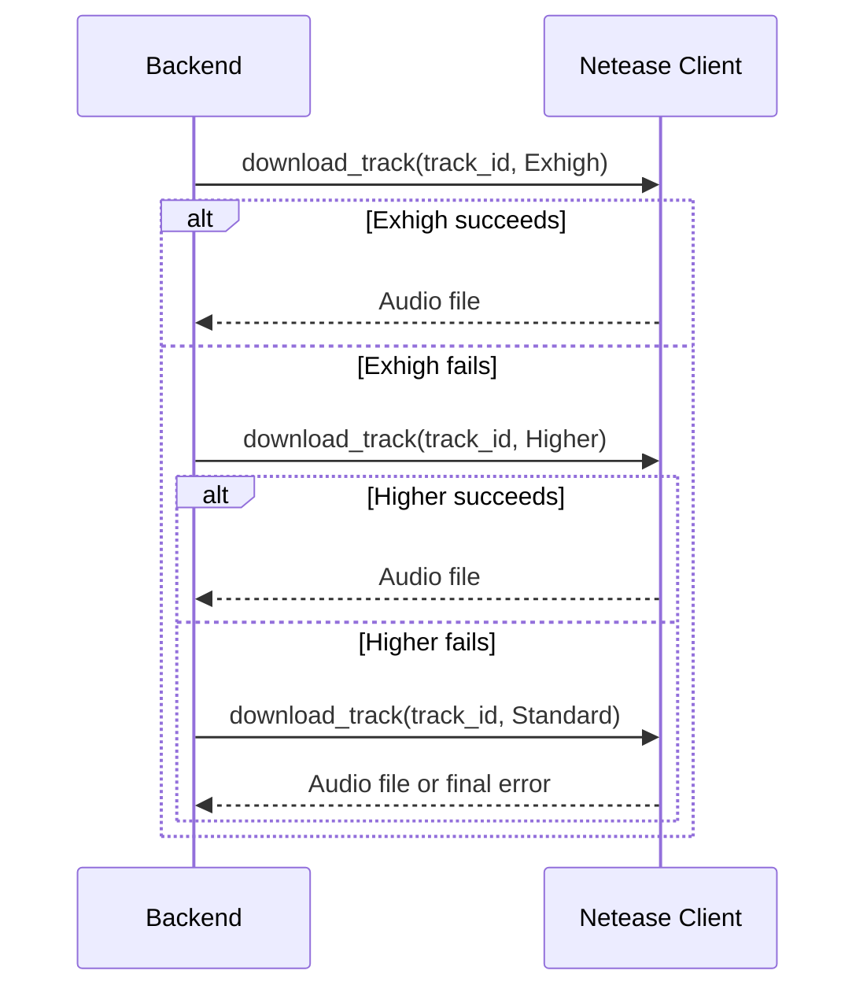

# Online Search and Download

## Overview

Kaulan supports online search, preview, lyric selection, and download for three providers:

- YouTube
- Netease
- Bilibili

The feature is exposed through the `在线查找` modal in the frontend. Provider login state is managed by the Tauri shell, while search, preview, and download requests are handled by the Rust backend.

This document describes the current behavior, request flow, and provider-specific rules.

## YouTube Solver Runtime Split

Kaulan now uses two different YouTube solver paths depending on how the backend is launched:

- Tauri desktop and Android:
  - the hidden webview solver loads local bundled copies of `meriyah` and `astring`
  - those files are prepared during the Tauri build step by `frontend/src-tauri/build.rs`
  - runtime no longer depends on `npm install` or CDN script loading
- Standalone backend mode:
  - no hidden webview exists
  - the vendored `ytdl-audio` crate falls back to its Node.js solver helper in `vendor/ytdl-audio/js/solver.mjs`
  - standalone deployments still need Node.js plus the vendored solver dependencies available on disk

Kaulan currently vendors `ytdl-audio` 0.2.1. Its player extraction flow tries the
VISIONOS client before the existing authenticated client fallbacks, rejects player
responses that do not contain a usable audio URL or signature cipher, and normalizes
player JavaScript URLs to the upstream `player_ias` variant. Pre-content ad metadata
is also honored before media download begins.

## Standalone Server Auth Import

Standalone backend mode can import provider auth from one file per source at process startup.

CLI flags:

- `--youtube-cookie-file <path>` points to a Netscape cookie jar file for YouTube
- `--netease-session-file <path>` points to a JSON file that matches `session.json`
- `--bilibili-session-file <path>` points to a JSON file that matches `bilibili_session.json`

Example:

```bash
cargo run -- run /path/to/music \
  --youtube-cookie-file /path/to/youtube-cookies.txt \
  --netease-session-file /path/to/netease-session.json \
  --bilibili-session-file /path/to/bilibili-session.json
```

Import behavior:

- YouTube keeps using the file directly through `KAULAN_YOUTUBE_COOKIE_HEADER_PATH`
- Netease copies the provided file into `$NCMDUMP_CONFIG_DIR/session.json`
- Bilibili copies the provided file into `$NCMDUMP_CONFIG_DIR/bilibili_session.json`
- If `NCMDUMP_CONFIG_DIR` is not set, Kaulan uses `~/.config/ncmdump/`

Optional Netease proxying:

- `NETEASE_RELAY_URL=<proxy-url>` routes only Netease API and media requests through the configured proxy
- Leave it unset to keep the current direct behavior
- The value is passed to `reqwest::Proxy::all`, so this build accepts `http://`, `https://`, and `socks5://` proxy URLs

Example:

```bash
cd backend
NETEASE_RELAY_URL=http://your-cn-proxy:7890 \
cargo run -- run /path/to/music \
  --netease-session-file /path/to/netease-session.json
```

## User-Facing Behavior

### Provider gating

- A provider is considered available only when Kaulan detects a saved login/session for that provider.
- In the modal, logged-out providers:
  - hide login capture actions after login is already present
  - are disabled as search sources when login is missing
- During search, the frontend only sends enabled sources.
- The backend also re-checks provider availability and drops logged-out sources defensively.

Current provider availability checks:

- `youtube`: saved raw cookie header exists
- `netease`: saved `MUSIC_U` session exists
- `bilibili`: saved session cookies exist

For YouTube, "saved cookies exist" is only a coarse gate. A provider can still fail later if the saved cookies are stale or no longer satisfy YouTube bot checks.

### Provider account management

- The modal only exposes `登录`, `同步登录`, and `退出` when the selected search source is the local `http://localhost:2080/api` backend running inside the Tauri shell.
- Remote sources still report provider availability through `/api/download/providers`, but their account state must be managed on the remote device itself.
- On Android, the YouTube login page uses the device WebView's regular phone user-agent so Google sign-in follows its supported mobile flow. Synchronizing the YouTube cookies restores desktop mode. Netease and Bilibili login pages, the application webview at startup, and the hidden YouTube download solver keep the existing desktop user-agent. Related sources: `frontend/src-tauri/src/lib.rs`, `frontend/src-tauri/gen/android/app/src/main/java/afeather/kaulan/MainActivity.kt`.

### Search behavior

- The modal includes a backend source selector so users can switch the online-search server without leaving the panel.
- Only sources with at least one usable provider can be selected for online search.
- Search is merged across the selected enabled providers.
- Backend provider requests are fanned out concurrently, not serially.
- Result rows show:
  - title
  - artist/uploader
  - duration
  - source badge
- Users can request:
  - `试听` for temporary playback
  - `歌词` for Netease lyric candidates
  - `下载` for a full download
- Opening `歌词` expands a lyric search box for that result.
- The lyric search box is pre-filled from the user's current main search input. If that input is empty, Kaulan falls back to `title + artist` for the selected result.
- Users can edit that lyric query before searching again, so lyric matching is no longer locked to the chosen track metadata.
- The lyric list is for selection only. After selecting a lyric candidate, the user still uses the song row's `下载` button to save both the audio file and the selected `.lrc`.

### Preview behavior

- Preview downloads a temporary local file first.
- The frontend replaces the current playback queue with a single temporary track.
- Temporary preview tracks are not inserted into the main library database.
- On Android, preview files are stored in the app download root under `.preview-cache`.
- On desktop, YouTube preview downloads are finalized through Kaulan's backend FFmpeg pipeline. Opus sources are remuxed into `.mka` with stream copy only instead of being rewritten as `.ogg`. Related sources: `backend/src/services/download/youtube.rs`, `backend/src/ffmpeg.rs`.
- Bilibili preview downloads are remuxed to `.m4a` with FFmpeg stream copy only on both desktop and Android. No audio re-encoding is performed. Related sources: `backend/src/services/download/bilibili.rs`, `backend/src/handlers/download.rs`.

### Download behavior

- Full downloads are saved under the configured online download root.
- Users can edit the saved audio filename before starting a full download.
- The backend treats the edited value as a basename only:
  - path separators are rejected
  - blank names are rejected
  - any user-supplied extension is stripped
  - the provider-specific extension is appended by Kaulan (`.mp3`, `.m4a`, `.mka`, or other provider output)
- On Android, Kaulan uses the app external files music directory:
  - `/sdcard/Android/data/afeather.kaulan/files/Music`
- On desktop, YouTube full downloads are finalized through Kaulan's backend FFmpeg pipeline. Opus sources are remuxed into `.mka` with stream copy only instead of being rewritten as `.ogg`, which keeps the audio unchanged and lets Kaulan attach cover art. Related sources: `backend/src/services/download/youtube.rs`, `backend/src/ffmpeg.rs`.
- Bilibili full downloads are remuxed to `.m4a` with FFmpeg stream copy only on both desktop and Android, because the provider audio is AAC and does not need transcoding. This avoids raw `.m4s` outputs, keeps the files indexable by the scanner, and lets the shared cover-art embedding path work on the saved file. Related sources: `backend/src/services/download/bilibili.rs`, `backend/src/handlers/download.rs`, `backend/src/file_ops/mod.rs`.
- If the user selected a lyric candidate, Kaulan tries to save a matching `.lrc` file beside the audio file.
- After a successful full download, Kaulan refreshes the music database through the registered scan backends:
  - `StdFsScanBackend` for the configured music directory
  - `StdFsScanBackend` for the configured online download root when it differs
  - `MediaStoreScanBackend` on Android for device media
- The download panel keeps completed and failed job entries visible until the user dismisses them. Completed entries show a reminder to refresh the library if the new file is not visible yet. Related frontend sources: `frontend/src/stores/downloads.ts`, `frontend/src/components/DownloadJobsView.vue`.

### Android YouTube cookie refresh note

If Android YouTube downloads suddenly fail with a provider error like:

- `Sign in to confirm you're not a bot`
- `playability=LOGIN_REQUIRED`
- no returned `formats` or `adaptive_formats`

the usual fix is to export YouTube cookies again from the Android login webview.

This failure pattern normally means:

- the request reached YouTube successfully
- fallback clients (`tv_downgraded`, `WEB`, `web_safari`) were attempted
- but the saved cookies were stale or incomplete for the fallback auth path

It does **not** usually indicate that the embedded solver JavaScript failed to load.

## API

### `POST /api/download/search`

Search online providers and return a merged result list.

Request:

```json
{
  "query": "keyword",
  "max_results": 8,
  "sources": ["youtube", "netease", "bilibili"]
}
```

Response item:

```json
{
  "source": "netease",
  "id": "2015001195",
  "title": "Song Title",
  "artist": "Artist Name",
  "duration": "3:28",
  "thumbnail_url": "https://...",
  "can_preview": true,
  "can_download": true,
  "requires_login": false
}
```

### `POST /api/download/preview`

Download a temporary preview file and return a one-track playback item.

Request:

```json
{
  "source": "netease",
  "id": "2015001195",
  "title": "Song Title",
  "artist": "Artist Name"
}
```

Response:

```json
{
  "success": true,
  "message": "试听准备完成",
  "song": {
    "id": -123456,
    "name": "Song Title [Artist Name]",
    "path": "/absolute/path/to/temp-file.mp3",
    "stream_url": "http://localhost:2080/api/download/preview/preview-....mp3",
    "cover_url": "https://...",
    "source": "netease",
    "is_temporary": true
  }
}
```

### `GET /api/download/preview/{filename}`

Stream a previously prepared preview file.

### `POST /api/download/lyrics/search`

Search Netease lyric candidates for the current lyric query.

Request:

```json
{
  "query": "user supplied lyric keywords"
}
```

Response item:

```json
{
  "source": "netease",
  "id": "2015001195",
  "title": "Song Title",
  "artist": "Artist Name",
  "album": "Album Name"
}
```

### `POST /api/download/track`

Download the selected track into the online download root and optionally save lyrics.

Request:

```json
{
  "source": "netease",
  "id": "2015001195",
  "title": "Song Title",
  "artist": "Artist Name",
  "file_name": "Artist - Song Title",
  "target_subdir": "",
  "lyric_selection": "2015001195"
}
```

Response:

```json
{
  "success": true,
  "message": "下载完成",
  "filename": "Song Title.mp3",
  "lyric_filename": "Song Title.lrc",
  "warning": null
}
```

### `GET /api/download/directory-tree`

Return the selectable directory tree under the online download root.

## Sequence Diagrams

### Provider login gating



### Concurrent search flow



### Preview flow



### Full download and lyric flow



### Netease quality fallback flow



## Implementation Notes

### Search source availability

- `youtube` search/download requires a saved cookie header.
- `netease` search/download requires a saved `MUSIC_U` session.
- `bilibili` search/download requires saved login cookies.

The current backend behavior intentionally ignores logged-out providers instead of returning partial provider login errors from `/api/download/search`.

### Temporary preview tracks and LUFS

- Preview tracks use synthetic negative IDs and are not in the main music table.
- They are streamed by `/api/download/preview/{filename}` instead of `/api/music/id/{id}`.
- They should be treated as temporary playback-only items.

### Target directory validation

- `target_subdir` is always interpreted as a path relative to the online download root.
- Kaulan rejects parent traversal and paths outside the configured root.
- The root directory itself is valid when `target_subdir` is empty.

## Related Source Files

- `frontend/src/components/modals/OnlineSearchModal.vue`
- `frontend/src/App.vue`
- `frontend/src/composables/useLibrarySources.ts`
- `frontend/src/composables/useAudioPlayer.ts`
- `frontend/src-tauri/build.rs`
- `frontend/src-tauri/src/lib.rs`
- `frontend/src-tauri/gen/android/app/src/main/java/afeather/kaulan/MainActivity.kt`
- `backend/src/handlers/download.rs`
- `backend/src/services/download.rs`
- `backend/src/services/download/youtube.rs`
- `backend/src/services/download/netease.rs`
- `backend/src/services/download/bilibili.rs`
- `backend/src/handlers/lufs.rs`
- `backend/src/server/mod.rs`
- `backend/src/types/mod.rs`
- `vendor/ytdl-audio/src/lib.rs`
- `vendor/ncmdump-rs/netease-api/src/track.rs`
- `vendor/ncmdump-rs/bilibili-api`
