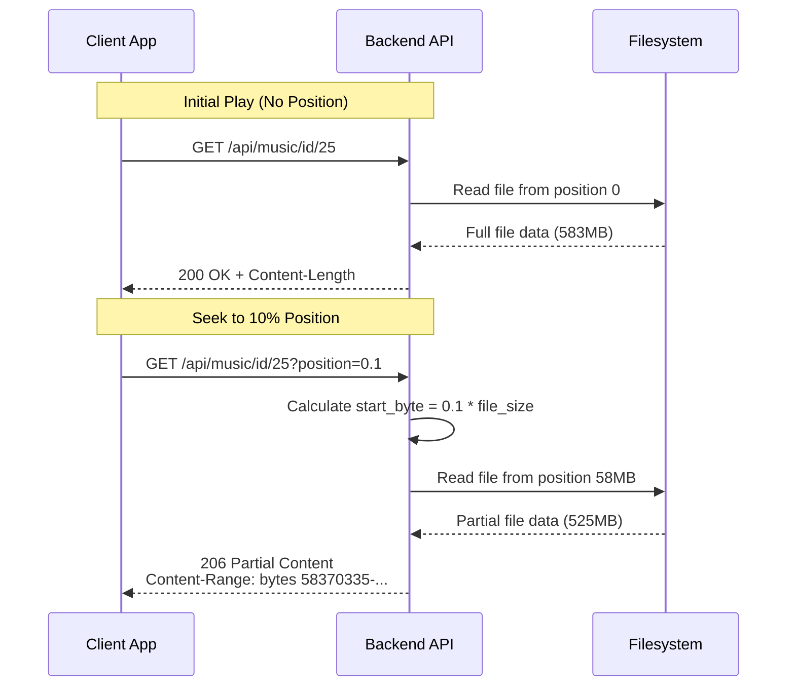

# Position-Based Music Streaming

## Overview

The music streaming API supports position-based seeking via query parameter, allowing clients to request audio starting from a specific position in the file (0.0 to 1.0) without downloading from the beginning.

## API Endpoint

**`GET /api/music/id/{id}?position={0.0-1.0}`**

| Parameter | Type | Description |
|-----------|------|-------------|
| `id` | integer | Music ID from database |
| `position` | float (optional) | Position in file (0.0 = start, 0.5 = middle, 1.0 = end) |

**Behavior:**
- **Without `position`:** Streams entire file from beginning (HTTP 200 OK)
- **With `position`:** Streams from calculated byte position to end (HTTP 206 Partial Content)
- **Invalid position:** Falls back to streaming from beginning (HTTP 200 OK)

**Response:**
```http
HTTP/1.1 206 Partial Content
Content-Type: audio/mpeg
Content-Length: 525333015
Content-Range: bytes 58370335-583703349/583703350
Accept-Ranges: bytes
Cache-Control: public, max-age=86400, must-revalidate
X-Seek-Position: 0.1
```

## How It Works

### Architecture



### Client-Side Calculation

The client calculates the position value:

```typescript
// In the audio player composable
const position = currentTime / duration  // 0.0 to 1.0

// Example:
// currentTime = 60 seconds
// duration = 1980 seconds (33 minutes)
// position = 60 / 1980 ≈ 0.03

const url = `/api/music/id/${songId}?position=${position}`
```

### Server-Side Calculation

```rust
// Server calculates byte position
let start_byte = (position * file_size).floor() as u64;

// Example:
// position = 0.1 (10%)
// file_size = 583703350 bytes (557MB)
// start_byte = 0.1 * 583703350 ≈ 58370335 bytes
```

## Usage Examples

### Streaming from Start (Default)
```bash
curl -X GET "http://localhost:2080/api/music/id/25"
# Downloads: 583MB (full file)
```

### Streaming from 10% Position
```bash
curl -X GET "http://localhost:2080/api/music/id/25?position=0.1"
# Downloads: 525MB (skips first 10%)
```

### Streaming from 50% Position
```bash
curl -X GET "http://localhost:2080/api/music/id/25?position=0.5"
# Downloads: 291MB (skips first 50%)
```

### Streaming from End
```bash
curl -X GET "http://localhost:2080/api/music/id/25?position=1.0"
# Downloads: 1 byte (last byte only)
```

## Frontend Integration

### Threshold-Based Seeking

The frontend uses position-based seeking only for large jumps while paused:

```typescript
// In useAudioPlayer.ts
const USE_TIMESTAMP_THRESHOLD = 30  // seconds

const seekToTime = (time: number) => {
  const jumpDistance = Math.abs(time - currentTime.value)

  // Use position parameter for large jumps while paused
  if (!isPlaying.value && jumpDistance > USE_TIMESTAMP_THRESHOLD && time > 0) {
    playSong(currentSong.value, time)  // Triggers position-based URL
    return
  }

  // Otherwise use standard HTML5 seeking
  audioElement.value.currentTime = time
}
```

### URL Building

```typescript
const buildAudioUrl = (songId: number, seekTime?: number): string => {
  const url = new URL(`${apiBase}/music/id/${songId}`)

  if (seekTime !== undefined && duration.value > 0) {
    const position = seekTime / duration.value
    url.searchParams.set('position', position.toString())
  }

  return url.toString()
}
```

## Related Source Files

### Backend
- **`backend/src/handlers/music.rs`**
  - `MusicQueryParams` - Position query parameter struct
  - `get_music_by_id()` - Main handler with position-based seeking logic
  - Position validation and byte calculation
  - Priority: Position parameter > Range header > Full stream

### Frontend
- **`frontend/src/composables/useAudioPlayer.ts`**
  - `buildAudioUrl()` - Construct URLs with position parameter
  - `playSong()` - Accept optional `seekTime` parameter
  - `seekToTime()` - Threshold-based position seeking logic

### Tests
- **`backend/tests/timestamp_seek_test.rs`** - Backend position seek tests (7 tests)
- **`frontend/src/composables/__tests__/useAudioPlayer.timestamp.test.ts`** - Frontend tests (8 tests)

## Edge Cases

| Position | Calculation | Result |
|----------|-------------|--------|
| 0.0 | start_byte = 0 | Full file (200 OK) |
| 0.5 | start_byte = 50% | Half file (206 Partial Content) |
| 1.0 | start_byte = file_size (clamped to size-1) | 1 byte (206 Partial Content) |
| -0.1 | Invalid | Falls back to full stream (200 OK) |
| 1.1 | Invalid | Falls back to full stream (200 OK) |

## Benefits

| Scenario | Without Position Parameter | With Position Parameter |
|----------|---------------------------|------------------------|
| Initial play | Downloads full file | Same (no position) |
| Small seek (< 30s) | HTML5 Range request | HTML5 Range request (smoother) |
| Large seek while paused | Downloads from seek point | Downloads from seek point |
| Large uncached seek | Browser estimates byte position | Exact position calculation |

## Limitations

### Approximate Seeking

The byte position is calculated proportionally: `start_byte = position × file_size`

This assumes constant bitrate:
- **CBR files:** Accurate seeking
- **VBR files:** Approximate (HTML5 audio handles final adjustment)

For most use cases, this approximation is acceptable since the browser's audio element will adjust playback based on actual audio timestamps.

### Duration Requirement

The client must know the duration before using position-based seeking:
- First load: Duration unknown → no position parameter
- Subsequent seeks: Duration known → position parameter available

This is handled naturally since the HTML5 audio element only provides duration after metadata loads.

## Configuration

No configuration required. The position-based seeking is built into the music streaming endpoint.

## Comparison with HTTP Range Headers

| Feature | HTTP Range Header | Position Parameter |
|---------|-------------------|-------------------|
| Implemented by | Browser automatically | Client explicitly |
| Precision | Browser-calculated | Client-calculated |
| Use case | All seeking | Large jumps while paused |
| Backward compatibility | Always available | Optional enhancement |

Both approaches work together:
1. Position parameter for initial large seeks (saves bandwidth)
2. HTTP Range headers for subsequent small adjustments (smoother)
