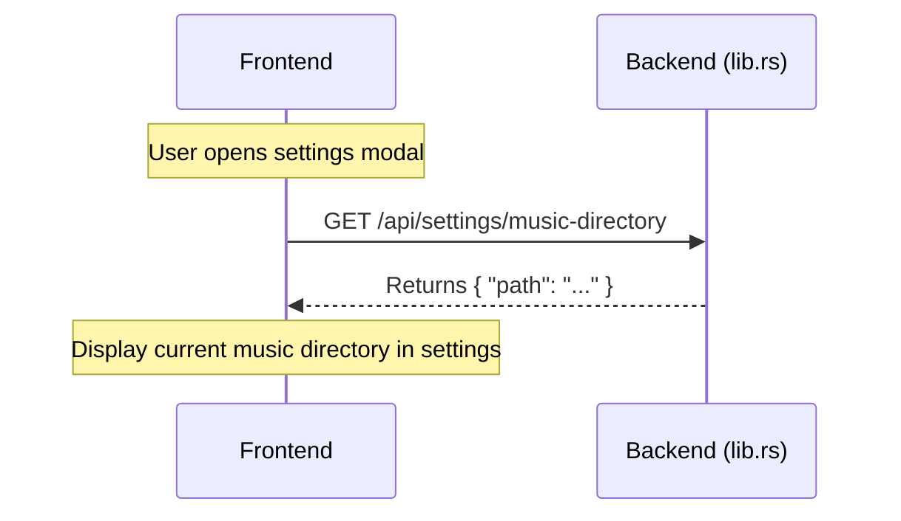
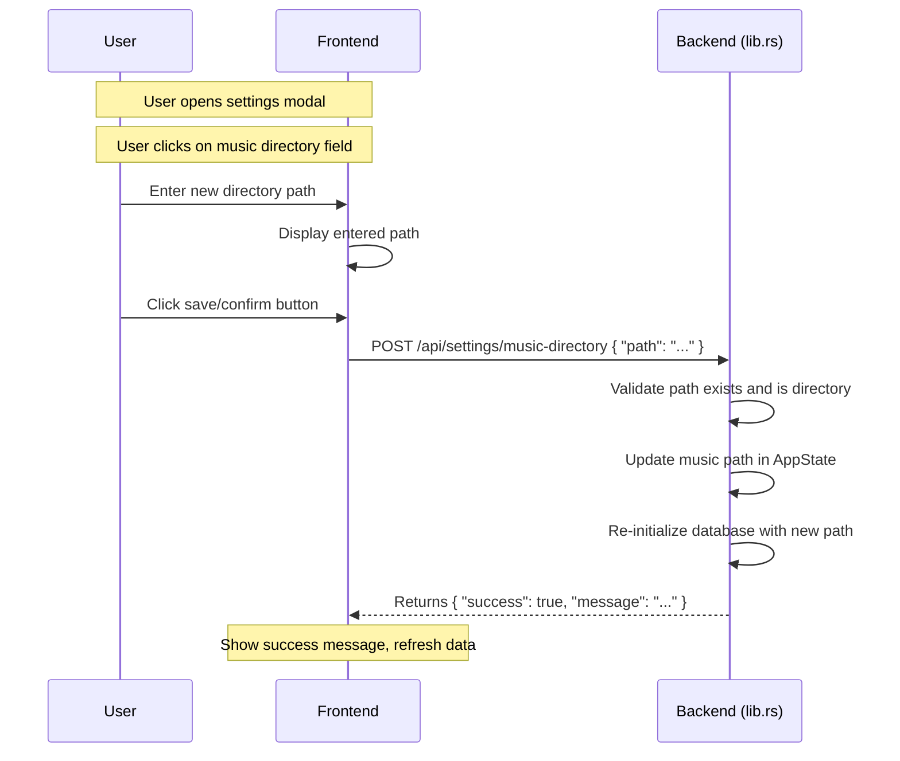
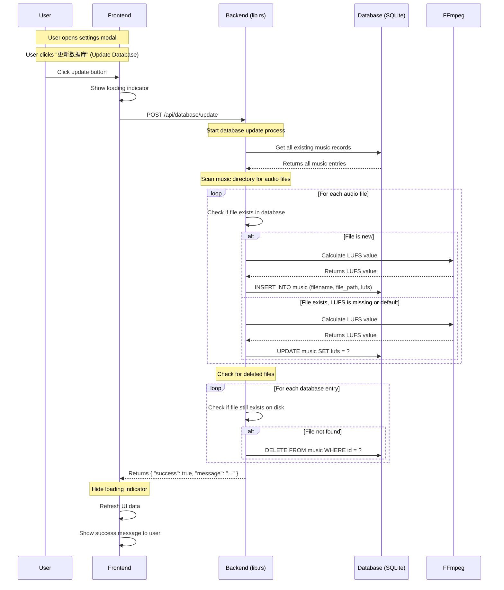

# Settings and Database Management

## Overview

The Settings and Database Management features allow users to configure the music directory and update the music database through the UI, without needing to restart the server or use command-line arguments.

## Features

1. **Music Directory Configuration** - Set and view the music directory path through the settings UI
2. **Database Update** - Trigger database refresh to scan for new files, update LUFS values, and remove deleted files

## API Endpoints

### Settings Endpoints

| Method | Endpoint | Description |
|--------|----------|-------------|
| GET | `/api/settings/music-directory` | Get the current music directory path |
| POST | `/api/settings/music-directory` | Set the music directory path (triggers database re-initialization) |
| POST | `/api/database/update` | Trigger database update (scan for new files, update LUFS, remove deleted files) |

## Request/Response Formats

### Get Music Directory

```bash
GET /api/settings/music-directory

Response:
{
  "path": "/path/to/music"
}
```

### Set Music Directory

```bash
POST /api/settings/music-directory
Content-Type: application/json

{
  "path": "/new/path/to/music"
}

Response:
{
  "success": true,
  "message": "Music directory updated to: /new/path/to/music"
}
```

### Update Database

```bash
POST /api/database/update

Response:
{
  "success": true,
  "message": "Database updated successfully"
}
```

## Sequence Diagrams

### Initial Load - Get Music Directory



### Change Music Directory



### Update Database



## User Interface Usage

### Viewing Current Music Directory

1. Open the app
2. Click the settings button (≡) in the bottom right
3. The current music directory is displayed in the "音乐文件夹" (Music Folder) field

### Changing Music Directory

The music directory can be changed directly through the REST API without restarting the server.

1. Open the settings modal
2. Click on the music directory field
3. Enter the new directory path
4. Click save/confirm button

The server will:
- Validate that the path exists and is a directory
- Update the music path in `AppState`
- Re-initialize the database with the new path
- Return a success message

**Note:** The music directory change takes effect immediately without requiring a server restart.

### Updating the Database

1. Open the settings modal
2. Click the "更新数据库" (Update Database) button
3. Wait for the update to complete (a loading indicator will be shown)
4. The UI will automatically refresh after a successful update

The update process will:
- **Scan for new files** - Add newly discovered audio files to the database
- **Update LUFS values** - Calculate LUFS for files with missing or default (0.5) values
- **Remove deleted files** - Delete database entries for files that no longer exist on disk

## Database Update Details

### What Gets Updated

| Scenario | Action |
|----------|--------|
| New file in directory | Insert into database with calculated LUFS |
| Existing file without LUFS | Calculate LUFS and update record |
| Existing file with default LUFS (0.5) | Calculate LUFS and update record |
| File in database but not on disk | Delete from database |

### Supported Audio Formats

- MP3 (`.mp3`)
- OGG Vorbis (`.ogg`)
- WAV (`.wav`)
- AAC (`.aac`)
- FLAC (`.flac`)

### LUFS Calculation

LUFS (Loudness Units Full Scale) values are calculated using FFmpeg. The update process will:
1. Run FFmpeg's `loudnorm` filter on each audio file
2. Extract the integrated loudness value
3. Store the value in the database for volume normalization during playback

**Note:** FFmpeg must be installed on the system for LUFS calculation to work. If FFmpeg is not available, the update process will skip LUFS calculation and log a warning.

## Technical Notes

### Backend Implementation

The database update is implemented in `backend/src/lib.rs`:

- `update_database_endpoint()` - Actix-web endpoint handler
- `update_database()` - Core database update logic
- `scan_directory_recursive()` - Recursive directory scanning

### State Management

- The music directory is stored in `AppState` (Arc<RwLock<String>>)
- The music directory can be updated at runtime via `POST /api/settings/music-directory`
- When changed, the database is automatically re-initialized with the new path
- No server restart is required to change the music directory

### Error Handling

The database update endpoint returns appropriate HTTP status codes:
- `200 OK` - Update completed successfully
- `500 Internal Server Error` - Database or file system error occurred

## Future Improvements

Potential enhancements for these features:

1. **Progress indicator** - Show detailed progress during database update (files processed, LUFS calculated, etc.)
2. **Scheduled updates** - Configure automatic database updates at intervals
3. **Partial updates** - Allow updating specific folders or file types
4. **Batch LUFS calculation** - Queue LUFS calculation as a background task
5. **Folder picker UI** - Implement a native folder picker for easier directory selection
