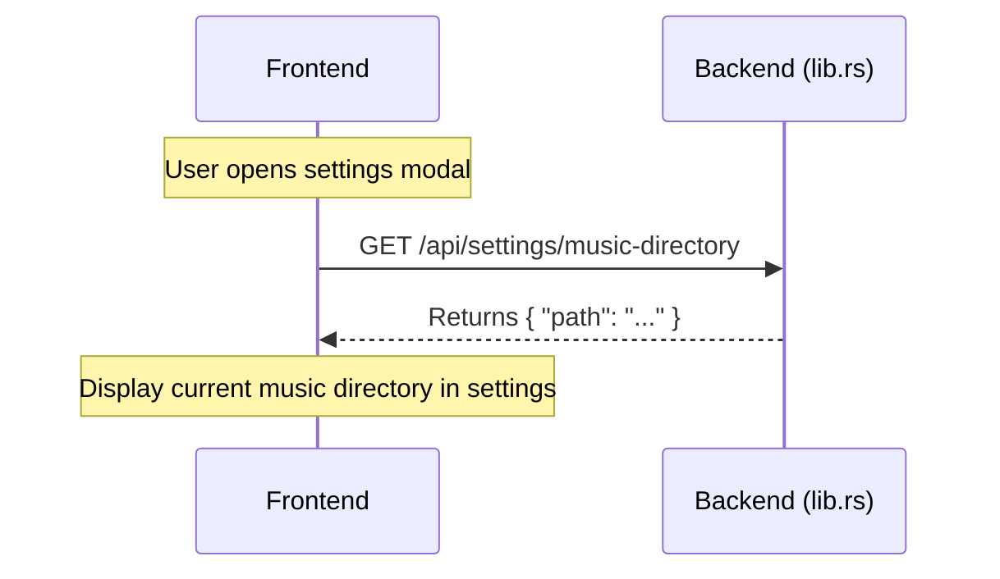
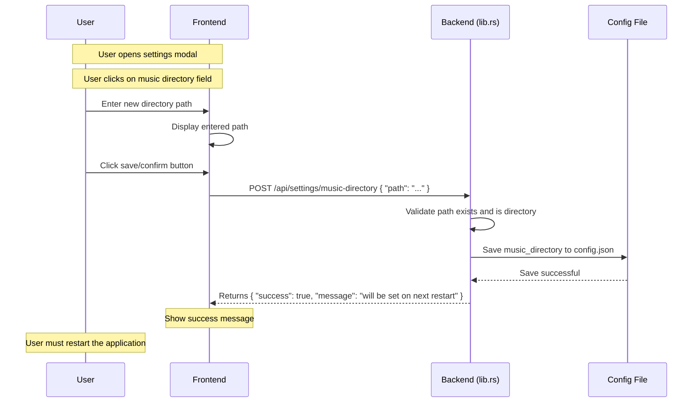
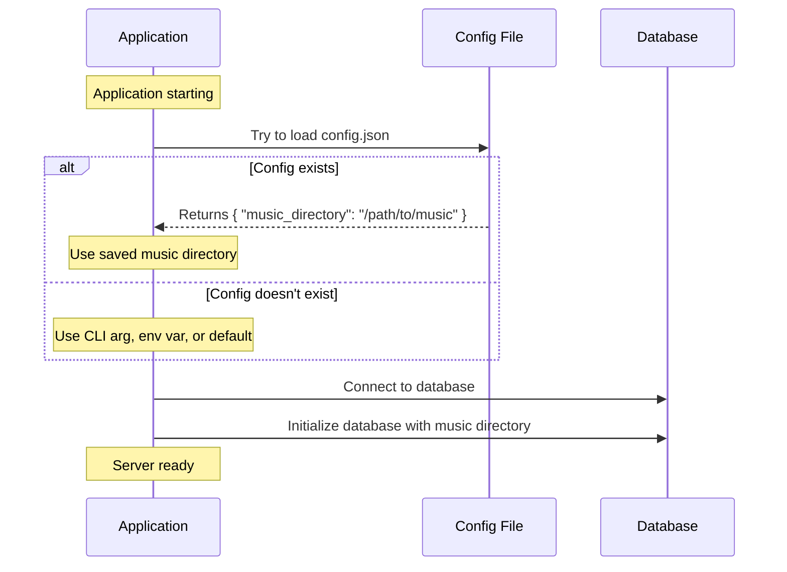
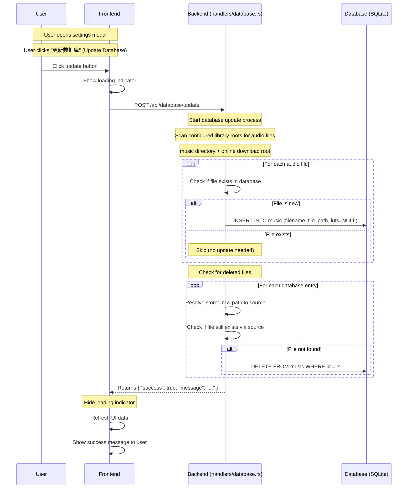

# Settings and Database Management

## Overview

The Settings and Database Management features allow users to configure the music directory, choose which media types are scanned, and update the music database through the UI. Music directory and media type changes are persisted to a config file.

## Features

1. **Music Directory Configuration** - Set and view the music directory path through the settings UI
2. **Media Type Filter** - Choose whether database scans include audio only or both audio and video files
3. **Database Update** - Trigger database refresh to scan for new files and remove deleted files
3. **On-Demand LUFS Pre-caching** - LUFS values are calculated automatically during playback for the next song
4. **Playback Normalization Settings** - Volume mode and slider settings affect playback immediately
5. **Persistent Configuration** - Music directory is saved to a config file and persists across restarts

## Source-Resolved Paths

The database continues to store raw file paths in `music.file_path`, but backend file access is now resolved through source-specific implementations:

- `StdFs` for normal filesystem paths
- `AndroidMediaStoreContent` for `content://` paths

Database updates now use source-aware path normalization and existence checks instead of assuming every entry is a plain filesystem path.

## API Endpoints

### Settings Endpoints

| Method | Endpoint | Description |
|--------|----------|-------------|
| GET | `/api/settings/music-directory` | Get the current music directory path |
| POST | `/api/settings/music-directory` | Set the music directory path (saved to config, takes effect on restart) |
| GET | `/api/settings/media-types` | Get enabled media types for scanning |
| POST | `/api/settings/media-types` | Set enabled media types for scanning |
| POST | `/api/database/update` | Trigger database update (scan for new files, remove deleted files) |
| POST | `/api/music/{id}/precache-lufs` | Pre-cache LUFS for a music track (called automatically during playback) |

## Request/Response Formats

### Get Music Directory

```bash
GET /api/settings/music-directory

Response:
{
  "path": "/path/to/music"
}
```

### Set Music Directory

```bash
POST /api/settings/music-directory
Content-Type: application/json

{
  "path": "/new/path/to/music"
}

Success Response:
{
  "success": true,
  "message": "Music directory will be set to '/new/path/to/music' on next restart."
}

Error Response (path doesn't exist):
{
  "success": false,
  "message": "Directory does not exist: /invalid/path"
}
```

### Update Database

```bash
POST /api/database/update

Response:
{
  "success": true,
  "message": "Database updated successfully"
}
```

When the user triggers a database update from the settings panel, the frontend shows a `扫描中...` banner while the update request is in progress.

### Get Media Types

```bash
GET /api/settings/media-types

Response:
{
  "media_types": ["audio"]
}
```

### Set Media Types

```bash
POST /api/settings/media-types
Content-Type: application/json

{
  "media_types": ["audio", "video"]
}

Success Response:
{
  "success": true,
  "message": "Media types updated. Re-scan database to apply changes."
}
```

## Sequence Diagrams

### Initial Load - Get Music Directory



### Change Music Directory



### Application Startup - Load Config



### Update Database



## User Interface Usage

### Volume Mode and Slider

The settings modal also controls playback normalization:

1. Open the settings modal.
2. Tap the volume mode row to cycle between `auto`, `manual`, and `fixed`.
3. In `manual` mode, move the percentage slider to set a fixed playback volume.
4. In `fixed` mode, move the LUFS slider to choose the target loudness.

Behavior:

- Web playback applies the new effective volume immediately to the current `HTMLAudioElement`.
- Android playback sends the normalization config to `MusicPlayerService`, which reapplies the current track volume immediately and reuses the same config for later track changes.
- If the current song has no LUFS yet, `auto` and `fixed` temporarily fall back to the manual volume baseline until a real LUFS value is available.

### Android Sleep Timer Exit

Android settings include an extra checkbox named `定时关闭程序`.

1. Open the settings modal on Android.
2. Set the sleep timer duration.
3. Enable `定时关闭程序` if timer completion should exit the app instead of only stopping playback.
4. Start the timer.

Behavior:

- Disabled: the timer keeps the current behavior and only stops playback.
- Enabled: the timer stops the Android playback service, releases backend playback state, and exits the Android app.
- Switching songs or playlists on Android keeps the active sleep timer and reapplies the remaining delay to the restarted playback service.
- The setting is stored in frontend localStorage under `kaulan_timer_exit_app_on_android`.

### Viewing Current Music Directory

1. Open the app
2. Click the settings button (≡) in the bottom right
3. The current music directory is displayed in the "音乐文件夹" (Music Folder) field

### Changing Music Directory

The music directory can be changed through the settings UI. The change is saved to a configuration file and takes effect on the next application restart.

1. Open the settings modal
2. Click on the music directory field
3. Enter the new directory path
4. Click save/confirm button

The server will:
- Validate that the path exists and is a directory
- Save the path to the configuration file
- Return a success message indicating the change will take effect on restart

**Note:** The music directory change takes effect on application restart, not immediately. The configuration is persisted across restarts.

### Configuration File

The music directory is stored in a JSON configuration file:

**Standalone Mode:**
| Platform | Config Location |
|----------|----------------|
| Linux | `~/.config/kaulan/config.json` |
| macOS | `~/Library/Application Support/kaulan/config.json` |
| Windows | `%APPDATA%\kaulan\config.json` |

**Tauri Mode:**
| Platform | Config Location |
|----------|----------------|
| Linux | `~/.config/<app-name>/config.json` |
| macOS | `~/Library/Application Support/<app-name>/config.json` |
| Windows | `%APPDATA%\<app-name>\config.json` |

**Config Format:**
```json
{
  "music_directory": "/path/to/music"
}
```

**Startup Priority (highest to lowest):**
1. CLI argument (if provided) - **Overrides config file**
2. Config file (if exists)
3. Environment variable `KAULAN_MUSIC_DIR`
4. **Application aborts** if none of the above are configured

**Note:** The application will no longer fall back to a default directory. If no music directory is configured via CLI argument, config file, or environment variable, the application will abort with an error message.

### Updating the Database

1. Open the settings modal
2. Adjust the media type filter if needed and save it
3. Click the "更新数据库" (Update Database) button
3. Wait for the update to complete (a loading indicator will be shown)
4. The UI will automatically refresh after a successful update

The update process will:
- **Scan for new files** - Add newly discovered audio files or supported video files to the database, depending on the media type filter
- **Update LUFS values** - Calculate LUFS for files with missing or default (0.5) values
- **Remove deleted files** - Delete database entries for files that no longer exist on disk

## Database Update Details

### What Gets Updated

| Scenario | Action |
|----------|--------|
| New file in directory | Insert into database with null LUFS (calculated on-demand during playback) |
| File in database but not on disk | Delete from database |

### Supported Audio Formats

- MP3 (`.mp3`)
- OGG Vorbis (`.ogg`)
- WAV (`.wav`)
- AAC (`.aac`)
- FLAC (`.flac`)
- M4A (`.m4a`)
- Opus (`.opus`)

### Supported Video Formats

- MP4 (`.mp4`)
- Matroska (`.mkv`)
- AVI (`.avi`)
- MOV (`.mov`)
- 3GP (`.3gp`)

### LUFS Pre-caching (On-Demand Calculation)

LUFS (Loudness Units Full Scale) values are calculated on-demand during playback rather than during database updates. This provides a faster database update experience and ensures LUFS is only calculated for songs that are actually played.

The detailed playback behavior has changed over time and is documented separately in [`docs/lufs-playback-flow.md`](./lufs-playback-flow.md).

Current high-level rule:

1. The current song may do one LUFS request before playback starts.
2. The next song may do one non-blocking pre-cache request after current playback starts.
3. If LUFS is already cached, the player can use it immediately.
4. If LUFS is not cached yet, playback starts without waiting for a long calculation.

**Pre-cache endpoint:**

```bash
POST /api/music/{id}/precache-lufs

Response (200 OK - Already cached):
{
  "success": true,
  "lufs": -14.5,
  "cached": true
}

Response (202 Accepted - Processing in background):
{
  "success": true,
  "lufs": null,
  "cached": false
}

Response (500 Internal Server Error - Content URI read failure):
{
  "success": false,
  "lufs": null,
  "error": "LUFS calculation failed: Failed to read content URI: ..."
}
```

**Note:** Kaulan uses in-process FFmpeg bindings for LUFS calculation. The desktop/runtime environment still needs FFmpeg libraries available for `rusty_ffmpeg`, and pre-cache requests fail gracefully if that runtime support is missing.

Video files are excluded from LUFS pre-caching. The backend returns success immediately for video entries so playback does not block on an analysis path that is not supported.

## Technical Notes

### Backend Implementation

The database update is implemented in `backend/src/services/scanner.rs` and `backend/src/handlers/`:

| Function/Handler | Location | Description |
|------------------|----------|-------------|
| `update_database_endpoint()` | handlers/database.rs:32 | Actix-web endpoint handler |
| `update_database()` | services/scanner.rs:191 | Core database update logic (no LUFS calculation) |
| `initialize_database()` | services/scanner.rs:78 | Initial database scan on first run |
| `precache_lufs()` | handlers/lufs.rs:56 | LUFS pre-cache endpoint handler |
| `scan_directory_recursive()` | services/scanner.rs:27 | Recursive directory scanning |
| `load_config()` | config/mod.rs | Load config from file |
| `save_config()` | config/mod.rs | Save config to file |

### Configuration Module

The configuration module provides cross-platform config file handling:

```rust
// backend/src/lib.rs

/// Configuration file structure
struct Config {
    music_directory: Option<String>,
}

/// Load music directory from config file
fn load_config() -> Option<String>

/// Save music directory to config file
fn save_config(music_directory: &str) -> Result<(), Box<dyn std::error::Error>>
```

### State Management

- The music directory is stored in `AppState` as `Arc<String>` (immutable during runtime)
- The music directory can be updated via `POST /api/settings/music-directory`
- Changes are saved to config and applied on next restart
- No `RwLock` overhead since the path is constant during runtime

### Error Handling

The endpoints return appropriate HTTP status codes:
- `200 OK` - Operation completed successfully
- `400 Bad Request` - Invalid path (doesn't exist or not a directory)
- `500 Internal Server Error` - Config file write error or database error

## Related Source Files

| File | Description |
|------|-------------|
| `backend/src/config/mod.rs` | Config module implementation |
| `backend/src/handlers/settings.rs` | Settings API endpoints |
| `backend/src/handlers/database.rs` | Database update endpoint |
| `backend/src/handlers/lufs.rs` | LUFS pre-cache endpoint |
| `backend/src/services/scanner.rs` | Directory scanning and database operations |
| `backend/src/server/mod.rs` | Route registration and server startup |
| `frontend/src/composables/useAudioPlayer.ts` | Audio player with onSongStart callback |
| `frontend/src/App.vue` | LUFS pre-cache trigger in handleSongStart |
