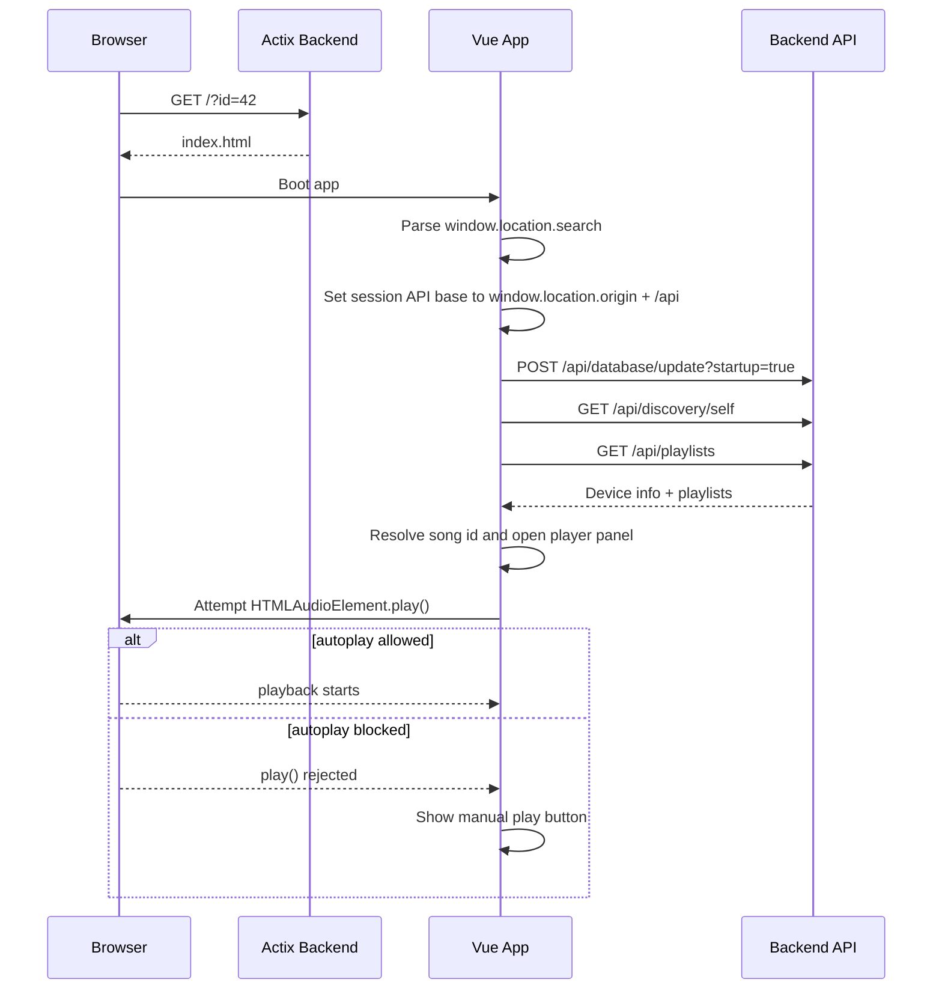

# Shared Song Links

Kaulan can open a specific song directly in the backend-served web player by
using a query-arg share link:

```text
http://server_ip:2080/?id=42
```

Related source files:

- `frontend/src/utils/sharedLink.ts`
- `frontend/src/composables/useAppShell.ts`
- `frontend/src/composables/useLibrarySources.ts`
- `frontend/src/composables/useAudioPlayer.ts`
- `frontend/src/App.vue`

## Behavior

- The backend serves the same `index.html` shell at `/`.
- The frontend reads `window.location.search` and parses `id`.
- The frontend treats `window.location.origin + "/api"` as the session-local
  source for this page load.
- The app refreshes library sources, finds the requested song id, opens the
  containing playlist, shows the player panel, and attempts playback.
- If the browser blocks autoplay, the song stays selected and the page shows a
  manual play button.
- If the `id` value is invalid or the song is missing, the page remains usable
  and shows an in-app status message.

## Link Format

| URL        | Result                                                    |
| ---------- | --------------------------------------------------------- |
| `/?id=42`  | Load song `42` from the current server and try to play it |
| `/?id=abc` | Show invalid-link message and keep the app usable         |
| `/`        | Normal app startup without shared playback intent         |

Song sharing is id-based only. There is no filename fallback contract.

## Creating a Link

The narrow action bar shows a link button on the right whenever a song is
selected and the action bar is visible. The button is not part of the search bar
or mini player.

```text
+--------------------------------------------------+
| [Back]                                    [Link] |
+--------------------------------------------------+
|              [ Cover ]                           |
|              [ Cover ]                           |
|              [ Cover ]                           |
+--------------------------------------------------+
| [Cover] Song Name                                |
| [Cover]      progress bar                        |
| [Shuffle] [Prev] [Play/Pause] [Next] [Queue]     |
+--------------------------------------------------+
```

Clicking the button opens a compact share dialog:

```text
+------------------------------------------------------+
| Share Song                                      [x]  |
+------------------------------------------------------+
| Song Name                                             |
| http://192.168.1.20:2080/?id=42                      |
|                                                      |
|                                  [Copy Link]         |
+------------------------------------------------------+
```

The generated link uses the selected song's source API base. For example, a song
loaded from `http://192.168.1.20:2080/api` creates
`http://192.168.1.20:2080/?id=42`, even if the browser is currently open on a
different Kaulan source. If a song does not carry a source key, the frontend
uses the current page origin plus `/api`, falling back to
`http://localhost:2080/api` only outside normal HTTP/HTTPS browser origins.

## Request Flow



## API Notes

This feature does not add new JSON endpoints. It reuses the existing routes:

- `POST /api/database/update?startup=true`
- `GET /api/discovery/self`
- `GET /api/playlists`
- `GET /api/music/id/{id}`

## UI Notes

- The link opens the normal Kaulan web player, not a separate share page.
- The shared server is labeled as `This Device` for that browser session.
- After startup, the frontend removes `id` from the address bar with
  `history.replaceState()` so the share intent is only consumed once per page
  load.
