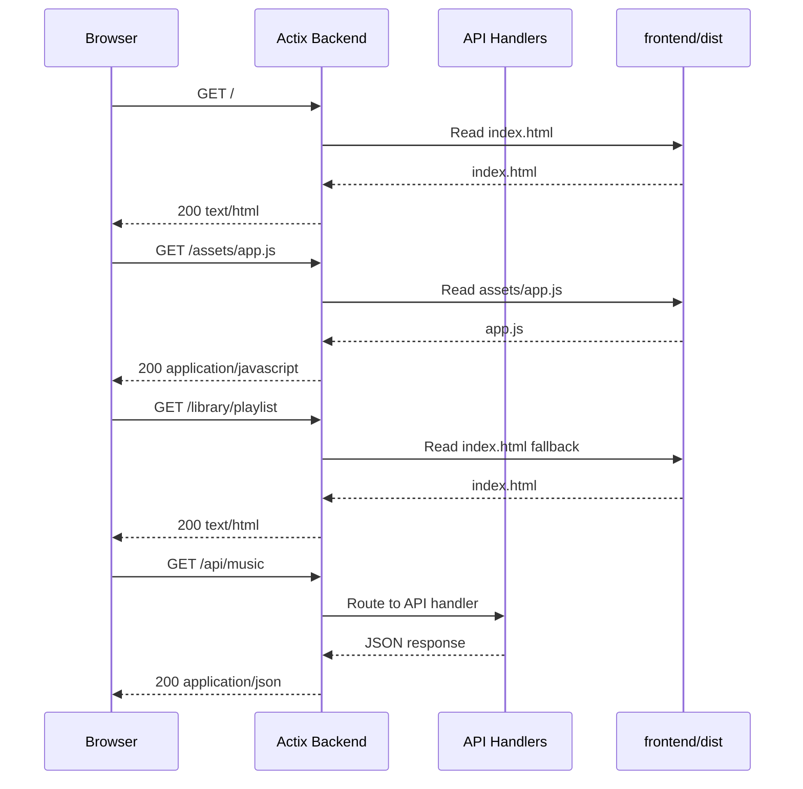

# Static Frontend Serving

Kaulan can serve the production Vue build from the Actix Web backend. This is
useful for standalone web deployments where users open the player from the same
host and port as the backend API.

Related source files:

- `backend/src/server/mod.rs`
- `backend/tests/static_frontend_test.rs`
- `frontend/vite.config.ts`

## Build and Run

Build the frontend first:

```bash
cd frontend
npm run build
```

Then start the backend:

```bash
cd ../backend
cargo run -- run /path/to/music
```

Open the web app at:

```text
http://localhost:2080/
```

The backend resolves the frontend build directory in this order:

1. `KAULAN_FRONTEND_DIST`, when set
2. `frontend/dist` relative to the current working directory
3. `../frontend/dist` relative to the current working directory
4. `../frontend/dist` relative to the backend crate directory

If no build is found, API endpoints still run normally and browser requests to
`/` return `404 Not Found` with a message explaining that the frontend build is
missing.

## Request Flow



## API Behavior

Static serving does not add new JSON APIs. It adds browser-facing static routes:

| Route | Behavior |
| --- | --- |
| `GET /` | Serves `index.html` from the frontend build |
| `GET /assets/...` | Serves built frontend assets |
| `GET /<browser-route>` | Falls back to `index.html` for SPA navigation |
| `GET /api/...` | Stays reserved for backend APIs |

Unknown `/api/...` paths return API `404 Not Found` and do not return the Vue
`index.html`.

## UI Usage

There is no new in-app UI. Users access the same Kaulan web player by opening
the backend root URL after the frontend has been built.
