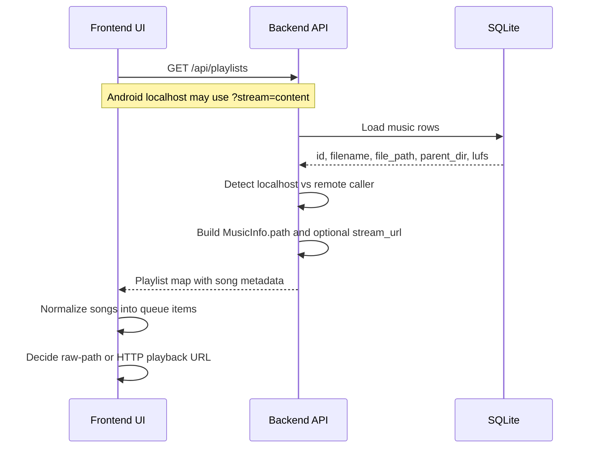
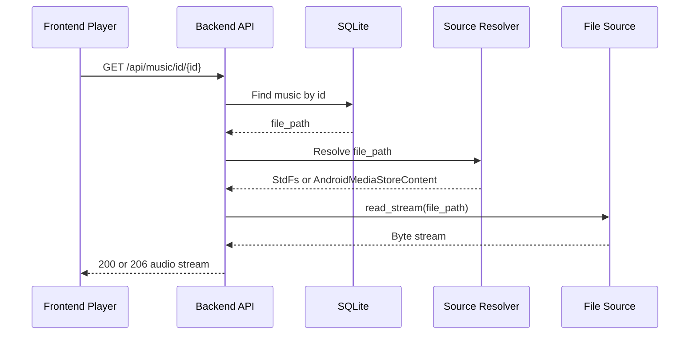
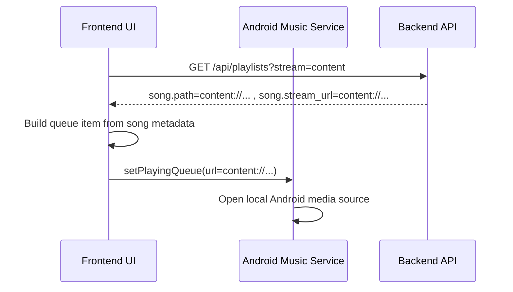
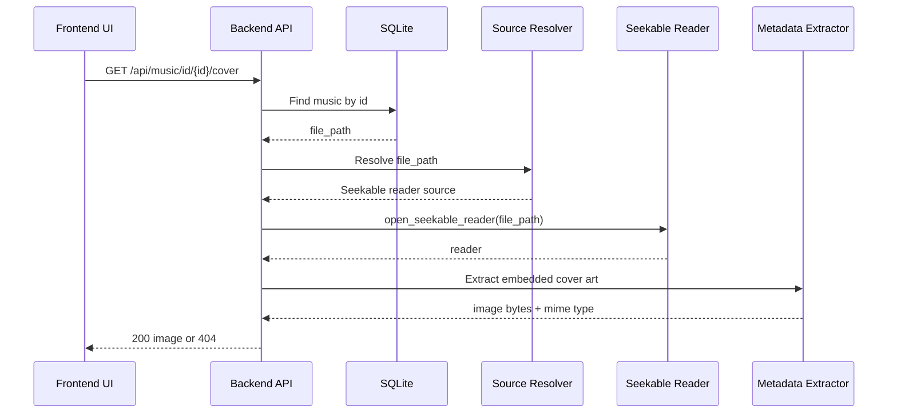
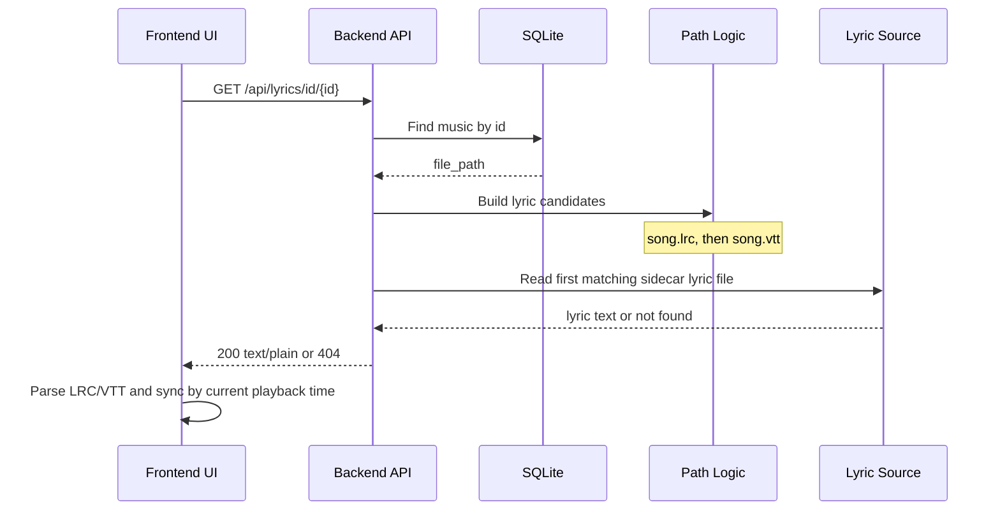
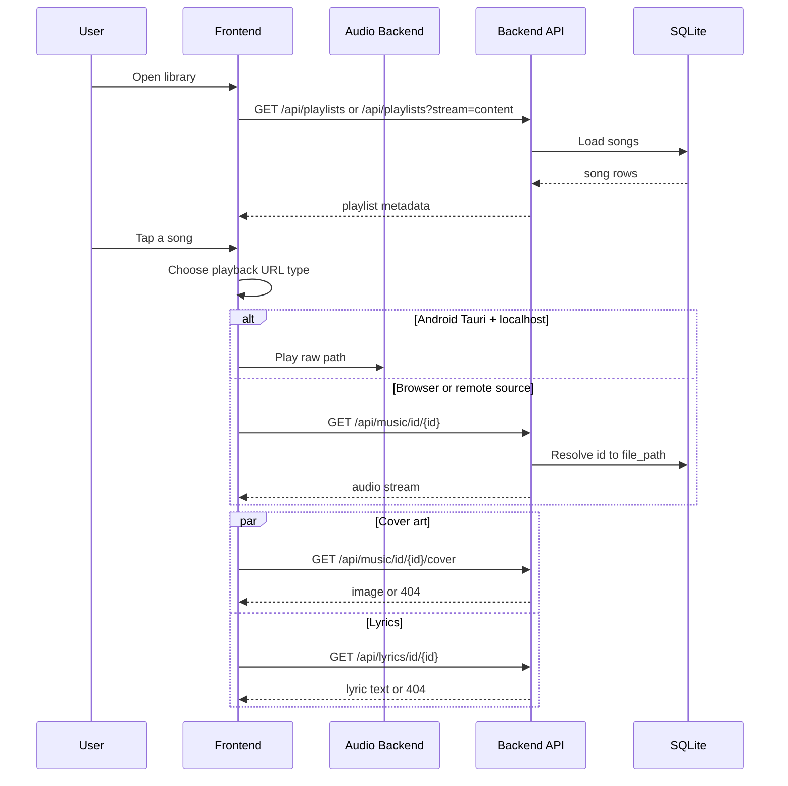

# Streaming Flow

## Overview

Kaulan has three related read flows:

1. music playback
2. cover art loading
3. lyric loading

These flows share the same playlist metadata and source-routing rules, but they do not always use the same final URL type.

This document explains:

- which API payload fields are metadata versus final playback URLs
- when the frontend uses raw paths versus HTTP URLs
- how backend handlers resolve `id` or filename requests into the real source path
- how music, cover, and lyric requests differ on desktop, Android localhost, and remote clients

## Related Source Files

### Backend

- `backend/src/handlers/playlists.rs` - playlist payload generation
- `backend/src/handlers/music.rs` - music streaming and cover art endpoints
- `backend/src/handlers/lyrics.rs` - lyric endpoints
- `backend/src/types/mod.rs` - stream query handling, localhost checks, HTTP URL builders
- `backend/src/file_ops/mod.rs` - source resolver for filesystem paths and `content://` URIs

### Frontend

- `frontend/src/App.vue` - source-group playlist loading and song normalization
- `frontend/src/composables/useAudioPlayer.ts` - playback URL selection and Android queue sync
- `frontend/src/composables/useLyrics.ts` - lyric loading by song id
- `frontend/src/composables/usePlaylist.ts` - localhost playlist fetch with `?stream=content`
- `frontend/src/utils/platform.ts` - Android and localhost detection

### Related Docs

- [`docs/position-based-streaming.md`](./position-based-streaming.md)
- [`docs/lyrics-display.md`](./lyrics-display.md)
- [`docs/android/mediastore-integration.md`](./android/mediastore-integration.md)

## Data Model And Response Fields

Playlist responses use `MusicInfo` records with these important fields:

| Field | Meaning | Notes |
|------|------|------|
| `id` | stable database id | used to build backend HTTP endpoints |
| `name` | display filename | shown in UI and queue |
| `path` | raw stored backend path for localhost callers | may be filesystem path or Android `content://` URI |
| `stream_url` | optional explicit playback URL | present when the backend is asked to expose a direct playback target |
| `cover_url` | frontend-derived or stored cover endpoint | usually `/api/music/id/{id}/cover` |

Important distinction:

- `path` is metadata about where the backend stored the song
- `stream_url` is the preferred playback target when present
- the frontend may still derive a playback URL from `id` when `stream_url` is absent

## URL Selection Rule

Kaulan uses this playback selection rule:

| Runtime / Source | Final playback URL |
|------|------|
| Android Tauri + localhost source | raw path (`content://...` or local file path) |
| Web frontend on desktop/browser | `http://.../api/music/id/{id}` |
| Remote source over LAN | `http://remote-host:2080/api/music/id/{id}` |

This rule is intentionally Android-specific. Desktop and normal browser playback do not use raw Android `content://` URIs.

## Playlist Metadata Flow

### Summary

The playlist endpoint returns song metadata first. The frontend then normalizes each song into a playable queue item.

### Sequence

### Backend Behavior

`GET /api/playlists` and `GET /api/playlists/{name}`:

- localhost callers receive the raw stored path in `path`
- remote callers receive an HTTP stream URL in `path`
- Android localhost callers that request `?stream=content` also receive the raw path in `stream_url`

That rule is implemented in:

- `backend/src/handlers/playlists.rs`
- `backend/src/types/mod.rs`

### Frontend Behavior

The frontend normalizes each playlist song:

- if `stream_url` is already present, it is kept
- otherwise the frontend derives `http://.../api/music/id/{id}`
- during actual Android localhost playback, the player prefers the raw `path`

That rule is implemented in:

- `frontend/src/App.vue`
- `frontend/src/composables/useAudioPlayer.ts`

## Music Streaming Flow

### Normal HTTP Streaming

For browser playback and all remote playback, the frontend uses:

- `GET /api/music/id/{id}`

The backend then resolves that `id` back to the stored raw path and streams the file.

### Android Localhost Direct Playback

For Android Tauri localhost playback, the frontend may bypass the HTTP music endpoint and pass the raw path directly to the Android playback backend.

Notes:

- this direct-play path is only for Android localhost playback
- the backend HTTP music endpoint still exists and is still used for web playback, remote playback, and seeking flows
- large seek operations may still rebuild an HTTP `/api/music/id/{id}?position=...` URL when needed

## Cover Art Flow

Cover art always uses the backend cover endpoint:

- `GET /api/music/id/{id}/cover`

The frontend does not use a raw image sidecar path for this feature. It always asks the backend to extract embedded artwork from the audio file.

Behavior:

- works for filesystem paths and Android `content://` URIs
- returns `404` when the song has no embedded artwork
- Android playback notifications reuse this endpoint when a cover URL is available

## Lyric Flow

Lyrics use separate backend endpoints:

- `GET /api/lyrics/id/{id}`
- `GET /api/lyrics/{filename}`

The frontend player uses the id-based route so lyric loading follows the currently selected song regardless of displayed filename.

### Android Lyric Notes

On Android, the music row may store a `content://` URI. Lyric loading is still sidecar-file based:

1. backend resolves the media item to a filesystem path
2. backend tries `song.lrc`, then `song.vtt`
3. frontend parses the returned text and syncs it using current playback position

Unlike audio playback, lyric loading does not stream from the `content://` URI itself.

## Combined End-To-End Flow

## API Summary

| Endpoint | Purpose | Final payload type |
|------|------|------|
| `GET /api/playlists` | playlist metadata | JSON |
| `GET /api/playlists?stream=content` | Android localhost playlist metadata with raw direct-play URL | JSON |
| `GET /api/music/id/{id}` | stream audio by id | audio bytes |
| `GET /api/music/id/{id}?position={0.0-1.0}` | stream audio from calculated offset | audio bytes |
| `GET /api/music/id/{id}/cover` | extract embedded artwork | image bytes |
| `GET /api/lyrics/id/{id}` | load lyric sidecar by song id | text |
| `GET /api/lyrics/{filename}` | load lyric sidecar by filename | text |

## Troubleshooting

### Why does `/api/playlists` show `content://...` but playback logs show `/api/music/id/{id}`?

Because `path` is metadata, not always the final playback URL. The frontend may derive an HTTP playback URL from `id`, or may prefer the raw path for Android localhost playback.

### Why does Android localhost sometimes use raw paths and sometimes HTTP?

Because the frontend uses raw paths only for Android Tauri localhost playback. Remote sources and normal web playback still use HTTP URLs.

### Why do cover and lyric requests still use backend endpoints on Android?

Because:

- cover art must be extracted from embedded audio metadata by the backend
- lyrics are loaded from `.lrc` or `.vtt` sidecar files by the backend
- these are different from the direct audio playback path decision
