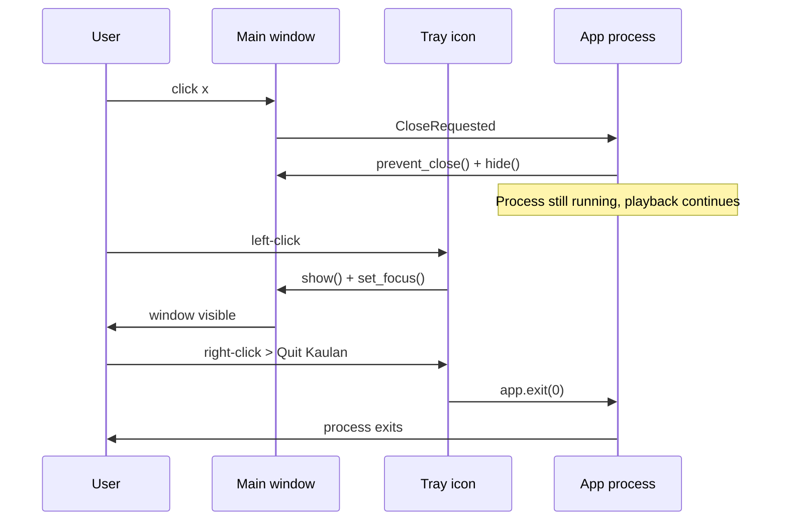

# System Tray (Hide to Dock)

Desktop-only feature that collapses the main window into the system tray
(notification area on Windows, menu bar on macOS, status area on Linux)
instead of exiting when the user clicks the window's close or minimize
button. Provides a dedicated **Quit** path through the tray's context menu.

Android and the browser-only web build have no system tray and are
unaffected.

## Related Source Files

- `frontend/src-tauri/src/lib.rs` - tray icon builder, window-event handler
- `frontend/src-tauri/Cargo.toml` - `tray-icon` and `image-png` features

## Why This Exists

Without this feature, clicking the window's `x` tears down the process and
stops playback even when the user just wanted the window out of the way.
Clicking `-` parks the window in the OS taskbar / dock, which on Windows is
visually noisy and on macOS does not match the "music player runs in the
background" expectation.

The system-tray collapse gives the user a single gesture (`x` or `-`) that
hides the UI while playback continues, plus a single discoverable gesture
(tray menu > Quit) to actually stop the process.

## Behavior

| User action                                            | Result                                                            |
| ------------------------------------------------------ | ----------------------------------------------------------------- |
| Click window `x`                                       | Window hides; app process and playback continue                   |
| Click window `-`                                       | Window hides (after un-minimizing); app process and playback continue |
| Left-click tray icon while window is hidden            | Window is shown and focused                                       |
| Left-click tray icon while window is visible           | Window hides (toggle)                                             |
| Right-click tray > **Show Kaulan**                     | Window is shown and focused                                       |
| Right-click tray > **Quit Kaulan**                     | Process exits cleanly (bypasses the hide-on-close intercept)      |

There are no settings to disable this. It is the default behavior on every
desktop build (Windows, macOS, Linux). The Android build skips the tray
registration entirely through `#[cfg(not(target_os = "android"))]`.

## How It Works

Three pieces cooperate in `frontend/src-tauri/src/lib.rs`:

1. **Window-event handler** registered via `tauri::Builder::on_window_event`.
   Filters on `window.label() == "main"` so the hidden `youtube-solver`
   webview is not affected.

   - `WindowEvent::CloseRequested { api, .. }` -> `api.prevent_close()` +
     `window.hide()`.
   - `WindowEvent::Resized(_)` -> if `window.is_minimized()`, call
     `window.unminimize()` + `window.hide()`. Tauri 2.x has no dedicated
     minimize-requested event, so `Resized` + `is_minimized()` is the
     canonical recipe.

2. **Tray icon** built by `build_system_tray` in the `setup` hook. Uses
   `TrayIconBuilder` with a two-item menu (`Show Kaulan`, `Quit Kaulan`).
   The icon comes from `app.default_window_icon()`, which is sourced from
   the `bundle.icon` list in `tauri.conf.json`.

3. **Menu / click handlers**:
   - `show` menu item and left-click on the tray icon both restore the
     main window (`unminimize` + `show` + `set_focus`).
   - `quit` menu item calls `app.exit(0)`, which terminates the process
     without firing another `CloseRequested` event - that's why Quit is
     not subject to the hide-on-close intercept.

## Quit Path Is the Tray Menu

There is no in-window Quit button. The intended discovery path is the tray
icon's right-click menu. `app.exit(0)` bypasses `CloseRequested`, so the
intercept does not trap the user in a running process.
