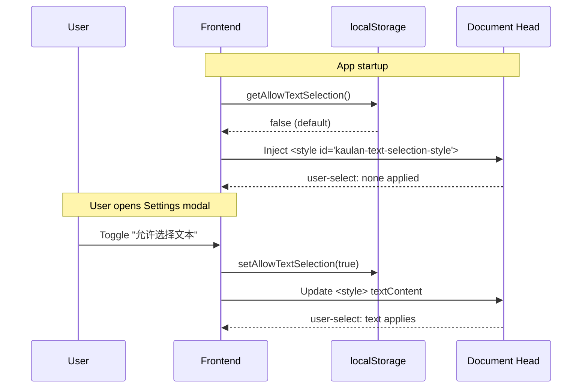

# Text Selection

## Overview

By default the Kaulan web UI disables mouse-based text and image selection so
the player looks like a polished app instead of a web page (issue #30). A
user-facing toggle lets people re-enable selection when they need to copy
lyrics, song names, or other text.

## Feature Behavior

| Setting state | UI behavior                                                                                                                                                                                                                                  |
| ------------- | -------------------------------------------------------------------------------------------------------------------------------------------------------------------------------------------------------------------------------------------- |
| Off (default) | `user-select: none` on `html`/`body`; images also get `-webkit-user-drag: none` + `user-select: none` so cover art can't be highlighted or dragged; inputs, textareas, and `contenteditable` regions stay selectable so editing still works. |
| On            | No global `user-select` override; the browser default behavior returns.                                                                                                                                                                      |

The preference is **frontend-only** and persists in browser localStorage
under `kaulan_allow_text_selection`. There is no backend API.

## How It Works

A Vue composable (`useTextSelection`) owns a singleton `<style>` element in
`document.head`. The composable:

1. Reads the initial preference from localStorage on mount.
2. Writes the selection-disabling CSS into the `<style>` tag (only when
   selection is off).
3. Watches a reactive `allowed` ref: when the user toggles selection on, the
   `<style>` element is removed entirely so an empty tag doesn't linger in
   `<head>` and the browser defaults take over; toggling off re-injects it.
4. Ref-counts consumers so the `<style>` element is also removed after the
   last component using the composable unmounts (the root component is the
   only consumer today, but the pattern is safe to reuse).

The CSS that gets injected when selection is disabled:

```css
body,
html {
  -webkit-user-select: none;
  -moz-user-select: none;
  -ms-user-select: none;
  user-select: none;
}
img {
  -webkit-user-drag: none;
  -webkit-user-select: none;
  -moz-user-select: none;
  -ms-user-select: none;
  user-select: none;
}
input,
textarea,
select,
[contenteditable="true"],
[contenteditable=""] {
  -webkit-user-select: text;
  -moz-user-select: text;
  -ms-user-select: text;
  user-select: text;
}
```

> **Platform note:** `-webkit-user-drag` is a WebKit/Chromium-only property
> with no effect on Firefox. Kaulan targets Android WebView and
> Chromium-based desktop browsers, where it is supported, so image
> drag-blocking is only enforced on those platforms. `user-select` itself is
> cross-browser and applies everywhere.

## Sequence Diagram



## User Interface

1. Open the settings modal (gear icon in the top bar).
2. Under the **个人** section, toggle **允许选择文本**.
3. The change takes effect immediately.

When the toggle is on, the user may select any text or picture with the
mouse as in a normal web page. When off, only form fields remain
selectable so search and rename dialogs still work.

## Related Source Files

| File                                               | Description                                                                          |
| -------------------------------------------------- | ------------------------------------------------------------------------------------ |
| `frontend/src/utils/storage.ts`                    | `ALLOW_TEXT_SELECTION` storage key, `getAllowTextSelection`, `setAllowTextSelection` |
| `frontend/src/composables/useTextSelection.ts`     | Reactive composable that injects and updates the global CSS                          |
| `frontend/src/composables/useAppShell.ts`          | Mounts the composable once and exposes the toggle to the root component              |
| `frontend/src/components/modals/SettingsModal.vue` | Settings UI checkbox                                                                 |
| `frontend/src/App.vue`                             | Passes the prop and event between the shell and the modal                            |
