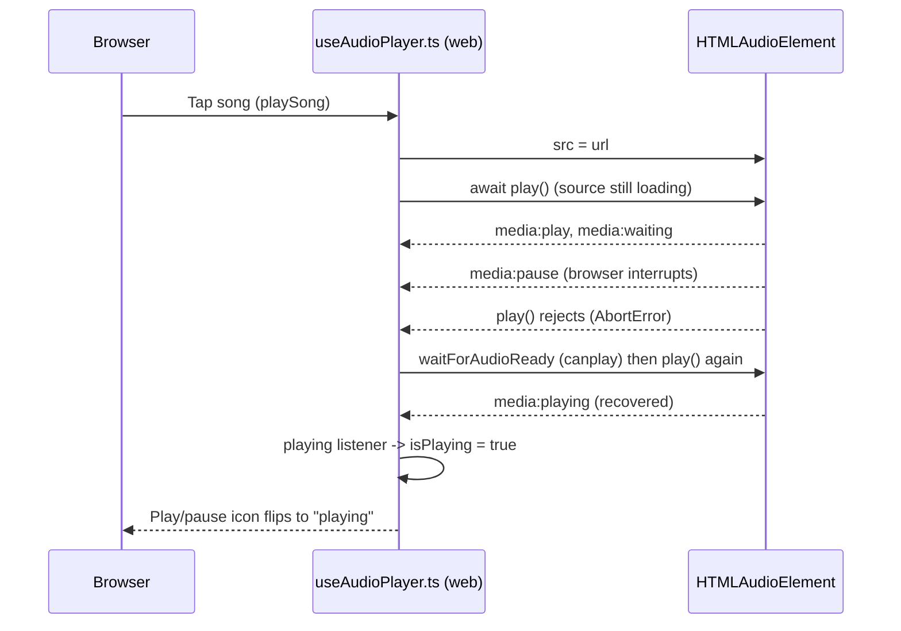

# Web Playback `isPlaying` State

## Overview

On desktop and in the browser the frontend plays audio with a single
`HTMLAudioElement` that is **reused across every song** (only its `src`
changes). The play/pause icon in
[`PlayerControls.vue`](../frontend/src/components/PlayerControls.vue) and
[`AppPlayerView.vue`](../frontend/src/components/AppPlayerView.vue) is bound to
the `isPlaying` ref exposed by
[`frontend/src/composables/useAudioPlayer.ts`](../frontend/src/composables/useAudioPlayer.ts).

This document explains two things:

1. Why the element is reused (Safari blocks `play()` on a fresh element without
   a user gesture, which broke auto-advance).
2. Why `isPlaying` must follow the audio element's real media events rather than
   the `play()` promise, and why an `AbortError` from `play()` is **not** an
   autoplay block.

Related Android behavior is documented separately in
[`docs/android/playback-session.md`](android/playback-session.md).

## The Bug (browser only)

### Auto-advance left the next song paused

Symptom: a song played to the end, the UI switched to the next song, but it
never started — it sat on "paused". Reproduced in the browser (notably
Safari/WebKit); Android was unaffected because it plays through the
MediaStore-backed notification service, not an `HTMLAudioElement`.

Root cause, captured with the `[web-playback]` console logs:

```
[web-playback] play() REJECTED -> isPlaying=false
  { errorName: 'NotAllowedError',
    errorMessage: 'play() can only be initiated by a user gesture.' }
```

`playSong` created a **brand-new** `HTMLAudioElement` for every song. The first
song played because the user tapped it — that gesture "unlocked" the element.
When the track ended, auto-advance advanced to the next song on a **fresh**
element with **no user gesture**, so Safari rejected `play()` with
`NotAllowedError` and the next song stayed paused.

### Click-to-play icon stayed on "play" (historical)

A separate, earlier symptom: tapping a song played the audio, but the
play/pause icon stayed on "play" (`isPlaying` stayed `false`).

`playSong` called `await play()` while the remote source was still loading
(`readyState` 0, `networkState` 2); the browser interrupted that pending
`play()` and the promise rejected with `AbortError`. The element then loaded
and reached the `playing` state on its own, but the old catch treated **every**
rejection as "autoplay blocked": it set `isPlaying = false` and threw
`PlaybackStartError`, so the UI read "paused" even though audio was playing.

Desktop/local loads finish fast enough that `play()` resolves first, so the
interrupt never happened there — which is why this symptom was browser-only and
appeared even with a fast remote server.

### Pause button stuck after seeking while paused

Repro: click a song → pause → click the progress bar → click resume. Audio
plays, but the play/pause icon stays on "play", so the next click sends another
`play()` instead of `pause()` and the user can no longer pause without
switching tracks.

Root cause: after the seek the element sits at `HAVE_CURRENT_DATA`, so Chrome
fires the `play` event (`paused` flipped) but never `playing` (data not yet
buffered for continuous advance). `isPlaying` was driven only by the `playing`
listener, so it stayed `false` even though the element was no longer paused and
playback had started. If the user pressed pause before the seek-target buffer
filled, the resume `play()` also rejected with `AbortError`, which surfaced as
an unhandled promise rejection.

## The Fix

Changes in the `web` backend inside `useAudioPlayer.ts`:

1. **Reuse one unlocked element.** `ensureAudioElement()` creates a single
   `HTMLAudioElement` (lazily, on first use) and attaches all media listeners
   once; `playSong` swaps its `src` instead of allocating a new element. Because
   the element was unlocked by the user's initial tap, Safari permits
   `play()` on it during auto-advance (no fresh gesture required). This is what
   fixes auto-advance.

2. **`isPlaying` mirrors media events.** `playing`, `play`, and `pause`
   listeners set `isPlaying` from the element's actual state, so the UI can
   never disagree with the audio regardless of how the `play()` promise
   resolves. Each listener is scoped to the current element with
   `toRaw(audioElement.value) !== toRaw(audio)` so a stale element cannot flip
   the UI. `toRaw` is required because `ref()` wraps plain-object values in a
   reactive proxy; real `HTMLAudioElement` values are host objects and are not
   proxied, but `toRaw` keeps the identity check correct in both production and
   tests.

3. **The `play` event drives `isPlaying`, not just `playing`.** `play` fires
   the moment `paused` flips to `false`; `playing` only fires once enough data
   is buffered for continuous advance. After a seek while paused the element
   can sit at `HAVE_CURRENT_DATA` and emit `play` but never `playing`, so
   relying on `playing` alone left `isPlaying=false` even though the user had
   pressed resume and the element was no longer paused. Listening to `play`
   makes the UI follow the user's intent.

4. **`AbortError` is not fatal in `playSong`.** In the `play()` catch, only
   `NotAllowedError` is treated as an autoplay block. `AbortError` (source
   still loading) waits for the source to be ready (`waitForAudioReady`, the
   `canplay` event with a 2 s fallback) and calls `play()` again, so a slow
   remote load still starts. If the retry also fails, `isPlaying` is reconciled
   with the element's real `paused` state instead of forcing `false`/throwing.

5. **`play()` (resume) swallows `AbortError`.** The separate `play()` used when
   the user resumes after a seek or pause awaits `audio.play()` and used to
   re-throw any rejection. If the user pressed pause before the seek-target
   buffer filled, Chrome rejected `play()` with `AbortError` and the throw
   surfaced as an unhandled promise rejection (and left the play/pause icon
   stuck). Like `playSong`, it now reconciles `isPlaying` from the element on
   `AbortError` instead of throwing; other rejections still propagate.

6. **`isPlayingInternal` covers the whole switch.** `playSong` sets
   `isPlayingInternal = true` for the entire song switch (wrapped in
   `try/finally`), so the `isPlaying` watcher cannot pause the element
   mid-transition in reaction to the ending song's natural `pause`.

7. **Overlapping switches are serialized by generation.** Rapid skips (or
   auto-advance racing a manual skip) overlap `playSong` calls on the single
   reused element. Each switch takes a monotonic `playbackGeneration` token and
   re-checks it after every `await`; once a newer switch starts, an older one
   bails instead of retrying `play()` (which would now act on the newer song's
   `src`) or flipping `isPlaying`/`isPlayingInternal`. Only the active switch
   clears `isPlayingInternal` in `finally`, so a stale switch can never
   un-silence the watcher mid-transition and leave the newest song paused.

8. **`MEDIA_ERR_ABORTED` is ignored.** Swapping `src` on a loading element can
   abort the in-flight fetch; the `error` listener returns early on
   `error.code === 1` (`MEDIA_ERR_ABORTED`) so this expected abort does not
   reach `handlePlaybackFailure` (which would otherwise prune the current song
   from the queue). Real failures (network/decode/unsupported) still fall
   through.

## Sequence Diagram

### Auto-advance after a song ends (reused element)

```mermaid
sequenceDiagram
    participant UI as Browser
    participant Player as useAudioPlayer.ts (web)
    participant Audio as HTMLAudioElement (reused)

    UI->>Player: Tap song A (gesture)
    Player->>Audio: src = urlA; play()  -> element unlocked, playing
    Audio-->>Player: ended -> nextSong()
    Player->>Player: playSong(B): isPlayingInternal=true (whole switch)
    Player->>Audio: src = urlB (same element); play()
    Note over Audio: Already unlocked -> allowed without gesture
    Audio-->>Player: media:playing
    Player->>Player: isPlaying = true
    Player-->>UI: Next song keeps playing
```

### Click-to-play with an interrupted `play()`



### Resume after seek-while-paused (`play` event, no `playing`)

```mermaid
sequenceDiagram
    participant UI as Browser
    participant Player as useAudioPlayer.ts (web)
    participant Audio as HTMLAudioElement (HAVE_CURRENT_DATA)

    UI->>Player: pause, then click progress bar (seek)
    Player->>Audio: currentTime = 40 (still paused, HAVE_CURRENT_DATA)
    UI->>Player: click resume
    Player->>Audio: await play()
    Audio-->>Player: media:play (paused flipped; playing NOT fired)
    Player->>Player: play listener -> isPlaying = true
    Player-->>UI: Play/pause icon flips to "playing"
```

## Logging

The web path logs under the `[web-playback]` prefix: `playSong` entry,
`calling audio.play()`, `play() resolved` / `play() interrupted
(AbortError), retrying once ready` / `play() retry resolved` / `play() REJECTED`,
the `isPlaying changed` watch, and the `media:playing` / `media:play` /
`media:pause` reconciliation.

## Related Source and Tests

- [`frontend/src/composables/useAudioPlayer.ts`](../frontend/src/composables/useAudioPlayer.ts) - `ensureAudioElement`, `webBackend.playSong` (incl. the `playbackGeneration` overlap guard), the `playing`/`play`/`pause`/`error` listeners, the `isPlaying` watch, and `waitForAudioReady`
- [`frontend/src/composables/__tests__/useAudioPlayer.isplaying.test.ts`](../frontend/src/composables/__tests__/useAudioPlayer.isplaying.test.ts) - web click-to-play, `AbortError` retry/recovery, seek-while-paused (`play` event), and overlapping-switch (rapid skip) regression tests
- [`frontend/src/composables/__tests__/useAudioPlayer.autoadvance.repro.test.ts`](../frontend/src/composables/__tests__/useAudioPlayer.autoadvance.repro.test.ts) - web auto-advance (song ends -> next song keeps playing) regression tests, modeling Safari's `NotAllowedError` autoplay policy
